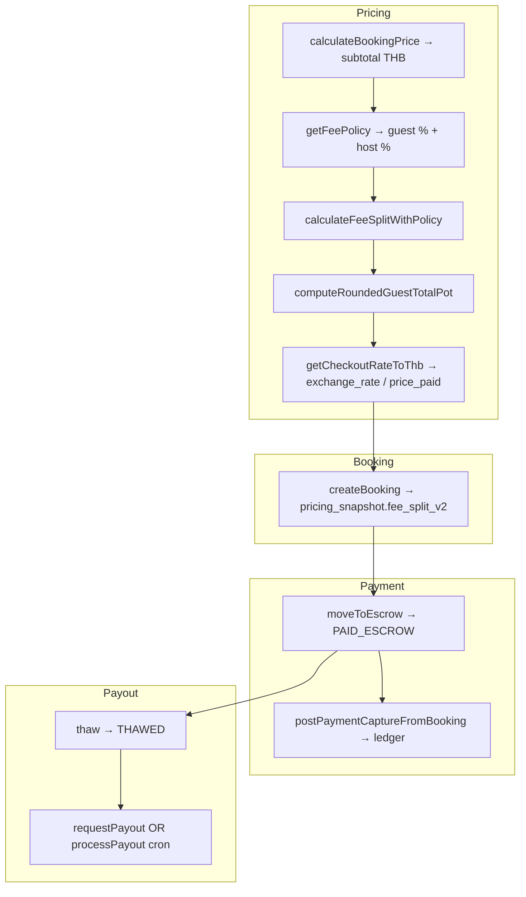
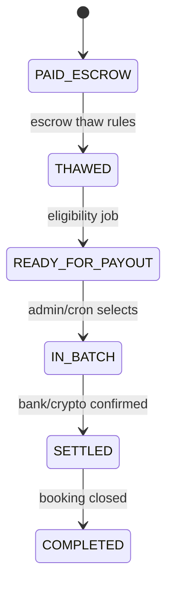

# ADR-097: Financial Model v2.0 (Pricing Profiles, RU/KG Split, Netto/Brutto, Batch Payouts)

| Field | Value |
|-------|--------|
| **Status** | Proposed |
| **Stage** | 97.0 — Financial Model Stabilization |
| **Date** | 2026-05-16 |
| **Deciders** | Product, Finance, Engineering |
| **Supersedes (partially)** | Ad-hoc split in `system_settings.general` + `profiles.custom_commission_rate` + `chatInvoiceRateMultiplier` |
| **SSOT after adoption** | This ADR + `ARCHITECTURAL_DECISIONS.md` (Golden rule §2) + `docs/FINANCIAL_FLOW_MAP.md` (updated) |

**Related audits (input):** financial inventory and business-model reviews in the same initiative (Pricing Engine 2.0, transborder RU–KG–TH). **Related code today:** `lib/services/pricing/pricing-fee-policy.js`, `lib/services/currency.service.js`, `lib/services/ledger.service.js`, `lib/services/escrow.service.js`, `lib/services/booking/creation.js`, `lib/booking-pricing-snapshot.js`.

---

## 1. Context and problem

Gostaylo operates as a **multi-jurisdiction rental Super-App** (Russia acquisition / agency, Kyrgyzstan service & FX entity, Thailand supply). The current implementation can:

- Calculate guest totals, partner net, platform margin, escrow, and double-entry ledger in **THB**;
- Apply FX spread via `chatInvoiceRateMultiplier` and checkout `exchange_rate`;
- Pay partners via configurable rails (THB, RUB, USDT, USD) and RU bank CSV registries.

It **cannot yet** present a single, investor-grade P&L per booking, cleanly separate **agency margin (RU)** from **service/FX margin (KG)**, or run **mass payout batches** aligned with treasury policy. Operational drift (naming, dual payout paths, FX not in GL) creates compliance and fundraising risk.

This ADR defines **Financial Model v2.0** — the target architecture. Implementation is staged under **Stage 97.0.x**; no behaviour change is implied until each sub-stage ships behind flags.

---

## 2. Goals

| Goal | Success criterion |
|------|-------------------|
| **Investor transparency** | Any booking reproduces a fixed **FinalBreakdown** from `pricing_snapshot` without re-running live settings. |
| **Sanctions & 115-ФЗ safety** | Money flows are explainable: guest Brutto, partner Netto, RU agency share, KG service/FX share, no “hidden” enrichment in partner Netto. |
| **RU–KG–TH scale** | One **Pricing Profile** per deal; regional overrides; batch payouts (e.g. Mon/Thu) to KG crypto/bank and RU registry. |
| **SSOT** | No new magic numbers in services; profiles + `exchange_rates` + env last-resort only (`currency-last-resort.js`). |
| **Super-App** | Profiles work across verticals (housing, transport, services) via listing/category context, not hardcoded “hotel-only” math. |

### Non-goals (v2.0)

- Replacing Supabase/Postgres or Prisma as documentation layer.
- Full automated SWIFT API integration (templates + batch export first).
- Tax filing automation in RU/KG/TH (reporting hooks only).

---

## 3. Current model (summary)

### 3.1. Calculation chain (today)



| Layer | Canonical module | Notes |
|-------|------------------|--------|
| Subtotal | `pricing-calculation.js` | Nights, seasonal, promo |
| Split-fee | `pricing-fee-policy.js` → **`calculateFeeSplitWithPolicy`** | `platformGross = guestFee + hostCommission` |
| FX | `pricing-fx-helpers.js`, `currency.service.js` | Multiplier in `general.chatInvoiceRateMultiplier`; not a separate P&L line |
| Snapshot | `booking-pricing-snapshot.js`, `fee_split_v2` | Immutable at create |
| Settlement enrich | `booking/pricing.service.js` → `settlement_v3` | On confirm |
| Ledger | `ledger.service.js` | Single **PLATFORM_FEE** credit leg |
| Escrow | `escrow.service.js`, `thaw.service.js`, `payout.service.js` | **Two payout paths** (THAWED vs PAID_ESCROW cron) |

### 3.2. Known gaps (from audit)

| Gap | Risk |
|-----|------|
| `bookings.commission_thb` = **guest** fee, not host commission | Misread in legal docs / investor decks |
| `defaultCommissionRate` vs `guestServiceFeePercent` | Admin shows 15% in presets while code default guest fee is 5% |
| FX markup embedded in rate, not `fx_markup_thb` | KG entity revenue not visible in GL |
| No RU 7% / KG 8% split | Cannot map agency agreement to postings |
| No `price_netto` / `price_brutto` columns | Transborder invoice clarity |
| Micro-payout per booking | Does not scale for KG treasury batches |
| Client FX cache 6h vs server TTL 2h | SSOT drift for display vs refresh |

**Deeper narrative:** see initiative audits and `docs/FINANCIAL_FLOW_MAP.md`, `ARCHITECTURAL_DECISIONS.md` (FX / commission).

---

## 4. Decision: target Financial Model v2.0

### 4.1. Pricing Profiles (SSOT for all percentages)

Replace scattered knobs with **`pricing_profiles`** + resolution chain.

**Resolution order (most specific wins):**

1. `listings.pricing_profile_id` (optional, per offer)
2. `profiles.pricing_profile_id` (partner / listing owner)
3. `pricing_profile_assignments` (region: country / city / district)
4. `system_settings.general.default_pricing_profile_id`
5. Platform fallback row + `PLATFORM_SPLIT_FEE_DEFAULTS` (emergency only)

**Profile fields (business defaults):**

| Field | Default | Meaning |
|-------|---------|---------|
| `guest_fee_pct` | 15 | Service fee on subtotal (guest-facing “platform fee”) |
| `host_fee_pct` | 0 | Commission deducted from partner subtotal |
| `fx_markup_pct` | 2.5 | Retail FX spread (replaces ad-hoc multiplier where profile applies) |
| `split_ru_pct` | 7 | Share of **platform margin pool** attributed to RU agency |
| `split_kg_pct` | 8 | Share of **platform margin pool** attributed to KG (incl. FX policy) |

**Invariant (ADR):** `split_ru_pct + split_kg_pct` MUST equal the agreed **total platform take** policy per product line (e.g. 15% of relevant base), OR split applies to **`platform_margin_thb` after insurance**, not independently to subtotal. Exact base is fixed in `PricingEngine` and stored in snapshot — **one formula, no double counting**.

Recommended base for split (v2.0):

```
platform_margin_pool_thb = guest_service_fee_thb + host_commission_thb - insurance_reserve_thb
platform_margin_ru_thb   = round(platform_margin_pool_thb * split_ru_pct / (split_ru_pct + split_kg_pct))
platform_margin_kg_thb   = platform_margin_pool_thb - platform_margin_ru_thb
fx_markup_thb            = computed from raw vs customer FX (see §4.3); attributed to KG in reporting
```

### 4.2. RU / KG split 7% / 8%

**Legal wording (acts, payment registers):** [`docs/legal/IT_SERVICE_KG_CONTRACT_SUMMARY.md`](../legal/IT_SERVICE_KG_CONTRACT_SUMMARY.md) — KG line = **ИТ-услуги и техподдержка**, not royalty.

| Concept | RU (agency) | KG (service / FX) |
|---------|-------------|-------------------|
| Legal role | Agent / payment facilitator in RF | Service company, FX, transit to TH |
| Ledger (target) | `PLATFORM_FEE_RU_AGENT` | `PLATFORM_FEE_KG_SERVICE` + `FX_MARKUP_REVENUE_KG` (or KG service includes FX per policy) |
| Booking snapshot | `final_breakdown.platform_margin_ru_thb` | `final_breakdown.platform_margin_kg_thb` |

**Ledger capture (target):** replace single `PLATFORM_FEE` credit with **two credits** (plus existing partner, insurance, pot legs). Drift absorption rules mirror today (small THB deltas → KG or “rounding” leg per finance policy).

### 4.3. FX markup as separate income (KG)

**Today:** `getCheckoutRateToThb` uses `rawRate / chatInvoiceRateMultiplier` when payment currency ≠ listing base currency; delta vs mid is **not** stored.

**Target:**

| Artifact | Content |
|----------|---------|
| Snapshot | `fx_raw_rate_to_thb`, `fx_customer_rate_to_thb`, `fx_markup_pct_applied`, `fx_markup_thb` |
| Guest Brutto | `total_guest_brutto_customer` + currency |
| Reporting | KG P&L includes `fx_markup_thb`; optional ledger account |

**Formula (illustrative):**

```
guest_brutto_customer = total_guest_payable_thb / fx_customer_rate_to_thb
guest_at_mid_customer = total_guest_payable_thb / fx_raw_rate_to_thb
fx_markup_thb ≈ total_guest_payable_thb * (1/raw - 1/customer)  // validate in PricingEngine unit tests
```

`fx_markup_pct` on profile maps to customer rate via one function in **`PricingEngine.applyFxQuote`** (SSOT); deprecate parallel use of multiplier without profile unless `PRICING_ENGINE_V2=false`.

### 4.4. Netto / Brutto

| Term | Definition (v2.0) | Storage |
|------|-------------------|---------|
| **Brutto (guest)** | Total paid by guest in charge currency incl. fees, tax, pot rounding | `pricing_snapshot.final_breakdown.total_guest_brutto` + `bookings.price_paid` / `currency` |
| **Netto (partner)** | Amount owed to partner before payout rail fee | `partner_earnings_thb` + `final_breakdown.total_partner_netto_thb` |
| **Netto (KG transit)** | THB (or USDT equivalent) sent toward TH supply chain | Batch line metadata, not guest-facing |

Optional columns on `bookings` (migration): `guest_brutto_thb`, `partner_netto_thb` as denormalized mirrors for SQL reporting; **canonical** remains snapshot JSON.

### 4.5. Batch payout (Mass Payouts)

**Today:** `processPayout` per booking; `requestPayout` per partner; `tbank-payout-registry` for RU CSV.

**Target state machine:**



| Entity | Purpose |
|--------|---------|
| `payout_batches` | One registry per rail / window (Mon, Thu) |
| `payout_batch_items` | booking_id, partner_id, amount_thb, status |
| Exporters | `RegistryExporter` plugins: `TBANK_RU`, `KG_CRYPTO`, `SWIFT_TEMPLATE` |

**Deprecate:** auto-`COMPLETED` via `processAllPayoutsForToday` on `PAID_ESCROW` without batch — behind `LEGACY_PER_BOOKING_PAYOUT` flag, then remove.

---

## 5. Proposed database schema

**Convention:** TEXT PKs for FKs to `profiles`, `listings`, `bookings` (production Supabase). Migrations under `database/migrations/` or `migrations/` per existing practice.

### 5.1. `pricing_profiles`

```sql
-- Illustrative; final names in migration PR.
CREATE TABLE public.pricing_profiles (
  id                TEXT PRIMARY KEY,
  name              TEXT NOT NULL,
  guest_fee_pct     NUMERIC(5,2) NOT NULL DEFAULT 15,
  host_fee_pct      NUMERIC(5,2) NOT NULL DEFAULT 0,
  fx_markup_pct     NUMERIC(5,2) NOT NULL DEFAULT 2.5,
  split_ru_pct      NUMERIC(5,2) NOT NULL DEFAULT 7,
  split_kg_pct      NUMERIC(5,2) NOT NULL DEFAULT 8,
  insurance_fund_pct NUMERIC(5,2) NOT NULL DEFAULT 0.5,
  tax_rate_pct      NUMERIC(5,2) NOT NULL DEFAULT 0,
  is_active         BOOLEAN NOT NULL DEFAULT TRUE,
  created_at        TIMESTAMPTZ NOT NULL DEFAULT now(),
  updated_at        TIMESTAMPTZ NOT NULL DEFAULT now(),
  CONSTRAINT pricing_profiles_split_nonneg CHECK (
    guest_fee_pct >= 0 AND host_fee_pct >= 0 AND fx_markup_pct >= 0
    AND split_ru_pct >= 0 AND split_kg_pct >= 0
  )
);
```

Seed: `pp-default-thai`, `pp-special-zero-host`, etc.

### 5.2. `pricing_profile_assignments`

```sql
CREATE TABLE public.pricing_profile_assignments (
  id                  TEXT PRIMARY KEY,
  pricing_profile_id  TEXT NOT NULL REFERENCES public.pricing_profiles(id),
  scope_type          TEXT NOT NULL CHECK (scope_type IN ('COUNTRY','REGION','CITY')),
  scope_key           TEXT NOT NULL,
  priority            INT NOT NULL DEFAULT 0,
  is_active           BOOLEAN NOT NULL DEFAULT TRUE,
  UNIQUE (scope_type, scope_key)  -- or composite policy per ADR tweak
);
```

### 5.3. Profile links

```sql
ALTER TABLE public.profiles
  ADD COLUMN IF NOT EXISTS pricing_profile_id TEXT REFERENCES public.pricing_profiles(id);

ALTER TABLE public.listings
  ADD COLUMN IF NOT EXISTS pricing_profile_id TEXT REFERENCES public.pricing_profiles(id);
```

`system_settings.general`: `default_pricing_profile_id`, `fx_quote_ttl_seconds` (replaces hardcoded TTL).

### 5.4. `payout_batches` / `payout_batch_items`

```sql
CREATE TABLE public.payout_batches (
  id              TEXT PRIMARY KEY,
  status          TEXT NOT NULL CHECK (status IN ('DRAFT','LOCKED','EXPORTED','SETTLED','FAILED')),
  rail            TEXT NOT NULL,  -- TBANK_RU | KG_CRYPTO | SWIFT | ...
  scheduled_for   DATE,
  totals_thb      NUMERIC(14,2),
  metadata        JSONB NOT NULL DEFAULT '{}',
  created_by      TEXT REFERENCES public.profiles(id),
  created_at      TIMESTAMPTZ NOT NULL DEFAULT now()
);

CREATE TABLE public.payout_batch_items (
  id              TEXT PRIMARY KEY,
  batch_id        TEXT NOT NULL REFERENCES public.payout_batches(id),
  booking_id      TEXT NOT NULL REFERENCES public.bookings(id),
  partner_id      TEXT NOT NULL REFERENCES public.profiles(id),
  amount_thb      NUMERIC(14,2) NOT NULL,
  status          TEXT NOT NULL DEFAULT 'PENDING',
  UNIQUE (batch_id, booking_id)
);
```

### 5.5. Ledger accounts (additions)

| `id` | `code` | Role |
|------|--------|------|
| `la-sys-platform-fee-ru` | `PLATFORM_FEE_RU_AGENT` | RU agency share |
| `la-sys-platform-fee-kg` | `PLATFORM_FEE_KG_SERVICE` | KG service share |
| `la-sys-fx-markup-kg` | `FX_MARKUP_REVENUE_KG` | FX markup (if separated from service) |

Update `move_to_escrow_and_post_ledger_v1` (SQL) and `LedgerService.postPaymentCaptureFromBooking` in lockstep.

### 5.6. Booking snapshot version

`pricing_snapshot.v = 2`, block `final_breakdown`:

```json
{
  "v": 2,
  "pricing_profile_id": "pp-default-thai",
  "resolution_trace": ["listing", "profile", "regional:TH", "default"],
  "final_breakdown": {
    "subtotal_thb": 10000,
    "guest_service_fee_thb": 1500,
    "host_commission_thb": 0,
    "insurance_reserve_thb": 8,
    "platform_margin_pool_thb": 1492,
    "platform_margin_ru_thb": 696,
    "platform_margin_kg_thb": 796,
    "fx_markup_thb": 120,
    "total_guest_payable_thb": 11500,
    "total_guest_brutto": { "amount": 4715, "currency": "RUB" },
    "total_partner_netto_thb": 10000,
    "rounding_diff_pot_thb": 0
  }
}
```

---

## 6. Integration map

### 6.1. `PricingEngine` (new SSOT service)

| Responsibility | Replaces / wraps |
|----------------|------------------|
| `resolvePricingProfile(ctx)` | `getFeePolicy` + multiplier reads |
| `computeFinalBreakdown(ctx)` | `calculateFeeSplitWithPolicy` + FX + split RU/KG |
| `validateClientAttestation` | Existing fraud checks in `creation.js` |
| `toPricingSnapshotV2(breakdown)` | `buildBookingPricingSnapshot` extension |

**Consumers:** `booking/creation.js`, `GET /api/v2/commission`, checkout hooks, admin preview API.

### 6.2. Booking creation

1. `calculateBookingPrice` → subtotal (unchanged module).
2. **`PricingEngine.computeFinalBreakdown`** → all THB lines + Brutto.
3. Persist `bookings` columns + **`pricing_snapshot` v2** (immutable).
4. Client attestation on `clientQuotedSubtotalThb` / `clientQuotedGuestTotalThb` unchanged in spirit.

### 6.3. Escrow & ledger

| Step | v2.0 change |
|------|-------------|
| `moveToEscrow` | Still `PAID_ESCROW`; attach `listing_category_slug`, payment metadata |
| Ledger capture | Legs from `final_breakdown` (RU/KG/FX), not recomputed from live profile |
| `attachSettlementSnapshotForBooking` | Read v2 breakdown; fill `settlement_v3` compat fields |

**Rule:** Post-capture **never** recalculates fees from `system_settings` — only snapshot.

### 6.4. Payout & UI

| Surface | Requirement |
|---------|-------------|
| **Admin** | CRUD pricing profiles; batch builder; export registry; booking breakdown viewer |
| **Partner** | Read-only active profile + Netto available / in batch |
| **Guest** | Checkout shows fee lines from preview API (guest fee, FX note if applicable) |
| **Investor export** | Monthly CSV from `final_breakdown` + ledger aggregates |

---

## 7. Trade-offs and risks

| Decision | Upside | Downside / mitigation |
|----------|--------|------------------------|
| Pricing Profiles table | One dial per market; investor clarity | Migration from `general` JSON; dual-write period |
| RU/KG ledger split | Compliance narrative | More reconciliation rules; SQL RPC must stay atomic |
| FX as separate line | KG revenue visible | Formula disputes; strict unit tests + ADR formula lock |
| Batch payouts | Treasury scale, fewer wires | Delayed partner cash; status UX (“in batch”) |
| Snapshot v2 | Immutable truth | Larger JSON; backfill not required for old bookings |
| Deprecate per-booking cron payout | Single payout story | Partners on legacy path need comms |

| Risk | Severity | Mitigation |
|------|----------|------------|
| Split % misunderstood as “7% of GMV” | High | Document base in snapshot; admin tooltips |
| Two payout paths during migration | High | Feature flag; metrics on path usage |
| `commission_thb` naming | Medium | v2 UI uses `guest_service_fee_thb`; alias in read APIs |
| Referral pool vs RU/KG split | Medium | Referral still from `netProfitOrder`; cap unchanged |
| Prisma drift vs Supabase | Low | Migration SSOT in `database/migrations/` |

---

## 8. Implementation stages (Stage 97.0.x)

| Stage | Scope | Deliverables | Flag |
|-------|--------|--------------|------|
| **97.0.1** Truth & naming | ADR approved; glossary; fix 2h/6h TTL doc + client align | Docs, `getAuthErrorMessage`-style glossary for finance terms | — |
| **97.0.2** Snapshot v2 | `FinalBreakdown` in code; write v2 on create; admin read API | `pricing_snapshot.v=2`, preview endpoint | `PRICING_SNAPSHOT_V2` |
| **97.0.3** Pricing Profiles | DB tables; `PricingEngine`; admin CRUD; wire creation + commission API | Profiles SSOT | `PRICING_ENGINE_V2` |
| **97.0.4** RU/KG + FX ledger | New accounts; ledger legs; SQL RPC update | Reconciliation green | `LEDGER_SPLIT_V2` |
| **97.0.5** Payout batches | `payout_batches`, READY_FOR_PAYOUT, exporters, admin UI | Mon/Thu registry job | `BATCH_PAYOUT_V2` |
| **97.0.6** Investor pack | Monthly aggregates API / admin export | GMV, take rate, RU/KG/FX, referral drag | — |

**Exit criteria (97.0 complete):**

- [ ] 100% new bookings have `pricing_snapshot.v2` with `final_breakdown`.
- [ ] No production path creates payout without batch or documented exception.
- [ ] Ledger reconciliation MVP: zero margin leakage on capture journals.
- [ ] Admin can explain any booking in &lt; 30s from UI.

---

## 9. Consequences

### Positive

- Single narrative for investors and banks (Brutto / Netto / RU / KG / FX).
- Aligns product UI with treasury (batch registries).
- Reduces accidental fee drift from per-partner `custom_commission_rate` alone.

### Negative / operational

- Engineering cost across pricing, ledger, escrow, admin UI.
- Training for support and partners on new statuses (`READY_FOR_PAYOUT`, `IN_BATCH`).
- Legal review of snapshot text on guest checkout (fee disclosure).

### Follow-up ADRs (expected)

- **ADR-098:** FX quote TTL and payment-session freeze.
- **ADR-099:** SWIFT / KG bank rail field schema for `partner_payout_profiles`.

---

## 10. References

| Document | Role |
|----------|------|
| `ARCHITECTURAL_DECISIONS.md` | Golden rules (no magic rates/commissions) |
| `docs/TECHNICAL_MANIFESTO.md` | Code-truth (update on implement) |
| `docs/ARCHITECTURAL_PASSPORT.md` | Routes, tables (update on implement) |
| `docs/FINANCIAL_FLOW_MAP.md` | Wallet / referral / pricing flow |
| `docs/ESCROW_LEDGER_ATOMIC_SQL_PLAN.md` | Atomic escrow + ledger |
| `database/migrations/030_financial_phase1_5_ledger_booking_metadata.sql` | Ledger schema |
| `database/migrations/029_financial_phase1_4_payout_rails_profiles.sql` | Payout methods |
| `lib/services/pricing/pricing-fee-policy.js` | Current split math |
| `lib/services/ledger.service.js` | Current capture legs |
| `README.md` | Treasury multi-entity mention (RU, KG, USDT, SWIFT) |

---

## 11. Approval checklist

- [ ] Finance: split base and 7%/8% definition signed
- [ ] Legal: Brutto/Netto labels on guest receipt
- [ ] Engineering: SQL RPC + LedgerService change plan accepted
- [ ] Product: admin + partner UI in 97.0.3–97.0.5 scope
- [ ] Update `ARCHITECTURAL_DECISIONS.md` cross-link after **Accepted**

---

*End of ADR-097*
