# ADR-131: Ambassador Program 3.0 (L2 guest pool, owner waterfall, caps)

| Field | Value |
|-------|--------|
| **Status** | **Accepted** (Product + Finance, 2026-06-01) |
| **Stage** | **131.0** (policy + implementation — Dynamic Fintech & Safety Core) |
| **Date** | 2026-06-01 |
| **Implementation SSOT** | `migrations/stage131_0_system_fintech_settings.sql` · `SystemConfigService` · `lib/config/fintech-config-defaults.js` |
| **Deciders** | Product owner, Finance, Engineering |
| **Supersedes (partially)** | Неявная политика «L1-only на guest_booking»; дефолт `referral_reinvestment_percent = 70` как операционная рекомендация |
| **SSOT after adoption** | Этот ADR + `ARCHITECTURAL_DECISIONS.md` (§ Ambassador) + `docs/BUSINESS_LOGIC_REFERRAL.md` + `docs/FINANCIAL_FLOW_MAP.md` §11 |
| **Related** | `docs/REFERRAL_OWNER_GUIDE.md`, `docs/REFERRAL_USER_GUIDE.md`, `docs/REFERRAL_PROGRAM_2_0_PLAN.md`, ADR-097 |

---

## 1. Context

### 1.1. Продуктовая цель

Вырасти как маркетплейс (Uber/Airbnb-модель: **продукт + простая рефералка**), но с **изюминкой для блогеров и сетевиков**:

- прозрачный доход с **команды** (L2), без пирамиды L3+;
- **повторяющийся** доход с завершённых поездок приглашённых;
- отдельный **supply-лифт** (приглашённые хосты);
- **владелец не уходит в минус** — все переменные и плановые постоянные расходы вычитаются **до** реферального пула.

### 1.2. As-is (код, 2026-06)

| Контур | Поведение |
|--------|-----------|
| **Guest booking** | Пул из `AdjustedNetProfitOrder × referral_reinvestment_percent`, cap **95% platform gross**. Платит **L1** (`bonus`) + **referee** (`cashback`). **L2 с поездок гостей не получает.** |
| **Host activation** | Фикс `partner_activation_bonus` (дефолт **500 THB**) из **Promo Tank**; split **L1/L2** по `mlm_level1_percent` / `mlm_level2_percent` (70/30). |
| **Расходы до пула** | Insurance (из snapshot), `acquiring_fee_percent`, `operational_reserve_percent`. **Нет** явного USN/НДС/payroll reserve; **нет** FX markup в базе пула. |
| **FX markup (settlement)** | `pricing_profiles.fx_markup_pct` (FinTech preset **3%**), считается в **`computeFinalBreakdown`** → `fx_markup_thb` в snapshot/ledger. **Не входит** в `ReferralPolicyService.deriveFeeBaseFromBooking` → **не делится** с амбассадорами (остаётся владельцу). |
| **Retail FX (витрина)** | `chatInvoiceRateMultiplier` / `getDisplayRateMap({ applyRetailMarkup: true })` — только каталог/checkout display; settlement — **mid** (`retail=0`). |
| **Два рынка** | `listing_base_currency` + `payment_currency`: RUB↔RUB → markup **0**; THB listing + RUB pay → markup **да**. Партнёр RUB: `TBANK_RU` rail + `getRubPayoutSpreadPct()` (**1.75%** default). Гость RUB: `mir-ru.adapter` / YooKassa. |
| **Вывод амбассадора** | `requestReferralWithdrawal` → admin `referral-bulk` approve — **без** удержания bank fee; **нет** `referral_withdrawal_fee_percent` (GAP, §10). |
| **Tier** | `referral_tiers`: Beginner 60% / Pro 75% / Ambassador 85% withdrawable на `referral_bonus`. |
| **Hold** | `referral_hold_days` дефолт **14**; статус `earned_held` → cron unlock. |
| **Caps** | Safety 95% gross; monthly spend **alert** (150k THB default); **нет** жёсткого program cap и L2 per-booking cap на guest. |

### 1.3. Проблема

- Сетевики не видят **пассива с L2** на demand (только на host activation).
- Владельцу сложно объяснить, что **остаётся после всех расходов**.
- Дефолт **70% reinvestment** агрессивен, если в проде комиссия ближе к **15% guest fee** (FinTech preset), а не к emergency **5%** (`PLATFORM_SPLIT_FEE_DEFAULTS`).

---

## 2. Decision summary

**Ambassador 3.0** — три столпа:

1. **Owner Waterfall** — расширенный водопад расходов **до** реферального пула (`system_fintech_settings`, Stage 128.0).
2. **Guest pool L2** — **один** upline (L2) получает долю **того же пула**, что L1 и cashback; **не глубже L2**; жёсткие caps.
3. **Go-to-market split** — два продукта в одной программе: **Travel Ambassador** (гости) и **Supply Builder** (хосты), публичный калькулятор и monthly program cap.

**Инварианты (не обсуждаются):**

- Выплаты **только из маржи платформы** (guest fee + host fee), **never** из `partner_earnings`, escrow хоста и **`fx_markup_thb`**.
- `SAFETY_LOCK_MAX_SHARE = 0.95` platform gross — сохраняется (cap считается от **commission gross**, без FX).
- Wallet credit только через `wallet_apply_operation`; ledger SSOT — `referral_ledger`.
- Максимальная глубина monetization на одну бронь: **L2** (L1 direct + L2 upline + referee cashback).
- **Комиссия банка за вывод амбассадору** (1.5%) — на **получателе**, не на P&L платформы (§10).

---

## 3. Два рынка: Таиланд и Россия (dual-market)

Запуск на **2 рынка** — одна реферальная математика в THB-ledger, разные **платёжные** и **FX** ветки.

| Сценарий | Listing base | Оплата гостя | FX markup (`fx_markup_thb`) | Эквайринг | Выплата хосту |
|----------|--------------|--------------|----------------------------|-----------|---------------|
| **TH domestic** | THB | THB | **0** | % от суммы платежа THB | THB / KG rail |
| **TH inbound** | THB | RUB / USD / … | **3.5–4%** (`fx_markup_pct`) | % от полной оплаты | THB |
| **RF domestic** | RUB | RUB | **0** (`payCur === baseCur`) | YooKassa **4.3%** от оплаты | **RUB** `TBANK_RU` |
| **RF cross** | RUB | USD / THB | по профилю, если `pay ≠ base` | по факту PSP | по rail |

**Канон в коде:** `lib/pricing-engine/compute-breakdown.js` — markup только если `payment_currency ≠ listing_base_currency` (и `payment ≠ THB` для блока FX).  
**Рефералка для «русских»:** гость платит в рублях, хост в РФ получает рубли — **FX-наценка не срабатывает**; cushion владельца = только guest fee − налоги − эквайринг.  
**Рефералка для Тая с иностранным гостем:** markup **помогает** владельцу, **не урезая** пул амбассадоров.

**Учёт в THB:** `bookings.price_thb` и ledger — THB; RUB-платёж конвертируется в snapshot (`exchange_rate`, `fee_split_v2`). FinTech и referral считают в THB.

---

## 4. Owner Waterfall (новые настройки)

### 4.1. Формула (целевая, dual-market)

```
commission_gross_thb   = guest_service_fee_thb + host_commission_thb   # pricing_snapshot
fx_markup_thb          = snapshot.fx_markup_thb (0 для RUB↔RUB)

guest_payment_thb      = total_guest_payable_rounded_thb               # база эквайринга
acquiring_thb          = guest_payment_thb × acquiring_fee_percent / 100   # launch: 4.3%

owner_revenue_thb      = commission_gross_thb + fx_markup_thb          # FX — только владельцу

usn_thb                = owner_revenue_thb × usn_percent / 100         # launch: 6%
vat_thb                = owner_revenue_thb × vat_percent / 100         # launch: 5%
insurance_reserve_thb  = из snapshot
bank_misc_thb          = commission_gross_thb × bank_misc_percent / 100  # launch: 0.5%

adjusted_net_thb       = max(0, owner_revenue − insurance − acquiring − usn − vat − bank_misc)

referral_pool_raw      = adjusted_net × referral_reinvestment_percent / 100
referral_pool_thb      = min(referral_pool_raw, commission_gross × 0.95)   # safety без FX

owner_retained_thb     = adjusted_net − referral_pool_thb + 0   # FX уже в owner_revenue до split
```

**Важно:** `acquiring_fee_percent` в админке сейчас применяется к **commission gross**, не к полной оплате — **GAP** (§11). Для RU-реальности P0: `acquiring_thb = guest_payment_thb × 4.3%`.

**Смысл полей:** плановый резерв; бухгалтер сверяет USN/НДС по факту. **FX markup** облагается теми же % (в модели — с `owner_revenue`).

### 4.2. Рекомендуемые значения на запуск (Ambassador 3.0 launch preset)

| Колонка `system_fintech_settings` | Launch | Диапазон | Комментарий |
|-----------------------------------|--------|----------|-------------|
| `pricing_profiles.fx_markup_pct` *(ADR-097)* | **3.5** | 3–4 | Settlement markup; **не** в этой таблице |
| `acquiring_fee_percent` | **4.3** | 4–5 | **От `guest_payment_thb`** (Stage 131.0) |
| `usn_provision_percent` | **6** | — | С `owner_revenue` |
| `vat_provision_percent` | **5** | — | С `owner_revenue` |
| `reserve_bank_percent` | **0.5** | 0.3–1 | РКО / мелочь |
| `referral_reinvestment_percent` | **45** | 40–50 | Пул после waterfall |
| `referral_withdrawal_fee_percent` | **1.5** | 1–2 | У амбассадора при выплате (§10) |
| `referral_hold_days` *(general)* | **14** | 7–21 | Пока в `system_settings.general` |
| `referral_monthly_program_cap_thb` | **250 000** | 150k–500k | Defer `pending` + `cap_deferred` |
| `referral_admin_monthly_spend_alert_thb` *(general)* | **150 000** | — | Alert раньше cap |

**Правило Finance:** поднятие `referral_reinvestment_percent` выше **60** только при `cohort LTV/CAC ≥ 1.2` за 90 дней (данные `/admin/marketing/analytics`).

---

## 5. Guest booking pool split (L1 / L2 / referee)

### 5.1. Новые ключи

| Ключ | Launch | Описание |
|------|--------|----------|
| `ambassador_guest_l2_enabled` | **true** | Флаг L2 на guest_booking |
| `ambassador_guest_pool_l1_percent` | **45** | % пула → direct referrer (L1) |
| `ambassador_guest_pool_l2_percent` | **12** | % пула → upline (L2) |
| `ambassador_guest_pool_referee_percent` | **43** | % пула → cashback приглашённого гостя |
| `ambassador_guest_l2_max_thb_per_booking` | **500** | Cap L2 с одной брони |
| `ambassador_guest_l2_max_thb_per_month` | **50 000** | Cap L2 на одного upline в месяц (UTC) |

**Инвариант:** `l1 + l2 + referee = 100` (±0.01). При выключенном L2: `l1=50`, `referee=50`, `l2=0` (legacy-совместимость).

### 5.2. Кто такой L2

- `referrer_id` связи = **L1** (кто привёл гостя).
- **L2** = предпоследний элемент `ancestor_path` (тот, кто привёл L1), тот же алгоритм, что `distributeHostPartnerActivation`.
- Если L2 отсутствует или L2 === L1 → доля L2 **остаётся в пуле** и перераспределяется: **50% L1 / 50% referee** (не платформе, не «сгорает» у пользователя без L2).

### 5.3. Ledger

- Три строки `guest_booking` на бронь (при наличии L2):
  - `type=bonus`, `referrer_id=L1`, `ledger_depth=1`
  - `type=bonus`, `referrer_id=L2`, `ledger_depth=2`
  - `type=cashback`, `referee_id=renter`, `ledger_depth=1`
- Уникальность `(booking_id, type, referral_type, referrer_id)` уже позволяет две `bonus` строки.

### 5.4. Caps (порядок применения)

1. Рассчитать pool по waterfall + safety 95%.
2. Split L1/L2/referee по %.
3. `l2_amount = min(l2_amount, ambassador_guest_l2_max_thb_per_booking)`.
4. Проверить `sum(earned L2 this month for upline) + l2_amount ≤ ambassador_guest_l2_max_thb_per_month`; иначе `l2_amount = 0`, excess → **L1** (прозрачно в metadata).
5. Проверить `referral_monthly_program_cap_thb`; при превышении — **pending** с `metadata.cap_deferred=true` (admin review), не earned.

---

## 6. Supply Builder (host activation) — без изменений формулы, уточнение позиционирования

| Параметр | Launch | Источник |
|----------|--------|----------|
| `partner_activation_bonus` | **500 THB** | Promo Tank |
| `mlm_level1_percent` / `mlm_level2_percent` | **70 / 30** | От бонуса активации |
| Tier progression | 0 / 5 / 20 **партнёров** | `referral_tiers` |

**Позиционирование (важно для коммуникации):**

| Продукт | Что получает амбассадор | Пассив? |
|---------|-------------------------|---------|
| **Travel Ambassador** (привёл **гостей**) | % пула с **каждой** COMPLETED поездки приглашённого гостя (L1; + L2 upline после P1) | Да, пока гость ездит |
| **Supply Builder** (привёл **хоста**) | **Один раз** бонус активации (~500 THB из Promo Tank) при **первой** брони хоста | **Нет** % с броней этого хоста |

**Не обещать:** «привёл виллу — получаешь с каждого её гостя». Чужие ренторы платят **тому, кто привёл этого рентора**, не хостоводу.

---

## 7. Tier & retention (уточнения 3.0)

| Tier | Партнёров | Withdrawable share | Hold (guest earned) |
|------|-----------|-------------------|---------------------|
| Beginner | 0 | 60% | 14 дней |
| Pro | 5 | 75% | **10 дней** |
| Ambassador | 20 | 85% | **7 дней** |

Cashback / welcome — **100% internal** (без изменений).

**Fast Start (launch):** разовый **+300 THB** из Promo Tank, если первый `earned` в **14 дней** после регистрации амбассадора (отдельный `referral_type=fast_start_bonus`, cap 1 на пользователя).

---

## 8. Numeric model (планирование)

> **Важно:** средние чеки ниже — **рабочие допущения** для планирования. После запуска заменить на факт из `bookings` (p50/p75 `price_thb` по `category_slug`).  
> Комиссия: сценарий **A** = кодовый fallback (5% guest), **B** = FinTech/pricing profile preset (**15% guest**, 0% host) — вероятнее для зрелого Airento.

### 8.0. Owner tax profile + dual-market (утверждено владельцем, 2026-06-01)

**Общие допущения:** субтотал **35 000**, guest fee **15%** → commission **5 250**; оплата гостя **40 250** (субтотал + fee); pool split **45/12/43**; reinvestment **45%**.

> **Stage 131.1 (2026-06-08):** цифры ниже пересчитаны по **itemized**-водопаду в `ReferralPolicyService` (эквайринг от `guest_payment`, УСН/НДС от `owner_revenue`). SSOT константы: `ADR131_REFERENCE_TARGETS` в `lib/services/finance/fintech-waterfall.js`. Старые агрегированные «tax/misc bundle» (~2 135 THB) **заменены** честной разбивкой (~2 361 THB).

| Статья | База | Ставка | THB (эталон A) |
|--------|------|--------|----------------|
| Эквайринг | **guest_payment** 40 250 | **4.3%** | **1 731** |
| УСН | owner_revenue (comm + FX) | **6%** | **315** |
| НДС | owner_revenue | **5%** | **263** |
| Банк/мелочь | commission gross | **0.5%** | **26** |
| Страховой | commission gross | **0.5%** | **26** |
| **Итого вычетов** | | | **~2 361** |

**FX markup (оценка):** `guest_payment × (fx_markup_pct / (100 + fx_markup_pct))` при cross-currency; **3.5%** → **~1 360 THB**; **4%** → **~1 548 THB**. FX идёт в `owner_revenue`, **не** в referral pool.

#### 8.0.A — **Таиланд**, THB listing, гость платит **THB** (нет FX)

| | THB |
|--|-----|
| owner_revenue | 5 250 |
| FX markup | **0** |
| − itemized deductions | **−2 361** |
| **adjusted net** | **2 889** |
| pool 45% | **1 300** |
| **owner retained** | **1 589** (**4.5%** чека) |
| L1 / L2 / guest | **585 / 156 / 559** |

#### 8.0.B — **Таиланд**, THB listing, гость платит **RUB** (FX **3.5%**)

| | THB |
|--|-----|
| commission | 5 250 |
| **FX markup** | **+1 360** |
| **owner_revenue** | **6 610** |
| − itemized deductions | **−2 510** |
| **adjusted net** | **4 100** |
| pool 45% | **1 845** |
| **owner retained** | **2 255** (**6.4%** чека) |
| L1 / L2 / guest | **830 / 221 / 793** |

→ **FX даёт +666 THB** к owner retained vs 8.0.A; амбассадоры получают **+545 THB** в пуле, но **не** долю от FX markup.

#### 8.0.C — **Россия**, RUB listing, гость платит **RUB** (FX **0**)

| | THB (экв.) |
|--|-----|
| owner_revenue | 5 250 |
| FX markup | **0** |
| − itemized deductions | **−2 361** |
| **adjusted net** | **2 889** |
| pool 45% | **1 300** |
| **owner retained** | **1 589** |
| L1 / L2 / guest | **585 / 156 / 559** |

Логика как 8.0.A; в ledger — THB по курсу snapshot; хост получает **RUB** через `TBANK_RU` (spread **1.75%** на **партнёрских** выплатах, не на referral).

#### 8.0.D — Сравнительная таблица (35k субтотал, itemized SSOT)

| Сценарий | FX | adj. net | pool | owner | L1 |
|----------|-----|----------|------|-------|-----|
| TH / THB pay | 0 | 2 889 | 1 300 | 1 589 | 585 |
| TH / RUB pay **3.5%** | 1 360 | 4 100 | 1 845 | **2 255** | **830** |
| TH / RUB pay **4%** | 1 548 | 4 267 | 1 920 | **2 347** | 864 |
| RF / RUB pay | 0 | 2 889 | 1 300 | 1 589 | 585 |

#### 8.0.E — Фиксированные расходы (ФОТ) — вне %

```
fixed_per_booking = monthly_fixed_thb / completed_bookings_month
true_margin = owner_retained − fixed_per_booking
```

Пример: **100k/мес**, **80** броней → **1 250**/бронь.  
TH cross-currency owner **2 255** → **~1 005** после ФОТ; RF/TH domestic **1 589** → **~339**.

---

### 8.1. Сценарий B (generic) — вилла, чек **35 000 THB**, guest fee **15%**

| Шаг | THB | % от чека |
|-----|-----|-----------|
| Субтотал брони | 35 000 | 100% |
| Guest service fee (platform gross) | **5 250** | 15% |
| Host commission | 0 | 0% |
| Insurance reserve (~0.5% gross) | −26 | 0.07% |
| Acquiring 2.5% gross | −131 | 0.37% |
| Operational 5% gross | −263 | 0.75% |
| Bank payout reserve 0.5% | −26 | 0.07% |
| Tax provision 5% gross | −263 | 0.75% |
| Payroll allocation 3% gross | −158 | 0.45% |
| **Adjusted net** | **4 383** | **12.5%** |
| Referral pool (55% adjusted net) | **2 411** | **6.9%** |
| **Owner retained** | **1 972** | **5.6%** |

**Split пула (45 / 12 / 43), L2 cap не упирается:**

| Получатель | THB / бронь |
|------------|-------------|
| **L1** (пригласил гостя) | **1 085** |
| **L2** (пригласил L1) | **289** |
| **Гость** (cashback) | **1 037** |

**После tier (доля к выводу с L1-бонуса):**

| Tier | L1 на руки «к выводу» / бронь |
|------|-------------------------------|
| Beginner 60% | **651 THB** |
| Pro 75% | **814 THB** |
| Ambassador 85% | **922 THB** |

---

### 8.2. Сценарий B — авто, чек **8 000 THB**, guest fee **15%**

| | THB |
|--|-----|
| Platform gross | 1 200 |
| Adjusted net (те же %) | ~1 002 |
| Referral pool 55% | **551** |
| L1 / L2 / guest | **248 / 66 / 237** |
| Owner retained | ~451 |

---

### 8.3. Сценарий B — яхта, чек **80 000 THB**, guest fee **15%**

| | THB |
|--|-----|
| Platform gross | 12 000 |
| Adjusted net | ~10 016 |
| Referral pool 55% | **5 509** |
| L1 / L2 / guest | **2 479 / 661 / 2 369** |
| L2 после cap **500** | **500** (остальные **161 THB** → L1 по правилу §4.4) |
| Owner retained | ~4 507 |

---

### 8.4. Сценарий A — консервативный кодовый fallback, чек **35 000 THB**, guest fee **5%**

| | THB |
|--|-----|
| Platform gross | 1 750 |
| Adjusted net (те же owner %) | ~1 461 |
| Pool 55% | **804** |
| L1 / L2 / guest | **362 / 96 / 346** |

→ При 5% fee рефералка **слабо мотивирует** сетевиков; **продуктовый приоритет** — довести effective guest fee к pricing profile (**10–15%**) или компенсировать **Turbo boost** из tank на launch.

---

### 8.5. Supply: активация хоста (500 THB из tank)

| Получатель | THB |
|------------|-----|
| L1 (пригласил хоста) | **350** (70%) |
| L2 upline | **150** (30%) |

Не зависит от чека брони; **не** идёт из guest pool.

---

### 8.6. Сетевой сценарий «блогер месяц 1» (TH cross-currency, 3.5% FX)

**Допущение:** 20 регистраций, 8 COMPLETED × **20 000** чек, 50% гостей с FX markup.

| Метрика | THB / мес |
|---------|-----------|
| Средний pool / поездку | ~**1 050** |
| L1 блогера (8 × 45% pool) | **~3 780** |
| L2 с сети (оценка) | **~1 500** |
| **Earned брутто** | **~5 280** |
| К выводу @ Pro 75% | **~3 960** |
| После bank fee **1.5%** на выводе | **~3 900** нетто на карту |
| + 2 host activation | **+700** |

**Owner:** 8 × ~**1 350** owner retained (mix TH/FX) ≈ **10 800 THB** до ФОТ.

---

### 8.7. Годовой потолок program cap

`referral_monthly_program_cap_thb = 250 000` → при среднем pool **2 400 THB** это **~104 COMPLETED реферальных брони / мес** на всю платформу, после чего начисления defer. Для роста — поднимать cap только по ROI review.

---

## 9. Transparency & compliance (product)

### 9.1. Публичные обещания (можно на `/about/referral`)

- До **2 уровней** на одну поездку.
- Выплаты с **комиссии платформы**, не с оплаты хосту.
- **Нет** вступительных взносов и гарантированного дохода.
- Сумма **плавающая** — калькулятор показывает пример для среднего чека **20 000 / 35 000 THB**.
- Hold **7–14 дней**; вывод — после проверки, min **1 000 THB**.
- **Комиссия банка за вывод — 1.5%** удерживается с суммы выплаты (§10); платформа не компенсирует.
- **FX-наценка** (3.5–4%) при оплате в валюте ≠ валюте объекта — **не** увеличивает бонус амбассадора; снижает давление на маржу владельца.

### 9.2. Запрещено в коммуникациях амбассадоров

- «Пассивный доход 30% в месяц гарантирован»
- «Пирамида / пассив без поездок»
- Обещание фиксированного % от полной стоимости виллы

---

## 10. Вывод амбассадорам: комиссия банка на получателе

**Решение:** комиссия исходящего перевода (**1.5%** launch default) **не** входит в P&L платформы и **не** уменьшает referral pool. Удерживается с **withdrawable** при фактической выплате.

### 10.1. Настройка

| Ключ | Launch |
|------|--------|
| `referral_withdrawal_fee_percent` | **1.5** |
| `referral_withdrawal_fee_paid_by` | **`beneficiary`** (fixed) |

### 10.2. UX / контракт

При запросе вывода показывать:

```
Баланс к выводу:     10 000 THB
Комиссия банка 1.5%:   −150 THB
К поступлению:        9 850 THB
```

Тексты: `REFERRAL_USER_GUIDE.md`, `/profile/referral`, confirm-modal перед `requestReferralWithdrawal`.

### 9.3. Реализация (P1, GAP today)

Сейчас `referral-bulk` approve **только** меняет статус — **не** debits wallet, **нет** fee.

**Target flow:**

1. `requestReferralWithdrawal` — показывает preview fee (read-only).
2. Admin approve → `WalletService.debitWithdrawable(userId, grossAmount, 'referral_payout', reference)` + metadata `{ withdrawal_fee_thb, net_paid_thb }`.
3. `wallet_transactions.tx_type = referral_payout_fee` для fee line (или один debit с split metadata).

**Отличие от партнёра:** partner payout fee — `payout_methods.fee_type`; referral — единый % из `general`.

---

## 11. Code readiness & gaps (dual-market + 3.0)

| Область | Статус | GAP / действие |
|---------|--------|----------------|
| **FX markup settlement** | ✅ `compute-breakdown.js`, ledger `fx_markup_thb` | FinTech P&L; **не** в referral pool (OK) |
| **Retail vs settlement FX** | ✅ `PRICING_SERVICES.md` | Не смешивать в калькуляторе для амбассадоров |
| **RUB↔RUB zero markup** | ✅ `payCur === baseCur` | — |
| **RUB payments** | ✅ `mir-ru.adapter`, YooKassa | Production keys + webhook |
| **RUB host payout** | ✅ `TBANK_RU`, spread 1.75% | Отдельно от referral |
| **Referral pool base** | ✅ Stage 131.0 | FX в `owner_revenue`, **не** в pool reinvestment base |
| **Acquiring в referral math** | ✅ Stage 131.0 | `guest_payment_thb × acquiring_fee_percent` |
| **USN/НДС в referral math** | ✅ Stage 131.0 | itemized на `owner_revenue` |
| **L2 guest booking (live ledger)** | ❌ | **P1** после shadow stats |
| **L2 guest shadow accrual** | ✅ Stage 131.1 | `referral-guest-l2-shadow.service.js` → `shadow_l2_thb` |
| **Ambassador withdrawal fee** | ❌ | **P1:** §10 |
| **Public calculator** | ✅ Stage 131.1 | `/about/referral` + `GET /api/v2/referral/calculator` |
| **Program monthly cap** | ✅ Stage 131.0 | `referral-program-cap.service.js` |
| **Ledger THB for RUB booking** | ✅ `price_thb` + snapshot | Display via `referral_display_currency` |

---

## 12. Implementation roadmap (high level)

```mermaid
flowchart LR
  subgraph P0 [P0 Owner safety 3-4 w]
    W[Owner waterfall settings]
    D[FinTech waterfall dashboard]
    C[Monthly program cap]
  end
  subgraph P1 [P1 Network motivation 4-6 w]
    L2[Guest L2 distribute]
    P[Public calculator page]
    U[User-facing copy 3.0]
  end
  subgraph P2 [P2 Blogger kit 4-5 w]
    UTM[Campaign UTM SSOT]
    N[Network L2 dashboard]
    FS[Fast Start bonus]
  end
  subgraph P3 [P3 Scale 6-10 w]
    AP[Auto-payout tier limits]
    AB[A/B reward rules production]
  end
  P0 --> P1 --> P2 --> P3
```



| Phase | Scope | Key files / surfaces |
|-------|--------|---------------------|
| **P0** | Waterfall fields в `general`; `deriveNetProfitAfterVariableCosts` + admin UI; `referral_monthly_program_cap_thb`; defer logic | `referral-policy.service.js`, `referral-calculation.js`, `SystemSettingsMarketing.jsx`, `ReferralLiabilityPanel` |
| **P1** | L2 **live** ledger + caps enforcement; FX branch в калькуляторе; `REFERRAL_USER_GUIDE` | `referral-payout.service.js`, `referral-ledger.service.js` |
| **P1 (started)** | L2 **Shadow Mode** ✅; публичный калькулятор ✅ | `referral-guest-l2-shadow.service.js`, `/about/referral` |
| **P2** | Fast Start; tier hold reduction; network earnings card (L2 month); TG notify | `referral-payout.service.js`, `ReferralProfileTabEarnings.jsx`, `referral-notification.service.js` |
| **P3** | Auto-approve withdrawal ≤ tier limit; cohort-gated reinvestment % | `wallet.service.js`, admin payout automation |

**Tests:** extend `tests/e2e/stage72-referral-cashflow.spec.ts` + новый smoke «guest L2 split + cap».

**Docs:** `TECHNICAL_MANIFESTO.md`, `ARCHITECTURAL_PASSPORT.md`, `BUSINESS_LOGIC_REFERRAL.md` — в том же PR, что P1.

---

## 13. Feature flags & rollout

| Flag | Default |
|------|---------|
| `AMBASSADOR_3_GUEST_L2_ENABLED` | `false` → enable after P1 QA |
| `AMBASSADOR_3_WATERFALL_ENABLED` | `true` (P0 safe — только уменьшает pool) |
| `AMBASSADOR_3_PROGRAM_CAP_ENABLED` | `true` |

Rollout: **1%** броней shadow ledger (compare old vs new split) → **100%** после 7 дней без liability gap.

---

## 14. Open questions (для владельца)

1. **`fx_markup_pct` launch: 3.5% или 4%?**
2. Эквайринг всегда с **полной оплаты гостя** (40 250), не с субтотала (35 000)?
3. УСН+НДС считать с **commission only** или **commission + FX**? (модель — с суммой revenue)
4. Утвердить **reinvestment 45%** и cap **250k/мес**?
5. Юр. приложение к оферте + строка про **1.5% withdrawal fee**

---

## 15. Acceptance criteria (Definition of Done)

- [ ] FinTech показывает waterfall: gross → reserves → adjusted net → pool → owner retained.
- [ ] Одна COMPLETED реферальная бронь с цепочкой A→B→guest создаёт **3 ledger rows** (L1, L2, cashback) с суммами по §4.
- [ ] L2 **не превышает** 500 THB/бронь и 50k THB/мес/upline.
- [ ] При достижении monthly program cap новые начисления **defer**, не silent drop.
- [ ] Публичная страница калькулятора совпадает с серверным расчётом ±1 THB на эталонной брони (ветки **8.0.A–C**).
- [ ] Withdrawal: approve debits wallet; beneficiary видит net после **1.5%**.
- [ ] FX markup **не** входит в `referral_pool_thb`; RUB↔RUB markup = 0 в smoke.
- [ ] `ARCHITECTURAL_DECISIONS.md` ссылается на этот ADR как SSOT для L2 guest.

---

## Appendix A — Quick reference card (для сетевика)

**При чеке ~35 000 THB, комиссии 15%, оплата **40 250** (TH domestic или RF RUB, без FX):**

- Друг **~559 THB** cashback; L1 **~585**; L2 **~156** (Shadow Mode до включения флага); к выводу L1 **~350–500** по tier.
- **TH + оплата в RUB/USD:** L1 **~830**, друг **~793**, L2 **~221** (FX помогает платформе, не режет вас).
- **Вывод 10 000 THB** → на карту **9 850** после комиссии банка **1.5%**.
- Повторяется **с каждой завершённой поездки** друга.
- Привели **хоста** → **~350 THB** (разово с первой брони) + рост уровня.

*Цифры itemized waterfall (Stage 131.1), до hold 7–14 дней и до вывода. Публичный калькулятор: `/about/referral`.*

---

## Appendix B — Связь с ADR-097

Financial Model v2.0 (pricing profiles) **не блокирует** Ambassador 3.0: pool по-прежнему от `pricing_snapshot.fee_split_v2`. При внедрении ADR-097 поля `owner_tax_provision_percent` должны синхронизироваться с `tax_rate_pct` профиля или оставаться глобальным резервом — решение Finance при Stage 97 rollout.
