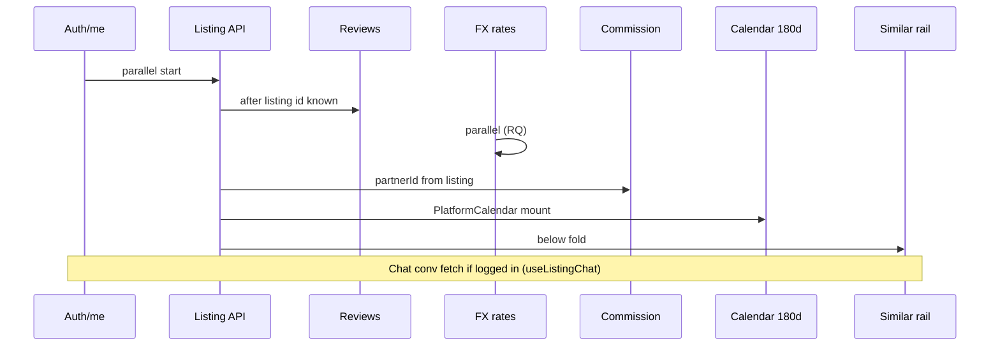
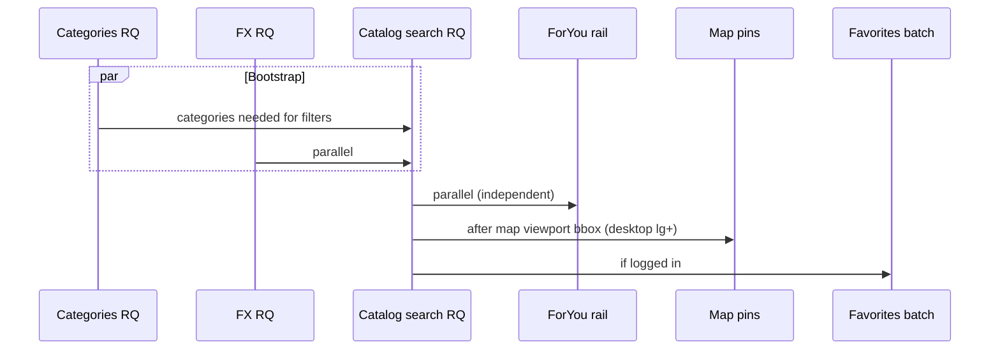
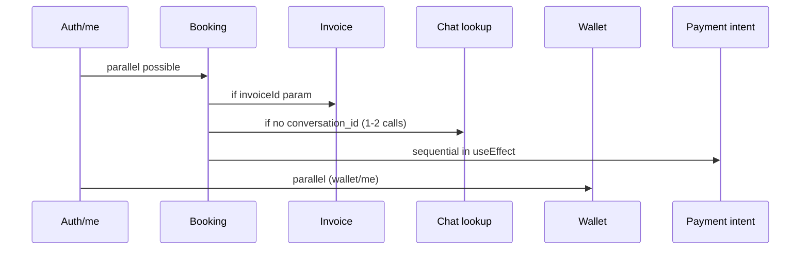

# Аудит data fetching: главная, каталог, PDP, checkout

**Дата:** 2026-07-15  
**Область:** `/`, `/listings`, `/listings/[id]`, `/checkout/[bookingId]`  
**Статус:** диагностика и целевая архитектура; **код не менялся**  
**Связанные аудиты:** [RSC / client bundle](AUDIT_RSC_OPTIMIZATION.md), [iOS PWA](AUDIT_IOS_PWA_PERFORMANCE.md)

---

## 1. Executive summary

Платформа использует **гибрид «тонкий RSC для SEO + тяжёлый client island для интерактива»**, но **без моста server → client** (нет `HydrationBoundary`, нет передачи prefetched payload в page). В результате:

| Проблема | Где | Impact |
|----------|-----|--------|
| **Double fetch listing** | PDP layout (Supabase admin) + client `/api/v2/listings/[id]` | +1 round-trip, skeleton до hydration |
| **Double/triple search** | Каталог: metadata count + ItemList JSON-LD + client `useListingsFetch` | +2–3 search на cold load |
| **Zero server data on checkout** | `checkout/[bookingId]` — 100% client | TTFB лёгкий, но TTI ждёт JS + waterfall |
| **Главная без SSR данных** | `app/page.js` — только Suspense shell | LCP ждёт categories + featured search |
| **Нет RQ dehydrate** | Все 4 маршрута | Prefetch с сервера / hover не переиспользуется как initialData |
| **Параллельные «сырые fetch»** | reviews, commission, rails, wallet | Вне TanStack Query — нет dedupe, сложнее streaming |

**P0 (Airbnb-style baseline):** PDP RSC shell + единый bootstrap payload; каталог — server prefetch первой страницы + dehydrate; checkout — server guard + booking snapshot; главная — server featured + categories в RSC.

---

## 2. Инвентарь паттернов (текущий канон)

| Паттерн | Где используется | Оценка |
|---------|------------------|--------|
| `React.cache` + Supabase admin | `lib/seo/listing-layout-data.js` (PDP layout/metadata) | ✅ dedupe внутри одного request |
| `React.cache` на каталоге | ❌ нет | metadata / ItemList / client search независимы |
| TanStack Query | categories, fx, catalog search, listing detail (частично), calendar | ✅ SSOT для client cache |
| `queryClient.prefetchQuery` | `useListingDetailPrefetch` (hover/touch с каталога) | ✅, но без server-side dehydrate |
| `HydrationBoundary` / `dehydrate` | ❌ не найдено в репозитории | критический gap |
| `Suspense` + RSC streaming | `/` (fallback skeleton), PDP `loading.js` | ⚠️ skeleton есть, **данные не streamятся** |
| Raw `fetch` в `useEffect` | reviews, commission, ForYou/Similar rails, checkout wallet, chat | ⚠️ legacy islands |

---

## 3. Глобальный baseline (все 4 страницы)

Каждая страница монтирует **root layout client providers** (`app/layout.js`):

```
AppQueryProvider → AuthProvider → I18nProvider → CurrencyProvider → GeoProvider
  → ChatProvider → PresenceProvider → AppHeader → … → page
```

### 3.1. Запросы до mount page-компонента

| # | Источник | Endpoint / действие | Условие | Кэш |
|---|----------|---------------------|---------|-----|
| G1 | `AuthProvider` / `useAuthSessionSync` | `GET /api/v2/auth/me` | всегда | localStorage `gostaylo_user` (optimistic UI) |
| G2 | `ChatProvider.refresh` | `GET /api/v2/chat/conversations` (enriched) | logged-in, не `/messages*` | in-memory |
| G3 | Realtime | Supabase channels (conversations + messages) | logged-in, не inbox defer | — |
| G4 | `GeoProvider` | geo / whoami (если включено) | по конфигу | — |
| G5 | SW / PWA | precache chunks | PWA install | — |

**Вывод:** гость на cold load ≈ **1 обязательный API** (`auth/me`). Авторизованный гость ≈ **2–3 API** до page-specific logic.

### 3.2. TanStack Query defaults (`lib/query-client.js`)

- `staleTime`: 5 min (global), per-query overrides (fx 2h, categories 5 min)
- `refetchOnWindowFocus`: **true** (fx, многие queries) — на iOS PWA даёт лишние refetch
- `refetchOnMount`: false — хорошо для prefetched data **если** data уже в cache

---

## 4. `/listings/[id]` — PDP

### 4.1. Текущая архитектура

```
Request
├── generateMetadata()          → getCachedListingForGuestGate(id)     [React.cache]
├── ListingLayout (RSC)
│   ├── getCachedActiveListingForLayout(id) → cache hit same row
│   ├── getCommissionRate()
│   └── ListingSchema JSON-LD
└── page.js ('use client')      → useListingViewData + booking + chat
```

**Server data не передаётся в `page.js`.** Layout использует урезанный `LISTING_LAYOUT_SELECT`; клиент тянет полный DTO через API.

### 4.2. Client waterfall (после hydration)



| # | Hook / component | Endpoint | RQ? | Blocking PDP paint? |
|---|------------------|----------|-----|---------------------|
| P1 | `useListingViewData` | `GET /api/v2/listings/[id]` | partial (manual setQueryData) | **да** (hero, title, price) |
| P2 | `useListingViewData.loadReviews` | `GET /api/v2/reviews?listing_id=` | ❌ | нет (below fold) |
| P3 | `useFxRatesQuery` | `/api/v2/exchange-rates` (+ LS) | ✅ | нет (placeholder THB:1) |
| P4 | `useCommission` | `GET /api/v2/commission?partnerId=` | ❌ | блокирует price calc до load |
| P5 | `useListingPublicCalendarQuery` | public calendar API | ✅ | calendar widget |
| P6 | `useListingAvailabilityQuery` | availability/pricing | ✅ | только при выбранных датах |
| P7 | `SimilarListingsRail` | `GET .../similar` | ❌ | нет |
| P8 | `useFavoriteState` | favorites API | partial | нет |
| P9 | `useListingChat` | chat conversations | ❌ | нет |
| P10 | `useRecentlyViewed` | POST listing-views (auth) | ❌ | нет |

### 4.3. Double-fetch matrix (PDP)

| Данные | Server (RSC) | Client | Дубль? |
|--------|--------------|--------|--------|
| Listing core row | ✅ Supabase admin (layout) | ✅ REST API | **да** (разные shape, не connected) |
| Commission | ✅ layout JSON-LD only | ✅ useCommission | частично |
| Reviews | ❌ | ✅ | — |
| Calendar | ❌ | ✅ | — |
| OG/metadata | ✅ generateMetadata | ❌ | — |

**React.cache работает только внутри одного HTTP request** (metadata + layout dedupe). **Client request — отдельный процесс**, cache не shared.

### 4.4. Prefetch с каталога (Stage 171.21–22)

`useListingDetailPrefetch` на hover/touch:

- `prefetchQuery(listing.detail)` → `fetchListingDetail`
- `prefetchQuery(listing.calendar)` → 120–180 days

**Эффект:** cold navigation с каталога может **пропустить skeleton** ( `readListingViewCacheSnapshot` ). Direct link / SEO crawl — **нет**.

### 4.5. Suspense / streaming сегодня

- `app/listings/[id]/loading.js` — route-level skeleton ✅
- Page — monolithic client; **нет** `<Suspense>` вокруг reviews/similar/calendar
- **Нет** RSC stream первого HTML с hero + price

### 4.6. Запросы до интерактивности (оценка)

| Сценарий | API count (page-specific) | До LCP hero | До booking widget ready |
|----------|---------------------------|-------------|-------------------------|
| Cold direct, guest | 4–5 (listing, reviews, fx, commission, calendar) | listing + images | + commission + calendar |
| From catalog (prefetch) | 2–3 (reviews, commission; listing cached) | instant if cache | + commission + calendar |
| Logged-in | +1–3 (chat, favorites, listing-views) | same | same |

---

## 5. `/listings` — каталог

### 5.1. Текущая архитектура

```
Request
├── generateMetadata()
│   ├── fetchCategoriesSeoSnapshot()
│   └── fetchListingsCountForCatalogSeo(searchParams)   [optional, category scoped]
├── ListingsCatalogItemListSchema (RSC)
│   └── fetchListingsForCatalogItemList → runListingsSearchGet (limit 18)
└── ListingsCatalogClient ('use client')
    └── useListingsFetch → fetchCatalogSearch → GET /api/v2/listings/search
```

### 5.2. Server-side search calls (один HTTP request)

| # | Caller | Search engine | Limit | Зависит от query |
|---|--------|---------------|-------|------------------|
| S1 | `fetchListingsCountForCatalogSeo` | Supabase count | head | только если `category` ≠ all |
| S2 | `fetchListingsForCatalogItemList` | `runListingsSearchGet` | 18 | всегда (featured fallback) |
| S3 | `generateMetadata` categories | `/api/v2/categories` snapshot | all | всегда |

**S2 и client search часто совпадают по intent**, но **не share cache** → типичный double search.

### 5.3. Client waterfall



| # | Hook | Endpoint | Условие |
|---|------|----------|---------|
| C1 | `usePublicCategoriesQuery` | `GET /api/v2/categories` | всегда |
| C2 | `useFxRatesQuery` | exchange-rates | всегда |
| C3 | `useListingsFetch` | `GET /api/v2/listings/search` | всегда; **+fallback search** если dates mismatch |
| C4 | `ForYouRail` | `GET /api/v2/recommendations/for-you` | всегда (raw fetch) |
| C5 | `useMapPinsFetch` | map-pins API | desktop map, bbox ready |
| C6 | `useFavoritesBatch` | favorites | logged-in |
| C7 | user bookings | `GET /api/v2/bookings?renterId=` | logged-in (map highlights) |

### 5.4. Double-fetch matrix (каталог)

| Данные | Server | Client | Дубль? |
|--------|--------|--------|--------|
| Categories | metadata snapshot | usePublicCategoriesQuery | **да** (разные code paths) |
| Search results (first page) | ItemList JSON-LD (18) | useListingsFetch (12–100) | **да** (если query совпадает) |
| Listing count SEO | Supabase count | meta.total из search | частично |
| Map pins | ❌ | client | — |

### 5.5. Suspense / streaming

- `ListingsCatalogClient` обёрнут в `<Suspense>` в `page.js` export? → client page, Suspense только для `useSearchParams` inner pattern
- `ListingsCatalogSkeleton` — client-side pending state
- **Нет** server-streamed listing grid

### 5.6. Запросы до интерактивности

| Сценарий | Server searches | Client API (page) | До first card paint |
|----------|-----------------|-------------------|---------------------|
| Cold, default query | 1–2 (ItemList + maybe count) | 3–4 (auth, cat, fx, search) | client search completes |
| Cold + category filter | 2–3 | 4–5 | same |
| Desktop + map | +0 server | +1 map-pins after bbox | map lazy chunk + pins |
| Logged-in | same | +2 (favorites, bookings) | same |

---

## 6. `/` — главная

### 6.1. Текущая архитектура

```javascript
// app/page.js — server shell only
<Suspense fallback={<HomePageSkeleton />}>
  <PlatformHomeContent />  // 'use client'
</Suspense>
```

**Нет `generateMetadata` override, нет server fetch.** Suspense не streamит данные — только client component.

### 6.2. Client waterfall (`usePlatformHomePage`)

| # | Hook / component | Endpoint | Blocking hero? |
|---|------------------|----------|--------------|
| H1 | `usePublicCategoriesQuery` | categories | **да** (`loading` gate) |
| H2 | `useQuery` featured | `GET /api/v2/search?featured=true&limit=12` | **да** (grid) |
| H3 | `useFxRatesQuery` | exchange-rates | нет |
| H4 | `useHomeLiveCountQuery` | search meta count | только если dates selected |
| H5 | `TrustBar` | `GET /api/v2/public/stats` | нет (skeleton) |
| H6 | `ForYouRail` | recommendations/for-you | нет |
| H7 | `RecentlyViewedRail` | localStorage + optional resolve API | нет |

**`loading` = categories pending OR featured pending** → весь hero/top grid ждёт оба.

### 6.3. Double-fetch vs каталог

| Данные | Home | Catalog | Shared RQ key? |
|--------|------|---------|----------------|
| Categories | `queryKeys.public.categories()` | same | ✅ cross-page |
| Featured/search | `queryKeys.home.featured(...)` | `queryKeys.catalog.search(...)` | ❌ different keys |
| FX | shared | shared | ✅ |

Navigate home → catalog: categories **cache hit**; search **miss** (новый query).

### 6.4. Запросы до интерактivity

| Сценарий | API count | Notes |
|----------|-----------|-------|
| Cold guest | 5–6 (auth, cat, featured, fx, stats, for-you) | hero blocked on cat+featured |
| Return visit (RQ warm) | 1–2 (auth, maybe featured refetch) | staleTime 5 min |
| Dates in hero | +1 live count search | debounced filters |

---

## 7. `/checkout/[bookingId]`

### 7.1. Текущая архитектура

- **`page.js` — 100% client**, no layout server fetch
- `useCheckoutPayment` orchestrates hooks

### 7.2. Waterfall (критично — mostly sequential)



| # | Hook | Endpoint | Sequential? |
|---|------|----------|-------------|
| K1 | auth | `/api/v2/auth/me` | global |
| K2 | `loadPaymentStatus` | `GET /api/v2/bookings/[id]` | **first** |
| K3 | invoice | `GET /api/v2/chat/invoice?id=` | after K2, if param |
| K4 | conversation lookup | 1–2 chat calls | after K2, if needed |
| K5 | `loadWalletState` | `GET /api/v2/wallet/me` | parallel with K2 |
| K6 | `loadPaymentIntent` | `GET .../payment-intent` | **after K2** |
| K7 | `useFxRatesQuery` | exchange-rates | parallel |

**`loading` true until K2 completes.** Payment methods need K6 → **TTI payment CTA ≈ K2 + K6 latency**.

### 7.3. TanStack Query gap

Booking, wallet, payment-intent — **raw fetch**, not RQ. Back navigation to checkout = full refetch.

### 7.4. Запросы до интерактивности

| Сценарий | Min API | До pay button ready |
|----------|---------|---------------------|
| Simple checkout | 4 (auth, booking, wallet, intent) | booking + intent |
| + invoice param | 5 | + invoice |
| + chat conv hunt | 6–7 | non-blocking for pay |

---

## 8. Сводная таблица double-fetch

| Route | Server fetch | Client duplicate | Severity |
|-------|--------------|------------------|----------|
| PDP | listing row (layout) | `/api/v2/listings/[id]` | **P0** |
| PDP | commission (JSON-LD) | `/api/v2/commission` | P1 |
| Catalog | ItemList search | client search | **P0** |
| Catalog | categories (metadata) | categories RQ | P1 |
| Home | — | — | n/a (no server data) |
| Checkout | — | — | n/a (opportunity, not duplicate) |

---

## 9. Целевая архитектура (Airbnb-style)

Принципы:

1. **Server owns first paint** — HTML содержит реальный контент (hero, first page, checkout summary).
2. **One bootstrap per route** — один aggregated read на сервере или один BFF endpoint; не 4–6 parallel REST с клиента.
3. **Hydrate TanStack Query** — `dehydrate(queryClient)` → `HydrationBoundary` для seamless client takeover.
4. **Client islands** — booking calendar, map, chat, payment widgets только там, где нужна интерактивность.
5. **Streaming Suspense** — ниже fold (reviews, similar, for-you) в отдельных async RSC или lazy client с placeholder.

### 9.1. PDP — target

```
app/listings/[id]/
├── layout.js          # metadata + JSON-LD (keep React.cache)
├── page.js (RSC)
│   ├── getListingPdpBootstrap(id)  [React.cache, single service]
│   │   ├── listing DTO (same shape as API)
│   │   ├── commission snapshot
│   │   └── reviews page 1 (optional)
│   ├── dehydrate listing + commission (+ reviews) into QueryClient
│   └── <HydrationBoundary>
│         ├── <ListingHeroGallery server props / RSC images>
│         ├── <ListingDetailsStatic />        # RSC
│         ├── <ListingBookingIsland client /> # calendar, dates, pricing
│         └── <Suspense><SimilarListingsAsync/></Suspense>
```

**API surface:**

- Новый server helper: `lib/listing/get-listing-pdp-bootstrap.js` — wraps existing API service layer (not duplicate SQL in page).
- Client `useListingViewData` → **`useQuery` only** (remove manual useState sync); reviews → RQ query `queryKeys.listing.reviews(id)`.
- `useCommission` → migrate to RQ with key `queryKeys.commission(partnerId)` prefetched from server.

**Prefetch path:** catalog hover prefetch remains; server navigation adds dehydrate → **same query keys**.

### 9.2. Catalog — target

```
app/listings/page.js (RSC)
├── parseSearchParams(sp)
├── getCatalogBootstrap(sp)  [React.cache]
│   ├── categories (once)
│   └── search page 1 (same engine as client key)
├── generateMetadata reuses getCatalogBootstrap (no extra count query)
├── ItemList from bootstrap.listings (no second search)
└── <HydrationBoundary state={dehydrated}>
      <ListingsCatalogClient initialSp={sp} />
```

**Client changes:**

- `useListingsFetch` — `initialData` from hydration; `placeholderData: keepPreviousData` on filter change only.
- `ForYouRail` → RQ + lazy `dynamic(..., { ssr: false })` below fold.
- Desktop map: defer `useMapPinsFetch` until `IntersectionObserver` or `requestIdleCallback`; reuse listing lat/lng from search until pins load.

**Metadata optimization:** replace standalone `fetchListingsCountForCatalogSeo` with `bootstrap.meta.total` when search runs anyway.

### 9.3. Home — target

```
app/page.js (RSC)
├── getHomeBootstrap()
│   ├── categories
│   └── featured default (limit 12)
└── <HydrationBoundary>
      <PlatformHomeContent />  # slim client — interactivity only
```

**Client:**

- Remove `loading` gate on categories+featured when hydrated.
- `TrustBar`, `ForYouRail` — async RSC wrappers or `@defer` client lazy after LCP.
- Hero search remains client; live count stays debounced RQ.

### 9.4. Checkout — target

```
app/checkout/[bookingId]/
├── layout.js (RSC) — auth guard redirect server-side
└── page.js (RSC)
    ├── getCheckoutBootstrap(bookingId, user) — 403 if not renter
    │   ├── booking + listing summary
    │   ├── payment status + allowed methods (merge intent preview)
    │   └── wallet snapshot (if authed)
    └── <HydrationBoundary>
          <CheckoutPaymentIsland />  # initiate/confirm only
```

**Sequential fix:** merge `booking + payment-intent preview` into **one server service** (`CheckoutService.getPaymentShell`) — client K6 disappears on first paint.

**Security:** server bootstrap must enforce renter ownership before rendering amounts (client-only `evaluateAccess` — insufficient for SSR secret fields).

---

## 10. TanStack Query — target keys (SSOT)

| Query key | Server prefetch | Client consumer |
|-----------|-----------------|-----------------|
| `queryKeys.public.categories()` | home, catalog | home, catalog, filters |
| `queryKeys.catalog.search(params)` | catalog page | `useListingsFetch` |
| `queryKeys.home.featured(params)` | home page | `usePlatformHomePage` |
| `queryKeys.listing.detail(id)` | PDP, catalog prefetch | PDP, cards |
| `queryKeys.listing.reviews(id)` | PDP optional | PDP |
| `queryKeys.listing.calendar(id, opts)` | PDP prefetch | PlatformCalendar |
| `queryKeys.commission(partnerId)` | PDP | booking pricing |
| `queryKeys.checkout.shell(bookingId)` | checkout | checkout page |
| `queryKeys.fx.rates({ retail })` | optional inline in bootstrap | all surfaces |

Implement helper: `lib/query-prefetch/dehydrate-route.js` — creates server `QueryClient`, prefetches, returns `{ dehydratedState }`.

---

## 11. Streaming / Suspense — target map

| Section | Strategy |
|---------|----------|
| PDP hero + title + price | RSC sync in first chunk |
| PDP reviews | `<Suspense fallback={ReviewsSkeleton}>` async RSC or client RQ lazy |
| PDP similar | below fold lazy |
| PDP calendar | client island; show cached month skeleton from prefetch |
| Catalog grid | RSC first 12 cards HTML + hydrate interactivity (favorites, hover prefetch) |
| Catalog map | client dynamic import; pins after idle |
| Home featured grid | RSC HTML + hydrate |
| Home for-you / trust | separate Suspense boundaries |
| Checkout summary | RSC sync; payment methods client after hydrate |

---

## 12. Phased rollout

| Phase | Scope | Outcome |
|-------|-------|---------|
| **P0.1** | PDP RSC `page.js` + bootstrap + dehydrate listing | eliminate layout/client double fetch |
| **P0.2** | Catalog bootstrap + single search | eliminate ItemList + client duplicate |
| **P0.3** | Checkout server bootstrap + auth guard | −2 sequential round-trips |
| **P1.1** | Home bootstrap (categories + featured) | faster LCP, lower TTFB perception |
| **P1.2** | Migrate reviews, commission, rails to RQ | dedupe, DevTools visibility |
| **P1.3** | `React.cache` wrapper `getCatalogBootstrap` shared by metadata + page | −1 categories fetch |
| **P2** | Below-fold RSC Suspense; map idle defer; fx inline in bootstrap | polish Web Vitals |
| **P2** | `refetchOnWindowFocus: false` on fx/search for PWA | iOS battery / data |

---

## 13. Метрики успеха (Definition of Done)

| Metric | Current (est.) | Target |
|--------|----------------|--------|
| PDP API calls before LCP (guest, direct) | 4–5 | **1** (+ images) |
| Catalog API calls before first card | 3–4 client + 1–2 server | **1** client (+ server merged) |
| Home blocking queries | 2 (cat + featured) | **0** (hydrated) |
| Checkout sequential waterfall depth | 2 (booking → intent) | **0** (merged bootstrap) |
| HydrationBoundary usage | 0 routes | **4 routes** |
| Double listing/search fetch | yes | **no** |

**Measure:** Chrome DevTools Network (Disable cache), WebPageTest mobile, `performance.mark` around `useListingViewData` / catalog search / checkout load — см. Sprint 0 в [AUDIT_IOS_PWA_PERFORMANCE.md](AUDIT_IOS_PWA_PERFORMANCE.md).

---

## 14. Файлы-якоря (текущая реализация)

| Concern | Path |
|---------|------|
| PDP layout cache | `lib/seo/listing-layout-data.js` |
| PDP client load | `hooks/useListingViewData.js`, `lib/catalog/fetch-listing-detail.js` |
| Catalog server ItemList | `lib/seo/listings-catalog-itemlist.js` |
| Catalog client search | `lib/hooks/useListingsSearch.js`, `lib/catalog/fetch-catalog-search.js` |
| Catalog metadata | `lib/seo/listings-catalog-metadata.js` |
| Home logic | `hooks/home/use-platform-home-page.js`, `lib/home/fetch-home-featured.js` |
| Checkout waterfall | `app/checkout/[bookingId]/hooks/useCheckoutLoadState.js`, `useCheckoutPayment.js` |
| RQ provider | `components/providers/app-query-provider.jsx` |
| Catalog → PDP prefetch | `lib/hooks/use-listing-detail-prefetch.js` |
| Global auth fetch | `contexts/auth/auth-session-sync.js`, `lib/auth.js` |

---

*Документ подготовлен как SSOT для Phase «Data fetching modernization»; изменения API/поведения при имплементации потребуют апдейта `docs/TECHNICAL_MANIFESTO.md` и `docs/ARCHITECTURAL_PASSPORT.md`.*
