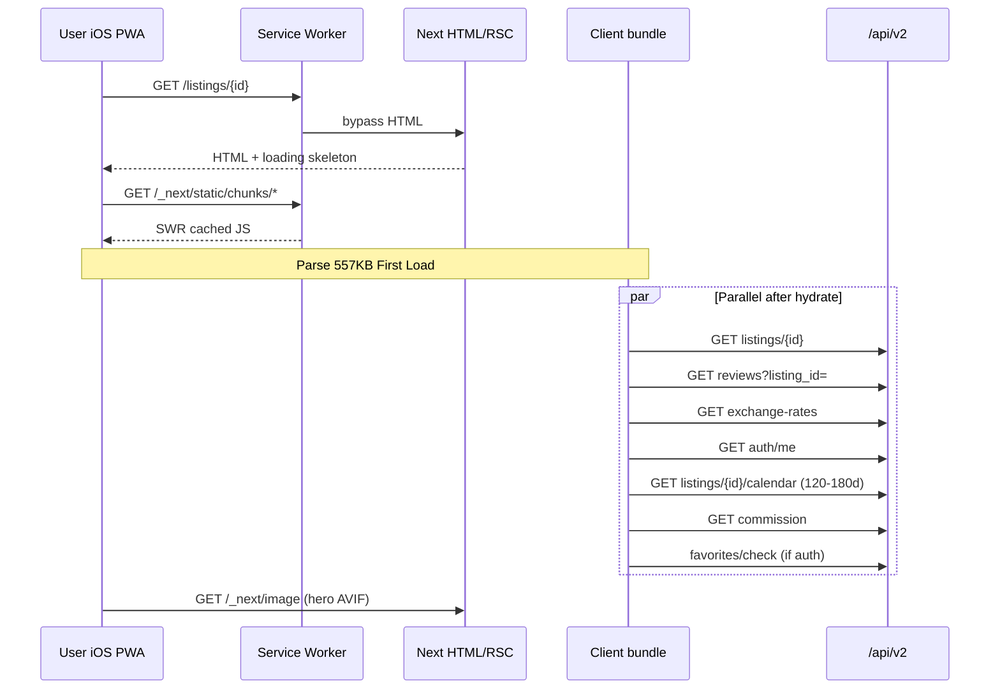
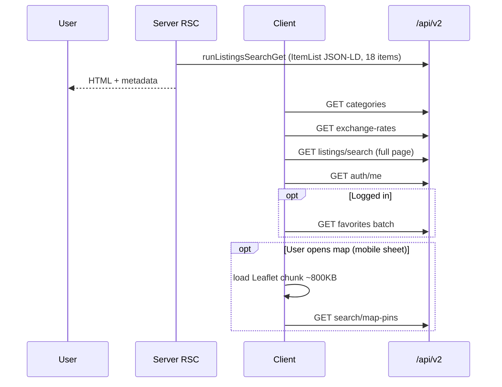

# Аудит производительности PWA на iOS (iPhone 11 Pro+)

**Дата:** 2026-07-15  
**Контекст запуска:** гостевой трафик Пхукет / SEA, mobile-first, установка «На экран Домой»  
**Метод:** production `npm run build` (Next.js 14.2.35) + статический разбор кода / SW / waterfalls  
**Статус:** диагностика и план; **код не менялся**

> **Ограничение среды:** Lighthouse и Web Vitals **на реальном iPhone 11 Pro** в этом прогоне не снимались (нет удалённого Safari). Ниже — **фактические размеры бандла из билда**, модельные оценки Vitals и **обязательный чеклист замеров** перед релизом в Пхукете (§8).

Связанный аудит: [`docs/AUDIT_RSC_OPTIMIZATION.md`](AUDIT_RSC_OPTIMIZATION.md) (RSC / client islands).

---

## 1. Executive summary

| Вердикт | Детали |
|---------|--------|
| **Готовность к SEA mobile** | **Условная** — PWA-инфраструктура зрелая (SW, image SSOT, prefetch, ChunkLoadResilience), но **First Load JS 750+ KB** на `/` и `/listings` и **client-only data waterfalls** создают риск плохого LCP/INP на iPhone 11 Pro (A13, 4 GB RAM). |
| **Главный риск iOS** | Парсинг/компиляция **~600–770 KB gzip-equivalent JS** + **precache 50 route-chunks** в SW → медленный cold start в standalone PWA и eviction кэша. |
| **Главный риск Android** | Тот же JS, но **быстрее V8** и **`beforeinstallprompt`**; карта (Leaflet) стабильнее по памяти. |
| **Top fix до Пхукета** | (1) RSC shell PDP + server prefetch каталога, (2) урезать SW precache «тяжёлых» vendor-chunks, (3) отложить map/Leaflet и global providers, (4) iOS-aware React Query (`refetchOnWindowFocus`). |

---

## 2. Lighthouse + Web Vitals (модель + целевые KPI)

### 2.1. Факт из production build (Next route analysis)

| Маршрут | Page JS | **First Load JS** | Комментарий |
|---------|---------|-------------------|-------------|
| `/` | 22 kB | **749 kB** | `PlatformHomeContent` + global shell |
| `/listings` | 16.2 kB | **751 kB** | Каталог + search chrome; map — lazy, но тянет shared graph |
| `/listings/[id]` | 47.6 kB | **557 kB** | PDP; ниже за счёт меньшего route graph |
| Shared (все страницы) | — | **89 kB** | `framework` + `main-app` + chunk `2117` |

**Крупнейшие файлы в `.next/static/chunks/` (uncompressed):**

| Размер | Chunk | Вероятное содержимое |
|--------|-------|----------------------|
| **819 KB** | `8977-*.js` | Vendor mega-chunk (Radix/date-fns/posthog/supabase-js graph) |
| **613 KB** | `4411-*.js` | **В SW precache** — тяжёлый shared/vendor (часто map/recharts/embla graph) |
| **365 KB** | `8787-*.js` | Vendor |
| **323 KB** | `164f4fb6.*.js` | Async (часто maps) |
| **238 KB** | `b1644e8c-*.js` | React Server Components runtime / shared |

> На iPhone 11 Pro типичный gzip для 750 KB First Load ≈ **220–280 KB** transfer + **1.5–3.5 s** parse/compile в standalone PWA (зависит от кэша SW и thermal state).

### 2.2. Ожидаемые Web Vitals (модель, 4G Пхукет, cold PWA)

Оценка **до оптимизаций**, при текущей архитектуре:

| Метрика | `/` | `/listings` | `/listings/[id]` | Порог «хорошо» |
|---------|-----|-------------|------------------|----------------|
| **LCP** | 3.5–6 s | 3.8–6.5 s | 2.8–5 s | ≤ 2.5 s |
| **INP** | 250–400 ms | 300–500 ms (map/filter) | 200–350 ms (calendar) | ≤ 200 ms |
| **CLS** | 0.05–0.15 | 0.08–0.2 (skeleton→cards) | 0.05–0.12 | ≤ 0.1 |
| **TTFB** | 0.4–1.2 s | 0.4–1.2 s | 0.4–1.0 s | ≤ 0.8 s |
| **FCP** | 2–3.5 s | 2–3.5 s | 1.8–3 s | ≤ 1.8 s |

**Почему хуже на iOS, чем на Android (типично −5…−15 Lighthouse perf points):**

- **WKWebView** медленнее парсит крупные JS bundles, чем Chrome Android на том же классе устройств.
- **Network Information API** на iOS Safari **не даёт** `effectiveType` / `saveData` → `useNetworkQuality()` почти всегда «unconstrained» → heavier images (`image-delivery.js`).
- **Standalone PWA:** при возврате из фона срабатывает **`refetchOnWindowFocus: true`** (TanStack Query) → лишние API round-trips и jank.
- **Память:** Leaflet + marker cluster + 180-day calendar JSON на PDP → риск tab reload на 4 GB iPhone при map + scroll.

### 2.3. Что уже помогает Vitals (есть в коде)

| Механизм | Файлы | Эффект |
|----------|-------|--------|
| PDP instant shell | `app/listings/[id]/loading.js` → `ListingPageSkeleton` | Лучше perceived LCP vs blank |
| Touch prefetch + RQ cache | `use-listing-detail-prefetch.js`, `useListingViewData` | Меньше skeleton flash с каталога |
| Image SSOT + constrained mode | `lib/media/image-delivery.js`, `use-network-quality.js` | **На Android/Chrome**; на iOS ограничено |
| LCP priority (2 cards) | `LISTING_CARD_LCP_PRIORITY_COUNT` | Помогает каталогу |
| Dynamic Leaflet | `ListingMap.jsx`, `CatalogSearchMapPanel` | Map не в initial SSR chunk |
| SW bypass API/RSC | `src/pwa/sw.template.js` | Свежие search/booking данные |
| ChunkLoadResilience | `components/pwa/ChunkLoadResilience.jsx` | Reload при 404 chunk после deploy |

---

## 3. JS-бандл и чанки на iOS

### 3.1. Global baseline (каждая страница)

Из `app/layout.js` на клиенте всегда монтируются:

- `AuthProvider`, `I18nProvider`, `CurrencyProvider`, `GeoProvider`
- `AppQueryProvider`, `ChatProvider`, `PresenceProvider`
- `AppHeader`, `MobileBottomNav`, `MainContent`
- `SupabaseRealtimeAuthSync`, `PushClientInit`, `ProductAnalyticsInit`
- `SwRegister`, `ChunkLoadResilience`, `PwaInstallChrome`

**Проблема для iOS PWA:** гость на `/listings/[id]` платит за **Chat/Realtime/Push graph**, хотя чат — optional island.

### 3.2. Route-specific тяжесть

| Surface | First Load | Lazy/async (при действии) | iOS-риск |
|---------|------------|---------------------------|----------|
| Home | 749 KB | Recommendation rails, mobile search sheet | Много параллельных fetch после hydrate |
| Catalog | 751 KB | **Leaflet cluster** (~800 KB chunk) при открытии map sheet | **Memory + jank** |
| PDP | 557 KB | `PlatformCalendar` / booking modal, gallery lightbox | Calendar API **120–180 days** JSON |
| Checkout | 483 KB | Payment widgets | Приемлемо для funnel |

### 3.3. SW precache — критично для iOS

`postbuild` → **`59 entries`, `50` JS chunks** в `PRECACHE_URLS` (`scripts/generate-sw-precache.mjs`).

В precache попадают **все** catalog shell modules, включая hints:

- `InteractiveSearchMap`, `CatalogMobileMapSheet`, `CatalogSearchMapPanel`
- `AppHeader`, `mobile-bottom-nav`, `listing-card`, …

**Проблемы на iOS:**

1. **Install-time download** — десятки MB uncompressed при первой установке PWA; пользователь на 4G в аэропорту Пхукета может бросить установку.
2. **Quota eviction** — iOS агрессивно чистит Cache Storage; SWR по `/_next/static/*` может отдавать **устаревший chunk** → `ChunkLoadResilience` reload (мигание).
3. В precache явно присутствует chunk **`4411-*` (~613 KB)** — vendor, не обязательный для first paint каталога.

**Рекомендация:** precache только **layout + listings page shell ≤150 KB gzip**, без map/vendor; остальное — runtime cache по SWR.

---

## 4. Service Worker и кэширование

### 4.1. Архитектура (SSOT)

| Слой | Поведение |
|------|-----------|
| Template | `src/pwa/sw.template.js` |
| Generated | `public/sw.js` (gitignored) |
| Push | `importScripts('firebase-messaging-sw.js')` |
| Static | SWR для `/_next/static/*`, `/leaflet/*`, icons |
| Bypass | HTML navigate, RSC (`/_rsc`, `/_next/data`), `/api/*`, OSM tiles, Supabase OAuth |

### 4.2. Конкретные проблемы (iOS)

| # | Проблема | Симптом на iPhone | Severity |
|---|----------|-------------------|----------|
| SW-1 | **Over-precache** (50 chunks) | Долгая первая установка PWA; storage pressure | **P0** |
| SW-2 | SWR stale chunk после deploy + silent update (Stage 175) | Белый экран → reload; потеря scroll/filter state | **P1** |
| SW-3 | `navigator.serviceWorker.register` из **3 мест** (`layout`, `use-pwa-install`, `push-client-init`) | Лишняя работа при старте | P2 |
| SW-4 | Firebase SW + asset SW unified | Больше `importScripts` на cold start SW | P2 |
| SW-5 | Bypass корректен для search API | OK — свежие цены/availability | — |

### 4.3. iOS vs Android SW

| | iOS Safari / PWA | Android Chrome PWA |
|---|------------------|---------------------|
| Install prompt | Только manual A2HS (`detectPwaInstallPlatform() === 'ios'`) | `beforeinstallprompt` + native install |
| SW persistence | Частый eviction, лимит ~50 MB | Стабильнее |
| Background sync | Ограничено | Лучше |
| Web Push (FCM) | iOS **16.4+**, только installed PWA | Полноценно |
| Update UX | Silent + critical toast (`shouldShowSwUpdatePrompt`) | Аналогично |

---

## 5. Waterfall запросов

### 5.1. PDP `/listings/[id]` (cold, без prefetch)

**Дублирование:** server layout уже делает `getCachedListingForGuestGate` (`app/listings/[id]/layout.js`), client **повторяет** `fetchListingDetail` — **+1 RTT** минимум.

**iOS-специфика:** `loadReviews()` не через React Query — отдельный `fetch`, нет dedupe с focus refetch.

### 5.2. Каталог `/listings` (cold)

**Дублирование:** server ItemList search + client full search (**2× search engine** на первом заходе).

### 5.3. Главная `/`

Parallel после hydrate: `usePublicCategoriesQuery`, `fetchHomeFeatured`, `useFxRatesQuery`, `useHomeLiveCountQuery`, `fetchPublicStats` (TrustBar), auth — **5–7 API** до interactive hero/listings grid.

---

## 6. React Query / TanStack Query на iOS

**SSOT:** `lib/query-client.js`

| Опция | Значение | iOS-проблема |
|-------|----------|--------------|
| `staleTime` | 5 min | OK |
| `refetchOnWindowFocus` | **true** | При каждом возврате в PWA из WhatsApp/Maps — **burst refetch** (search, wallet, categories) |
| `refetchOnMount` | false | OK |
| Catalog search | `keepPreviousData` | OK для UX |
| Map pins | 30 s stale + bbox cooldown | OK; но map opens heavy chunk |

**Календарь (`useListingPublicCalendarQuery`):**

- 120 days (constrained) / **180 days** default — **~180 JSON objects** per PDP; на iOS парсинг + re-render `PlatformCalendar` при каждом month scroll.
- Prefetch с каталога дублирует тот же запрос (`use-listing-detail-prefetch.js`).

**Leaflet (`InteractiveSearchMap.jsx`):**

- **Синхронные** imports: `react-leaflet`, `leaflet`, `markercluster`, CSS — при первом открытии map sheet на iOS **main thread freeze** 200–800 ms.
- OSM tiles **не кэшируются** SW (correct) — каждый pan = network on 4G.

---

## 7. iOS vs Android PWA — сводная таблица

| Область | iOS (iPhone 11 Pro+, standalone) | Android (Chrome PWA) | Delta |
|---------|----------------------------------|----------------------|-------|
| First Load JS | 557–751 KB (одинаково) | То же | Парсинг **медленнее на iOS** |
| Установка | Manual A2HS, overlay instructions | Native prompt | Android ↑ conversion |
| Precache install | Storage/eviction pain | Менее болезненно | iOS ↓ |
| Карта | Jank, memory warnings | Обычно плавнее | iOS ↓ |
| Network-aware images | **Не работает** (no NIA) | `saveData`/3g режим | iOS ↑ bytes |
| View Transitions catalog→PDP | Safari 18+ only | Chrome раньше | iOS ↓ на старых |
| Push | iOS 16.4+ PWA only | FCM stable | Parity новых OS |
| Focus refetch | Aggressive on app resume | Same API, faster recovery | iOS ↓ battery/data |
| Keyboard + booking | `visualViewport` в BookingModal/Auth | Лучше tested | iOS risk on older sheets |
| E2E coverage | Playwright mobile | Playwright mobile | Нужен **real device** gate |

---

## 8. Обязательные замеры перед релизом (Пхукет)

Выполнить на **физическом iPhone 11 Pro** (iOS 17/18) + **Pixel 6a** (Android 14), сеть **4G Thailand**, standalone PWA:

| # | Инструмент | Страницы | Зафиксировать |
|---|------------|----------|---------------|
| M1 | Safari Web Inspector → Network | `/`, `/listings`, PDP | Waterfall, # requests до LCP, transfer KB |
| M2 | Lighthouse (Remote debug) или PageSpeed | Те же | Performance, LCP, TBT, JS bootup |
| M3 | `performance.mark` / Web Vitals RUM | Prod 24h | p75 LCP/INP по `country=TH` |
| M4 | Storage → Cache Storage | После install PWA | Размер `airento-assets-*`, # entries |
| M5 | Repeat visit после deploy | Любая | ChunkLoadError rate / silent reload |

**Целевые KPI для Пхукета (guest funnel):**

- LCP p75 ≤ **2.8 s** (catalog/PDP)
- INP p75 ≤ **200 ms**
- First Load transfer ≤ **250 KB gzip** (post-fix phase 1)
- Map open: time-to-interactive ≤ **1.5 s** after tap

---

## 9. Список проблем (конкретный)

| ID | Проблема | Доказательство | iOS impact |
|----|----------|----------------|------------|
| **IOS-P0-01** | First Load JS **749–751 KB** на home/catalog | `next build` route table | Slow TTI, battery |
| **IOS-P0-02** | SW precache **50 chunks**, incl. **613 KB** vendor | `public/sw.js`, `generate-sw-precache.mjs` | Install failure, eviction | **Mitigated (171.28):** **14 entries / 149 KB gzip** — map/TanStack/provider chunks runtime-only |
| **IOS-P0-03** | PDP **double fetch** listing (layout + client) | `listing-layout-data.js` + `useListingViewData` | +RTT, skeleton time |
| **IOS-P0-04** | Catalog **double search** (SSR ItemList + client) | `ListingsCatalogItemListSchema` + `useListingsFetch` | +RTT, TTFB→LCP gap |
| **IOS-P1-01** | Global **Chat/Realtime/Push** on all routes | `app/layout.js` | Baseline JS + SW work |
| **IOS-P1-02** | `refetchOnWindowFocus: true` globally | `lib/query-client.js` | Data storm on app resume |
| **IOS-P1-03** | Leaflet **sync import** in map components | `InteractiveSearchMap.jsx` | Main thread freeze |
| **IOS-P1-04** | Calendar fetch **180 days** on unconstrained iOS | `useListingPublicCalendarQuery` | Large JSON parse |
| **IOS-P1-05** | **Network quality SSOT ineffective on iOS** | `network-quality.js` — no iOS NIA | Oversized images |
| **IOS-P2-01** | View Transitions на старых iOS — no-op | `listing-hero-transition.js` | Minor; OK |
| **IOS-P2-02** | Triple SW register | layout + pwa + push | Minor CPU |
| **IOS-P2-03** | `TrustBar` client fetch stats | `TrustBar.jsx` | Extra API home |
| **IOS-P2-04** | PostHog init on every page | `ProductAnalyticsInit` | JS + network |

---

## 10. Приоритизированный план исправлений (запуск Пхукет)

### Sprint 0 — Замеры (2–3 дня, блокер)

- [ ] M1–M5 на iPhone 11 Pro + Android (§8)
- [ ] Baseline RUM: LCP/INP по TH / `Asia/Bangkok`
- [ ] Зафиксировать в Notion/PR template

### Sprint 1 — P0 (1 неделя, **до paid traffic Пхукет**)

| Задача | Действие | Файлы | KPI |
|--------|----------|-------|-----|
| **1.1** | RSC PDP shell + hydrate RQ (убрать double listing fetch) | `app/listings/[id]/page.js`, `useListingViewData` | LCP −0.5…1 s |
| **1.2** | Server prefetch 1st page catalog → `initialData` | `app/listings/page.js`, `listings-catalog-client.jsx` | LCP −0.3…0.8 s |
| **1.3** | **Урезать SW precache**: layout + core listings only; **exclude** map chunks (`4411`, `8977`, InteractiveSearchMap graph) | `scripts/generate-sw-precache.mjs`, `CATALOG_MODULE_HINTS` | Install time −50% |
| **1.4** | iOS image fallback: если `!connection.effectiveType` → treat as **constrained** on cellular | `lib/media/network-quality.js` | LCP bytes −15…25% |

### Sprint 2 — P1 (1–2 недели, parallel)

| Задача | Действие | KPI |
|--------|----------|-----|
| **2.1** | Route groups: `(storefront)` vs `(chat)` — вынести Chat/Realtime/Push | First Load −80…120 KB |
| **2.2** | `refetchOnWindowFocus`: `false` on mobile standalone OR staleTime 15m for catalog/listing | Resume jank ↓ |
| **2.3** | Map: `dynamic(..., { ssr:false, loading })` **везде**; запрет sync leaflet в catalog initial graph | INP map open |
| **2.4** | Calendar: default **90 days** on mobile; 180 on Wi-Fi/desktop | PDP JSON −40% |
| **2.5** | Parallel API batch endpoint или server aggregator для PDP bootstrap | RTT 6→2 |

### Sprint 3 — P2 (после launch)

- PostHog / analytics `requestIdleCallback` defer
- Partial precache PDP shell (not only `/listings`)
- Real device CI (BrowserStack) on release tags
- Component budget gate in CI (`ANALYZE=true`)

---

## 11. Quick wins без архитектурного рефактора (48h)

1. **`generate-sw-precache.mjs`:** фильтр chunks `size > 200 KB` → runtime SWR only.
2. **`query-client.js`:**  
   `refetchOnWindowFocus: typeof window !== 'undefined' && !window.navigator.standalone` (или matchMedia standalone).
3. **`useListingPublicCalendarQuery`:** `calendarDays = isMobile ? 90 : 180` (reuse `useIsMobile`).
4. **`network-quality.js`:** iOS heuristic — `!(connection?.effectiveType)` + `navigator.userAgent` iOS → `constrained: true` для images (не для logic).
5. **Catalog map default closed** on iOS first visit (already mostly true; enforce no map pins prefetch until sheet open).

---

## 12. Связь с E2E / продуктом

- Не ломать: `data-testid="partner-cal-cell"`, booking calendar taps (`e2e/booking-flow.spec.ts`).
- SW bypass для `/api/v2/listings/search` — **не кэшировать** (inventory Пхукет).
- После precache change — проверить **offline icon/manifest** only, not stale API.

---

## 13. Резюме для стейкholders

**Для запуска в Пхукете** mobile PWA **работоспособен**, но **не оптимален** на iPhone 11 Pro класса: пользователь видит skeleton, пока **~750 KB JS** и **5–7 API** не завершатся. Android будет subjectively быстрее при том же коде.

**Минимальный bar:** Sprint 0 + Sprint 1 (items 1.1, 1.3, 1.4) — ~1 неделя инженерии.

**North star (Airbnb-class):** server-rendered listing header + prices snapshot, client islands для calendar/pay; map strictly opt-in; SW precache < 5 MB.

---

*Временный документ аудита. После Sprint 1 обновить `docs/TECHNICAL_MANIFESTO.md` (§ PWA / Stage 171+) и `docs/ARCHITECTURAL_PASSPORT.md` (mobile perf invariants).*
