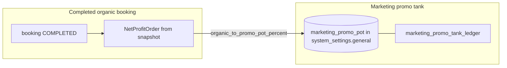
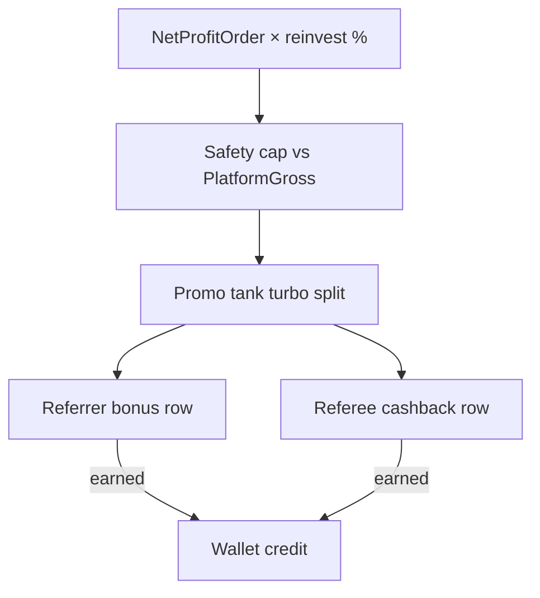
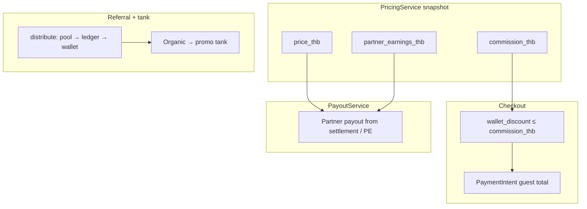

# Financial flow map (SSOT)

**Purpose:** single reference for how money moves between **PricingService**, **WalletService**, **ReferralPnlService** (promo tank + referral ledger), and **PayoutService**, with an explicit guarantee that **guest wallet discounts never reduce the partner’s earned share**.

**Related code:** `lib/services/pricing.service.js`, `lib/services/finance/wallet.service.js`, `lib/services/marketing/referral-pnl.service.js`, `lib/services/escrow/payout.service.js`, `app/api/v2/bookings/[id]/payment/initiate/route.js`, `lib/services/payment-intent.service.js`, `lib/services/booking/cancel-wallet-restore.service.js`, `app/api/v2/bookings/[id]/cancel/route.js`.

**Version:** Stage 71.7 | **Last updated:** 2026-04-27

---

## 0. Constants & SSOT (no duplicated fee math)

| Concern | Canonical source | Consumers |
|--------|-------------------|-----------|
| Guest/service fee %, tax, insurance reserve in pricing | `PricingService` + `pricing_snapshot` on booking | Checkout, escrow, referrals |
| Wallet caps (`welcome_bonus_amount`, `wallet_max_discount_percent`, referral reinvest %, split, promo tank) | `system_settings.general` via `PricingService.getGeneralPricingSettings()` | `WalletService.getWalletPolicy()`, `ReferralPnlService.getReferralSettings()`, admin UI |
| Split-fee numeric fallbacks when DB silent | `lib/config/platform-split-fee-defaults.js` (`PLATFORM_SPLIT_FEE_DEFAULTS`) | `PricingService` / commission helpers — **not** re-hardcoded in wallet/referral modules |
| Atomic wallet balance | DB `wallet_apply_operation` | `WalletService` only |

Referral P&L **re-reads** fee lines from **`pricing_snapshot`** / booking via `ReferralPnlService.deriveFeeBaseFromBooking` — it does not invent parallel commission percentages.

---

## 1. Booking price vs settlement (PricingService)

1. **At booking creation / snapshot:** `PricingService.calculateFeeSplit` / `calculateBookingPrice` produces guest-facing totals and persists **`pricing_snapshot`** on the booking (fee split v2, tax, insurance reserve, etc.).
2. **Stored booking columns used at checkout:**
   - `bookings.price_thb` — rental / service **subtotal** (host-facing tariff base).
   - `bookings.commission_thb` — **guest service fee** (platform margin line used as “platform fee” in checkout wallet cap).
   - `bookings.partner_earnings_thb` — **partner net** from pricing snapshot / fee split (not touched by wallet discount).

**Invariant:** Partner share is anchored in **`pricing_snapshot`** and **`partner_earnings_thb`**. Wallet logic **does not** mutate `price_thb` or `partner_earnings_thb` when applying bonuses.

---

## 2. Promo tank — вход (organic top-up)

**Where:** `ReferralPnlService.distribute(bookingId)` when the referee has **no** `referral_relations` row → organic path.

**Mechanism:** `applyOrganicTopup` computes a slice of **`netProfitOrderThb`** using `organic_to_promo_pot_percent` from settings, then calls **`adjust_marketing_promo_pot(+amount, 'organic_topup', { bookingId, metadata })`**.

---

## 3. Referral — распределение маржи (Referrer vs Referee)

**Trigger:** `ReferralPnlService.distribute` on **COMPLETED** booking when a **referral_relations** row exists for `renter_id`.

**Steps (simplified):**

1. **Fee base:** `deriveFeeBaseFromBooking` → `platformGrossRevenueThb`, `netProfitOrderThb` (after reserves / acquiring / operational — see `deriveNetProfitAfterVariableCosts`).
2. **Referral pool:**  
   `referralPoolRaw = netProfitOrderThb × (referral_reinvestment_percent / 100)`, then **clamped** by safety cap `≤ 95% × platformGrossRevenueThb`.
3. **Turbo:** `applyPromoBoost` may debit **`marketing_promo_pot`** and add boost per `referral_boost_allocation_rule` (`split_50_50` \| `100_to_referrer` \| `100_to_referee`).
4. **Split:**  
   - `referrerAmountThb = referralPoolThb × referral_split_ratio + referrerShareOfBoost`  
   - `refereeAmountThb = remainder + refereeShareOfBoost`
5. **Ledger:** `referral_ledger` rows (`bonus` / `cashback`) transition **pending → earned** in the same flow; **`WalletService.addFunds`** mirrors earned rows.

---

## 4. Checkout — расход кошелька (WalletService)

**Where:** `POST /api/v2/bookings/[id]/payment/initiate`.

**Applied to payment math:** only **`commission_thb`** is reduced when building the amount passed into **`PaymentIntentService`** — **not** `price_thb`, **not** `partner_earnings_thb`.

---

## 5. Главное неравенство: GuestDiscount ≤ PlatformFee

Let:

- \(P\) = **`price_thb`** (host tariff line — unchanged by wallet),
- \(F\) = **`commission_thb`** before wallet (guest platform fee line),
- \(W\) = **`wallet_discount_thb`** applied at initiate (THB actually debited from wallet, capped server-side),
- \(R\) = **`rounding_diff_pot`** (if present).

Server caps (see `payment/initiate` + `WalletService.getWalletPolicy`):

1. \(W \le\) available wallet balance.
2. \(W \le (P + F + R) \times \dfrac{\text{wallet\_max\_discount\_percent}}{100}\).
3. **Partner protection:** \(W \le F\).

Define **guest discount** as the reduction of what the guest pays toward platform fee: \(\Delta_{\text{guest,fee}} = \min(W, F) = W\) when (3) binds.

Then:

\[
\text{commission\_thb\_after} = F - W \ge 0 \quad\Leftrightarrow\quad W \le F.
\]

So **guest wallet discount cannot exceed the platform fee line** stored as `commission_thb`. **Host payout lines (`price_thb`, `partner_earnings_thb`) are unchanged** — **100% protection** of host-earned snapshot for this path.

---

## 6. Partner payouts (PayoutService / escrow)

**File:** `lib/services/escrow/payout.service.js`.

- Amounts derive from **`pricing_snapshot` / settlement**, **`partner_earnings_thb`**, **`price_thb`** — not from post-checkout wallet UI.
- Guest wallet spend only reduced the **guest’s** payable total via **`commission_thb`** on payment intent; it is **not** modeled as shrinking **`partner_earnings_thb`**.

---

## 7. Уведомления о сгорании welcome (5d / 1d)

**Cron:** `GET/POST /api/cron/wallet-welcome-expiry` → `runWalletWelcomeBonusCron` → `NotificationService.dispatch('WALLET_WELCOME_EXPIRING', …)`.

**Handler:** `handleWalletWelcomeExpiring` in `lib/services/notifications/marketing-events.js`:

- **Email:** `sendEmail` from notify-deps → **`NotificationService.sendEmail`** → **Resend** (`lib/services/notifications/email.service.js` / hub).
- **Telegram:** `sendTelegram(profile.telegram_id, …)` when `profiles.telegram_id` is set — **Bot API DM**.

Registry: `WALLET_WELCOME_EXPIRING` in `lib/services/notifications/notification-registry.js` (**`isAsync: false`** so delivery runs in cron context).

**UI:** `/profile/referral` shows a small banner when `welcome_bonus_remaining_thb > 0` and `welcome_bonus_expires_at` is in the future (data from **`GET /api/v2/wallet/me`**).

---

## 8. Стресс-тест: отмена брони после списания бонусов

**Правило продукта:** при отмене до финального захвата платежа бонусы, списанные на чекауте, возвращаются на кошелёк гостя; строки **`referral_ledger`** в статусе **`pending`** по этой брони аннулируются (**`canceled`**).

**Реализация (Stage 71.7):**

- **`restoreWalletSpendOnBookingCancel`** (`lib/services/booking/cancel-wallet-restore.service.js`) — идемпотентный кредит `booking_cancel_wallet_restore` с `reference_id = booking:{id}:wallet_cancel_refund`; затем **`restoreWelcomeSliceAfterCancelRefund`** для трекинга welcome-среза.
- **`POST /api/v2/bookings/[id]/cancel`** вызывает **`ReferralPnlService.cancelPendingLedgerForBooking`** после перевода брони в **CANCELLED**.
- **Важно:** строки referral для брони создаются в **`distribute`** только при **COMPLETED**; до завершения брони pending-строк часто **нет**. Аннулирование — защитный слой (в т.ч. если `distribute` прервался между `createPendingRows` и `markPendingAsEarned`).

**Эскроу-отмены** (`PAID_ESCROW` / …): возврат гостю идёт через **`LedgerService.postPartialRefundForBooking`**; отдельный возврат wallet из metadata для этих статусов **не дублируется** в том же виде — см. политику возврата в ADR при необходимости расширения.

---

## 9. End-to-end checklist

| Question | Answer (current design) |
|----------|-------------------------|
| Does wallet spend reduce `price_thb`? | **No.** |
| Does wallet spend reduce `partner_earnings_thb`? | **No.** |
| Which column is reduced for charging the guest less? | **`commission_thb`** (guest fee line) in payment intent path. |
| Is \(W \le F\)? | **Yes**, enforced in `payment/initiate`. |
| Cancel before capture + `wallet_discount_thb` in metadata? | **Wallet restored** + **pending referral rows canceled** (Stage 71.7). |

---

## 10. Diagram — full funnel (overview)

---

## 11. Audit conclusion (integrity)

- **Pricing / fee percentages:** single pipeline through **`PricingService`** + persisted **`pricing_snapshot`**; referrals read the same snapshot helpers.
- **Wallet caps:** **`system_settings.general`** via **`PricingService.getGeneralPricingSettings()`** — wallet and referral services do not hardcode commission %.
- **Wallet balance mutations:** only **`wallet_apply_operation`** (DB) via **`WalletService`**.
- **Promo tank:** only **`adjust_marketing_promo_pot`** RPC via **`ReferralPnlService.adjustMarketingPromoPot`**.

Если поведение расходится с этим документом — правка кода или документа в одном PR (**`AGENTS.md`**).
