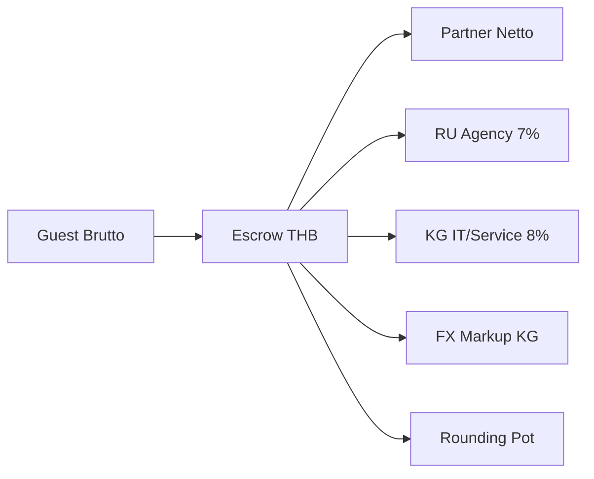

# GoStayLo — Financial Model v2.0 (Investor One-Pager)

**Stage 100 · ADR-097 · Soft launch ready**

## What we built

A **transborder rental Super-App** (RU acquisition → KG service/FX → TH supply) with an **immutable per-booking financial snapshot**, **double-entry ledger in THB**, and **batch treasury** (Mon/Thu payout pools).

## Unit economics (default profile)

| Line | % of subtotal | Entity | Investor view |
|------|---------------|--------|----------------|
| Guest service fee | 15% | Split | Platform take rate |
| → RU agency share | 7% | Russia | Agency margin (115-ФЗ safe) |
| → KG IT/service | 8% | Kyrgyzstan | **IT & support, not royalty** (see contract below) |
| FX markup | ~3% | KG | Separate GL + fiscal line |
| Host commission | 0–15% | TH partner | Deducted from Netto |
| Partner Netto | subtotal − host % | Thailand supply | Payable in batch |

**Guest Brutto** = subtotal + tax + guest fee + **rounding_pot** (integer THB).  
**Partner Netto** = subtotal − host commission (never includes hidden platform %).

## KG service contract (tax narrative)

The **8% Kyrgyzstan line** is booked and contracted as **«ИТ-услуги и техподдержка»** (software platform, APIs, escrow orchestration, support) — **not** as royalty or IP licensing. Under the current RF–KG treaty framing used by our advisors, this supports **0% withholding at source** on the service fee when documented correctly (agency + service agreement, acts, and registry wording). Ledger account `PLATFORM_FEE_KG_SERVICE` and fiscal line labels mirror this treatment.

Full technical and legal SSOT: **[ADR-097 — Financial Model v2.0](./ADR/097-financial-model-v2.md)** (§ fiscal, § fee split, § treasury).

## Compliance & transparency

- **Pricing profiles** in DB — no magic numbers in code.
- **Ledger split**: `PLATFORM_FEE_RU_AGENT`, `PLATFORM_FEE_KG_SERVICE`, `FX_MARKUP_REVENUE_KG`, `PROCESSING_POT_ROUNDING`.
- **54-ФЗ**: one receipt «Полный расчёт» at payment; transit `agent_sign=5`; KG OsOO name + RU INN in supplier tag.
- **Internal split (7/8/3)** visible only in admin/compliance — guests/partners see **Brutto/Netto only**.

## Treasury

- Escrow → thaw → **24h partner hold** → **READY_FOR_PAYOUT** → **payout_batches** (Mon/Thu) → bank/crypto CSV export.
- Partner UI: «Разморозка (24 ч)» then «Доступно к выводу» — same rule as cron `promote-ready-for-payout`.
- RUB columns on ledger for accountant exports.

## Operational USDT buffer (instant host liquidity)

For **time-sensitive Thailand supply** (check-in today, transport, disputes resolved in favor of host), the treasury maintains an **operational USDT buffer** on controlled wallets — not guest-facing balance. Purpose:

- **Instant micro-payouts** to hosts when batch rails (Mon/Thu T-Bank / registry) are too slow for UX promises.
- **Replenishment** from batch settlement and FX desk policy (KG entity), keeping platform float within board-approved limits.
- **Separation from guest escrow:** buffer spends are ledger-tagged; they do not mix with `PAID_ESCROW` guest funds.

Investor framing: batch payouts = **unit economics at scale**; USDT buffer = **conversion and NPS insurance** with capped operational risk.

## Why it matters for fundraising

1. **Reproducible P&L** — any booking = fixed `pricing_snapshot.v2.final_breakdown`.
2. **Jurisdiction clarity** — RU agency vs KG service vs TH supply, not a single “commission” blob.
3. **Operational scale** — batch payouts vs micro-transfers per booking.
4. **Audit trail** — ledger journals + fiscal status (`ISSUED` / `PENDING_FISCAL` / sandbox).

## Soft launch switches

| Flag | Effect |
|------|--------|
| `PRICING_ENGINE_V2=true` | PricingEngine + 1 THB rounding + snapshot v2 |
| `FISCAL_SANDBOX=true` | Mock receipts until OFD provider live |

## Pre-launch (Stage 100)

- Checklist: **`docs/PRE_LAUNCH_CHECKLIST.md`** · smoke: **`docs/FINANCIAL_SMOKE_E2E.md`** · plan: **`docs/SOFT_LAUNCH_PLAN.md`**.
- **Checkout attestation v2 locked:** `final_breakdown` + 1 THB rounding when `PRICING_ENGINE_V2=true`.
- Production OFD (`FISCAL_PROVIDER_URL`, sandbox off).
- First **~20 users** soft launch — sign-off per checklist §11.

## Roadmap (post soft launch)

- Investor dashboard from ledger + compliance API.
- Expand USDT buffer policy automation (limits, daily reconcile).

---

*SSOT: `docs/ADR/097-financial-model-v2.md`, migration `053_financial_model_v2.sql`, `lib/pricing-engine/`.*
