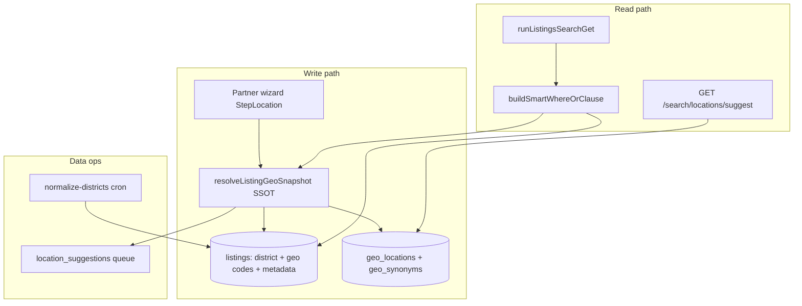

# Location Search & Discovery — Industrial Roadmap

**Version:** 1.1.0  
**Last updated:** 2026-06-17 | **Stage 157.0:** Location L2 write path + chip alignment (implemented).  
**Baseline:** v12.156.3 (post Location Audit Stage 156)  
**Audience:** product, engineering, AI agents  
**Status:** normative backlog; code-truth sync via `docs/TECHNICAL_MANIFESTO.md` + `docs/SEARCH_FILTERS_QUERY_MAP.md` on each merged PR

**Related audit:** conversation Stage 156 — Location Search & Discovery Deep Architectural Audit (2026-06-17).

---

## 1. North star

**Цель:** довести discovery по локациям до уровня, при котором гость и хост оперируют **одним каноническим графом мест**, а не разрозненными строками; поиск, wizard и карта читают **один SSOT**; новые локации из объявлений **нормализуются и попадают в каталог** без ручного редактирования JS-файлов.

**Референс (не копировать 1:1):** Airbnb place hierarchy + server autocomplete ranked by inventory; Booking.com destination graph + spell-tolerance.

**Принципы (ADR-aligned):**

| Принцип | Правило |
|---------|---------|
| SSOT | Один модуль резолва гео на write и read; UI-словари — производные или deprecated |
| TEXT FK | `listings` geo codes → `geo_locations.code` (TEXT), как в проде |
| Listing ≠ Apartment | `district` = micro-location внутри city; вертикаль не ветвит geo-логику |
| Narrow PRs | Каждый Stage — один слой; доки в том же PR |
| Data before ES | PostGIS + trigram в Postgres до внешнего search engine |

---

## 2. Зрелость: где мы и куда идём

| Уровень | Описание | Стадии |
|---------|----------|--------|
| **L0** (было до GP) | `district` free text, Phuket ILIKE | до 2026-02 |
| **L1** (сейчас) | GP migration + client autocomplete + umbrella Phuket; write path не замкнут | 156.x |
| **L2** | Geo codes on save, aligned chips, canonical district | **157** |
| **L3** | Server suggest + synonym table + listing_count rank | 158–159 |
| **L4** | Location governance (admin queue, batch normalize) | 160–161 |
| **L5** | PostGIS radius + map-first catalog | 162–163 |
| **L6** | Industrial ops (metrics, stale detection, i18n scale) | 164+ |

**Оценка пути до «уровня гигантов»:** L5–L6 ≈ 80% discovery parity для regional super-app; полный global parity (миллионы place nodes) — отдельный multi-year track, не блокер TH/RU launch.

---

## 3. Архитектура целевого состояния



**Целевой SSOT-модуль (создать в Stage 157):**

`lib/locations/resolve-listing-geo-snapshot.js`

- Input: `{ countryCode, regionCode, cityCode, districtRaw, lat, lon, language }`
- Output: `{ country_code, region_code, city_code, district, metadata: { city, parent_location } }`
- Used by: partner PATCH/POST, (later) import, admin tools, search filter hints

---

## 4. Stage 157 — Proposal (P0 closure, 1 PR)

**Название:** Global Pivot Write Path + Discovery Chip Alignment  
**Цель:** замкнуть разрыв audit L-P0-1…L-P0-4 без новых таблиц.

### 4.1 Scope (in)

| # | Work item | Files (primary) |
|---|-----------|-----------------|
| 157.1 | **`resolveListingGeoSnapshot()`** — map wizard cascade → `country_code` / `region_code` / `city_code` + canonical `district` + `metadata.city` / `parent_location` | `lib/locations/resolve-listing-geo-snapshot.js` (new) |
| 157.2 | Partner **save/publish** writes geo columns + allowed metadata | `app/api/v2/partner/listings/[id]/route.js`, `app/api/v2/partner/listings/route.js`, `useListingSave.js` |
| 157.3 | **Allow-list** `metadata.city`, `metadata.parent_location` in wizard normalize | `lib/partner/listing-wizard-metadata.js`, `lib/config/category-form-schema.js` |
| 157.4 | **Unify Phuket district lists** — single export `PHUKET_DISTRICTS_CANON` consumed by presets, city-district-map, wizard | `lib/locations/phuket-districts-canonical.js` (new), deprecate duplicates |
| 157.5 | **Popular chips registry** — slug aliases: `phuket` → `phuket-city`, `krabi` → `krabi-city`, hide or map destinations without `geo_locations` seed | `lib/locations/popular-destinations.js`, `lib/locations/resolve-where-target.js` |
| 157.6 | **Backfill script** (idempotent): set geo codes on ACTIVE listings where `district` set and codes NULL | `scripts/backfill-listing-geo-codes.mjs` |
| 157.7 | Docs + manifesto **v12.157.0** | `docs/TECHNICAL_MANIFESTO.md`, `docs/SEARCH_FILTERS_QUERY_MAP.md` §where, this file §History |

### 4.2 Out of scope (Stage 157)

- New tables (`geo_synonyms`, `location_suggestions`)
- PostGIS / server typeahead API
- Admin location CRUD UI
- Elasticsearch

### 4.3 Acceptance criteria

- [ ] New/updated listing from wizard has non-null `country_code`, `region_code`, `city_code` when country/region/city selected
- [ ] `metadata.city` persisted and matches canonical city label for umbrella search
- [ ] `GET /api/v2/listings/search?where=phuket` and `?where=phuket-city` return **same** result set (alias)
- [ ] Popular chip «Пхукет» uses slug that resolves via `resolveWhereTarget`, not raw ILIKE-only
- [ ] `npm run check:brand` OK
- [ ] `npm run smoke:full-financial` unchanged (32/32) — no booking API contract break
- [ ] Manual: publish listing in Patong → search `where=phuket-city` includes it

### 4.4 Test plan

- Unit: `resolveListingGeoSnapshot` — presets, custom district from map, missing coords
- Unit: `resolveWhereTarget('phuket')` → same target as `phuket-city`
- Script: `node scripts/backfill-listing-geo-codes.mjs --dry-run`
- Smoke: existing financial smoke (no new step required)

### 4.5 Effort

**M** (3–5 dev-days) — один focused PR, reviewable.

---

## 5. Phased roadmap (Stage 158 → 164+)

### Wave A — Search UX industrial (158–159)

| Stage | Theme | Key deliverables | Closes (Airbnb gap) |
|-------|-------|------------------|---------------------|
| **158** | Server suggest v1 | `GET /api/v2/search/locations/suggest?q=&lang=&limit=`; query `geo_locations` + aggregated `listing_count` from listings; deprecate full-scan in hot path | Server autocomplete |
| **159** | Synonyms v1 | Migration `geo_synonyms(code, lang, alias, weight)`; seed Patong/Чалонг/Патонг; suggest + `resolveWhereTarget` read synonyms | Multi-language + typo tolerance |

**Acceptance Wave A:** typing «патонг» / «patong» / «чалонг» returns ranked suggestions; p95 suggest &lt; 100ms on prod-sized data.

---

### Wave B — Data governance (160–161)

| Stage | Theme | Key deliverables | Closes |
|-------|-------|------------------|--------|
| **160** | Unknown district queue | Table `location_suggestions` (district_raw, lat, lon, listing_id, status); on publish if district ∉ canon → insert `pending`; admin list approve → add to `geo_locations` or map to existing | Auto-discovery with human gate |
| **161** | Batch normalize | Cron `POST /api/cron/normalize-listing-districts`; trim, case-fold, alias map; report drift metrics to admin health | Data consistency |

**Acceptance Wave B:** zero new ACTIVE listings with non-canonical district after 7 days; admin can approve «Cherngtalay» → «Cherng Talay» once.

---

### Wave C — Spatial & map (162–163)

| Stage | Theme | Key deliverables | Closes |
|-------|-------|------------------|--------|
| **162** | PostGIS | Extension + `geography(Point)` on listings; `ST_DWithin` in search; remove JS haversine for default radius | Geo-radius in SQL |
| **163** | Map-first catalog | Catalog map bounds → primary discovery; «Search this area»; cluster markers | Airbnb map parity (regional) |

---

### Wave D — Industrial ops (164+)

| Stage | Theme | Key deliverables |
|-------|-------|------------------|
| **164** | Observability | Metrics: empty `where` results, suggest latency, % listings missing geo codes; TG alert on drift |
| **165** | Scale i18n | Generate alias candidates from `geo_locations` labels; optional ML transliteration layer |
| **166** | Optional search engine | Only if Postgres suggest p95 &gt; 200ms at target QPS — OpenSearch for suggest index |

---

## 6. SSOT consolidation map (что удалить / свести)

| Current | Target | Stage |
|---------|--------|-------|
| `lib/geo/country-presets.js` | Read from `geo_locations` API or generated JSON from DB | 159+ |
| `lib/locations/thailand-aliases.js` | `geo_synonyms` table + thin reader | 159 |
| `lib/locations/city-district-map.js` | District children from `geo_locations` where `parent_code = city` | 160 |
| `GET /api/v2/search/locations` full scan | Materialized view `mv_location_inventory` refreshed hourly | 158 |
| `app/api/v2/districts/route.js` hardcoded | Deprecate → suggest API | 158 |
| Prisma without geo columns | Update `schema.prisma` | 157 |

---

## 7. Мультивертикальность и новые страны

**Добавление страны (после L4):**

1. Insert `geo_locations` seed (country → regions → cities → districts)
2. No code change if UI reads from DB
3. Popular chips: add group only when `listing_count &gt; 0` or `coming_soon` flag

**Вертикали:** transport/tours use same `resolveListingGeoSnapshot`; `listingProfileRequiresGeoCoordinates` unchanged.

---

## 8. Риски и mitigations

| Risk | Mitigation |
|------|------------|
| FK violation on bad city_code | `resolveListingGeoSnapshot` validates against `geo_locations` before write |
| Breaking old URLs `?where=Patong` | Keep district-level `where` + aliases; add redirect map in `resolveWhereTarget` |
| Nominatim rate limits | Cache geocode responses; move to paid geocoder at scale (Stage 163+) |
| Dual SSOT during migration | Feature flag `GEO_SSOT_WRITE_V2=1`; backfill before enabling |

---

## 9. Порядок слияния (рекомендация)

```
157 (write path + chips) 
  → 158 (suggest API) 
  → 159 (synonyms) 
  → 160 (suggestions queue) 
  → 161 (normalize cron) 
  → 162 (PostGIS) 
  → 163 (map UX) 
  → 164+ (ops)
```

**Не параллелить** 157 и 158 в одном PR — write SSOT должен стабилизироваться первым.

---

## 10. Definition of Done — «промышленный уровень» (L5)

Считаем discovery **production-industrial**, когда:

1. **100%** ACTIVE listings have valid `country_code` + `city_code` + canonical `district`
2. Suggest API p95 &lt; 100ms, zero full-table scans on user path
3. Empty search rate for popular chips &lt; 1% (7-day rolling)
4. Unknown district queue SLA: median approve &lt; 48h
5. PostGIS radius used in default catalog geo filter
6. Runbook + admin health panel for location data drift
7. `docs/SEARCH_FILTERS_QUERY_MAP.md` and manifesto match code

---

## 11. History

| Version | Date | Change |
|---------|------|--------|
| 1.1.0 | 2026-06-17 | **Stage 157.0 implemented:** write SSOT, Phuket canon, slug aliases, migration seed, backfill script |
| 1.0.0 | 2026-06-17 | Initial roadmap post Stage 156 audit; Stage 157 proposal |
