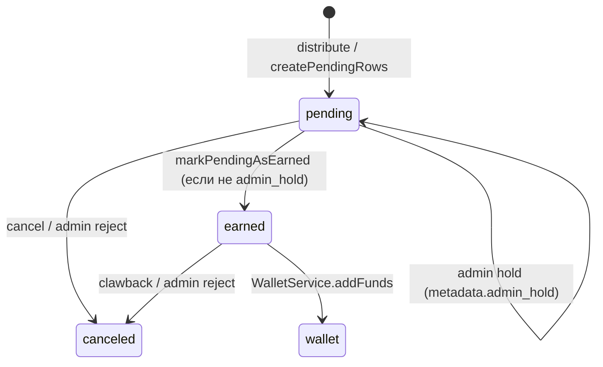

# Referral Accounting (SSOT)

**Stage 114.7** — launch readiness (approaching monthly spend, FinTech progress bar, payout queue UX).  
**Stage 114.5** — единый бухгалтерский учёт реферальной программы для владельца и FinOps.  
Операционный поток: `docs/REFERRAL_FINANCIAL_FLOW.md`. Экономика начислений **не меняется** этим документом.

---

## 1. Учётные счета (логические)

| Счёт | Источник данных | Что означает |
|------|-----------------|--------------|
| **Referral obligation (ledger)** | `referral_ledger.status = earned` | Обязательство платформы перед амбассадором/гостем |
| **Wallet liability** | `user_wallets.withdrawable_balance_thb` + `internal_credits_thb` | Исполнение obligation в кошельке |
| **Promo tank** | `marketing_promo_pot` + `marketing_promo_tank_ledger` | Маркетинговый резерв (turbo, host activation) |
| **Cash-out / withdrawn** | `wallet_transactions` debit (referral payout refs) | Фактический вывод withdrawable (полуавтомат) |
| **Pending accrual** | `referral_ledger.status = pending` | Ещё не earned (может быть **hold**) |
| **Canceled / clawback** | `referral_ledger.status = canceled` + `metadata.clawback_at` | Сторно obligation |

Основной **`financial_ledger`** (escrow, комиссии) — **отдельный контур**; не смешивать с `referral_ledger`.

---

## 2. Формулы FinTech-дашборда

Снимок: `loadReferralAccountingSnapshot()` → `GET /api/v2/admin/referral/liability`.

| KPI | Формула | Примечание |
|-----|---------|------------|
| **totalEarnedThb** | Σ `referral_ledger.amount_thb` где `status = earned` | Lifetime |
| **totalWithdrawnThb** | Σ debit `wallet_transactions` с referral payout признаками | Если дебетов нет — 0 (история до Stage 114.2 могла не логировать) |
| **currentLiabilityThb** | `totalEarned − totalWithdrawn − canceledEarned*` | *canceled не уменьшает earned в агрегате monitor — см. gap |
| **walletExposureThb** | Σ withdrawable + internal по кошелькам | «В системе» сейчас |
| **promoTankUsageThb** | Σ отрицательных движений `marketing_promo_tank_ledger` | Дебеты tank |
| **netMarketingCostThb** | `totalEarnedThb + promoTankUsageThb` | Оценка полной маркетинговой нагрузки |
| **monthlyEarnedThb** | earned с `earned_at` ≥ 1-е число UTC месяца | Для месячного spend alert |

---

## 3. Жизненный цикл строки ledger

**Admin hold (114.5):** `metadata.admin_hold = true` на `pending` — строка **не** переходит в `earned` при `markPendingAsEarned`.

**Admin reject:**
- `pending` → `canceled`
- `earned` → clawback кошелька + `canceled` (одна строка, `PATCH /api/v2/admin/referral/ledger/[id]`)

---

## 4. Вывод средств (полуавтомат)

1. Пользователь: `POST /api/v2/wallet/referral-withdrawal-request`
2. `referral_withdrawal_status = withdrawable_referral`
3. Админ: `/admin/marketing/payouts?referralOnly=1`, `POST …/referral-bulk` approve/reject
4. **Автобанковский вывод не включён** — отдельный payout rail по политике платформы

История в UI: `/profile/referral` → вкладка «История» (`ReferralWithdrawalHistory`, данные `GET /api/v2/wallet/me`).

---

## 5. Алерты (TG FINANCE)

Пороги в `system_settings.general` (через `getReferralAdminAlertPolicy()`):

| Ключ | Default | Событие |
|------|---------|---------|
| `referral_admin_large_earn_alert_thb` | 10 000 | Одно earned ≥ порога |
| `referral_admin_hourly_burst_alert_thb` | 25 000 | Σ earned referrer за 1ч |
| `referral_admin_monthly_spend_alert_thb` | 150 000 | Σ earned за календарный месяц (1×/мес., `critical_signal_events` `REFERRAL_MONTHLY_SPEND_ALERT`) |
| `referral_admin_monthly_spend_warn_percent` | 80 | **Approaching** (1×/мес. `REFERRAL_MONTHLY_SPEND_APPROACHING` + FinTech progress bar) |

Событие: `REFERRAL_ADMIN_ALERT` → `referral-events.handleReferralAdminAlert` → topic **FINANCE** (large / burst / monthly exceeded / **monthly approaching**).

FinTech KPI (114.7): `monthlySpendPercent`, `monthlySpendApproaching`, `monthlySpendRemainingThb` в `accounting` снимка liability.

---

## 6. Контроль и лимиты (рекомендации)

1. Ежедневно: `currentLiability` vs `walletExposure`, баланс promo tank.
2. При `monthlySpendAlertTriggered`: ревью топ-амбассадоров и hold подозрительных `pending`.
3. Перед массовым approve referral payouts: сверка очереди с `totalWithdrawn` + withdrawable.
4. Не повышать `referral_reinvestment_percent` без ADR; tier ratio меняет только split кошелька.

### 6.1 Launch readiness — рекомендуемые лимиты (Stage 114.6)

Настраиваются в **`system_settings.general`** (без смены формул начисления):

| Параметр | Ключ | Default | Назначение |
|----------|------|---------|------------|
| Крупное earned | `referral_admin_large_earn_alert_thb` | 10 000 | TG FINANCE на одно начисление |
| Всплеск за час | `referral_admin_hourly_burst_alert_thb` | 25 000 | Подозрительная активность referrer |
| Месячный spend (hard) | `referral_admin_monthly_spend_alert_thb` | 150 000 | 1×/мес. алерт по Σ earned |
| Месячный spend (warn) | `referral_admin_monthly_spend_warn_percent` | 80 | FinTech жёлтая полоса + TG approaching 1×/мес. |
| Мин. вывод | `wallet_min_payout_thb` | из pricing | Порог заявки withdrawable |
| Reinvestment % | `referral_reinvestment_percent` | ADR | Не поднимать без ревью маржи |

**Операционные лимиты (ручной контроль, не hardcode в коде):**

- **Max earned на пользователя / месяц** — мониторить в FinTech (топ амбассадоров + CSV export); при превышении внутреннего порога (например 50 000 THB) — hold pending + ревью.
- **Max approve payouts за смену** — не более N заявок без второй подписи (процесс FinOps).
- **Promo tank floor** — не допускать `marketing_promo_pot` ниже прогноза 10 host activations без topup.

**FinTech workflow (114.6–114.7):** очередь `withdrawable_referral` — поиск, сортировка, approve/reject выбранных и **filtered**; bulk **Hold all pending** / **Release all held** по фильтру ledger. Компонент: `ReferralPayoutWorkflowPanel`, `ReferralMonthlySpendBar`.

---

## 7. API и код

| Назначение | Путь / модуль |
|------------|----------------|
| Accounting snapshot | `lib/admin/referral-accounting-snapshot.js` |
| Liability UI | `components/admin/finances/ReferralLiabilityPanel.jsx` |
| Ledger admin actions | `lib/admin/referral-ledger-admin.js`, `PATCH /api/v2/admin/referral/ledger/[id]` |
| Ledger bulk hold/release | `POST /api/v2/admin/referral/ledger-bulk` |
| Payout bulk approve/reject | `POST /api/v2/admin/wallet/payouts/referral-bulk` |
| Профиль (perf) | `GET /api/v2/referral/me?includeTeam=0&teamLimit=` |
| Публичная визитка | `GET /api/v2/referral/landing-meta/[userId]` (revalidate 60s) + `referral-landing-meta-client.js` |

---

## 8. Связанные документы

- `docs/REFERRAL_FINANCIAL_FLOW.md` — поток денег
- `docs/FINANCIAL_FLOW_MAP.md` §8 — clawback, cancel
- `ARCHITECTURAL_DECISIONS.md` — политика маржи / reinvestment

При расхождении KPI с БД — правка кода и этого файла в одном PR (`AGENTS.md`).
