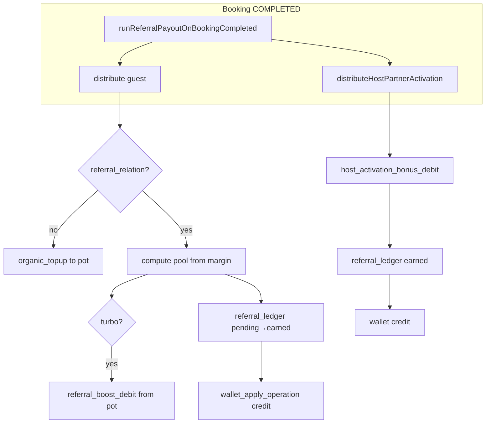

# Stage 119.0 — Технический аудит реферальной системы (Ground Truth)

> **Дата:** 2026-05-27  
> **Статус:** только анализ, без изменений кода/схемы  
> **SSOT кода:** `migrations/stage71_*` … `stage114_*`, `lib/services/marketing/referral-*.js`, `lib/services/finance/wallet.service.js`  
> **Доп. материал (не истина):** `docs/REFERRAL_PROGRAM_2_0_PLAN.md` — сверялся, выводы ниже независимы

---

## Краткое резюме

Текущая рефералка — **зрелый MVP+**: отдельные таблицы кодов/связей/ledger, margin-based расчёт с safety cap 95%, атомарный кошелёк через `wallet_apply_operation`, контролируемый marketing promo tank для turbo/boost и host activation, clawback earned с Stage 114.1, админ hold/reject.

**Главные пробелы:** нет pre-registration attribution; clawback вызывается только из `POST /api/v2/bookings/[id]/cancel` (не из диспутов/других путей отмены); turbo-debit из promo tank **не возвращается** при отмене; базовый guest pool **не списывается** из tank (учётная «доля маржи», не кассовый резерв); OAuth молча отбрасывает невалидный код; anti-fraud на IP/fingerprint частичный.

**Оценка:** **6.5 / 10** — можно масштабировать осторожно, но Referral 2.0 должен закрыть финансовую целостность и единый lifecycle hook до роста трафика.

---

## 1. Схема данных и связи (Database Reality)

### 1.1 Карта сущностей

```mermaid
erDiagram
  profiles ||--o| referral_codes : "1 code per user"
  profiles ||--o{ referral_relations : referrer
  profiles ||--o| referral_relations : "1 inviter per referee"
  referral_codes ||--o{ referral_relations : optional FK
  bookings ||--o{ referral_ledger : booking_id
  profiles ||--o{ referral_ledger : referrer_referee
  bookings ||--o{ marketing_promo_tank_ledger : optional
  profiles ||--|| user_wallets : user_id
  user_wallets ||--o{ wallet_transactions : wallet_id
  system_settings ||.. marketing_promo_pot : "JSON general.marketing_promo_pot"
```

### 1.2 `referral_codes`

**Миграция:** `migrations/stage71_referral_system.sql`

| Колонка | Тип | Ограничения |
|---------|-----|-------------|
| `id` | TEXT | PK |
| `user_id` | TEXT | NOT NULL, **UNIQUE**, FK → `profiles(id)` ON DELETE **CASCADE** |
| `code` | TEXT | NOT NULL, **UNIQUE**, `CHECK char_length(trim(code)) >= 4` |
| `is_active` | BOOLEAN | DEFAULT true |
| `metadata` | JSONB | DEFAULT `{}` — хранит `owner_ip`, `source` |
| `created_at`, `updated_at` | TIMESTAMPTZ | |

**Индексы:** `idx_referral_codes_is_active (is_active)`

**Legacy-дубль:** `profiles.referral_code` (генерируется при регистрации) + `profiles.referred_by` (строка кода пригласившего). Резолв кода: сначала `referral_codes`, fallback `profiles.referral_code` (`ReferralGuardService.resolveReferrerByCode`).

### 1.3 `referral_relations`

| Колонка | Тип | Ограничения |
|---------|-----|-------------|
| `id` | TEXT | PK |
| `referrer_id` | TEXT | FK → `profiles` ON DELETE **RESTRICT** |
| `referee_id` | TEXT | FK → `profiles` ON DELETE **CASCADE**, **UNIQUE** (один пригласитель на referee) |
| `referral_code_id` | TEXT | nullable, FK → `referral_codes` ON DELETE **SET NULL** |
| `referred_at`, `created_at` | TIMESTAMPTZ | |
| `metadata` | JSONB | `referral_code`, `referee_email`, `referee_ip`, `device_fingerprint`, `trigger` |
| `network_depth` | SMALLINT | Stage 72.2, 1–32, DEFAULT 1 |
| `ancestor_path` | JSONB | массив id предков для MLM L2 |

**CHECK:** `referrer_id <> referee_id`

**Индексы:** `referrer_id`, `referred_at DESC`

**Где фиксируется Referrer → Referee:** upsert при email-регистрации (`app/api/v2/auth/register/route.js`) и OAuth (`lib/services/auth/oauth-profile-sync.service.js`), `onConflict: referee_id`. Дерево: `lib/referral/referral-network.js` → `computeInviteTreeFields`.

### 1.4 `referral_ledger`

**База:** `stage71_referral_system.sql`  
**Расширения:** `stage72_2_referral_engine.sql`, `stage72_3_partner_activation_and_payout_admin.sql`

| Колонка | Тип | Смысл |
|---------|-----|--------|
| `booking_id` | TEXT | FK → `bookings` CASCADE |
| `referrer_id`, `referee_id` | TEXT | FK RESTRICT |
| `amount_thb` | NUMERIC(14,2) | ≥ 0 |
| `type` | TEXT | `bonus` (реферер) \| `cashback` (рефери) |
| `status` | TEXT | `pending` \| `earned` \| `canceled` |
| `referral_type` | TEXT | `guest_booking` \| `host_activation` |
| `ledger_depth` | SMALLINT | снимок глубины сети |
| `net_profit_order_thb`, `platform_gross_thb`, `referral_pool_thb` | NUMERIC | PnL-снимок на момент записи |
| `metadata` | JSONB | policy snapshot, `admin_hold`, `clawback_at`, boost |
| `earned_at`, `canceled_at` | TIMESTAMPTZ | |

**Уникальность (актуальная):**

```sql
UNIQUE (booking_id, type, referral_type, referrer_id)
```

Позволяет несколько строк `host_activation` (L1/L2 uplines с разными `referrer_id`). Для `guest_booking` по-прежнему две строки: `bonus` + `cashback`.

**Индексы:** `booking_id`, `(referrer_id, status)`, `(referee_id, status)`, `(status, created_at)`, `(referral_type, status, created_at)`.

**Связь с promo tank:** прямого FK **нет**. Косвенно — общий `booking_id` в `marketing_promo_tank_ledger` для `referral_boost_debit` / `host_activation_bonus_debit`.

### 1.5 `marketing_promo_tank_ledger`

**Миграция:** `stage71_3_marketing_promo_tank.sql`, типы entry — `stage72_3`

| Колонка | Тип | |
|---------|-----|--|
| `id` | TEXT PK | |
| `booking_id` | TEXT nullable | FK bookings SET NULL |
| `entry_type` | TEXT | см. ниже |
| `amount_thb` | NUMERIC | положительный = пополнение, отрицательный в RPC = списание |
| `metadata` | JSONB | |
| `created_at` | TIMESTAMPTZ | |

**`entry_type` (CHECK):**  
`organic_topup`, `referral_boost_debit`, `manual_topup`, `manual_debit`, `welcome_bonus_return`, `host_activation_bonus_debit`

**Уникальность:** `UNIQUE (booking_id, entry_type) WHERE booking_id IS NOT NULL` — идемпотентность движения на бронь.

**Баланс pot:** не сумма по ledger, а **`system_settings.key = 'general'` → `value.marketing_promo_pot`** (обновляется атомарно в RPC `adjust_marketing_promo_pot` с `FOR UPDATE` на settings).

### 1.6 `user_wallets` и `wallet_transactions`

**База:** `stage71_5_wallet_core.sql`  
**Расширения:** `stage71_6` (welcome), `stage72_2` (`verified_for_payout`), `stage72_4` (buckets), `stage114_2` (withdrawal request fields)

**`user_wallets` (ключевое):**

| Колонка | Назначение |
|---------|------------|
| `user_id` | UNIQUE FK profiles CASCADE |
| `balance_thb` | агрегат (legacy total) |
| `internal_credits_thb` | невыводимые кредиты (cashback, часть bonus) |
| `withdrawable_balance_thb` | выводимая доля bonus (retention split) |
| `welcome_bonus_remaining_thb`, `welcome_bonus_expires_at` | welcome slice |
| `verified_for_payout` | гейт вывода |
| `referral_withdrawal_status`, `referral_withdrawal_requested_at`, `referral_withdrawal_amount_thb` | заявка на вывод (114.2) |

**`wallet_transactions`:**

| Колонка | |
|---------|--|
| `operation_type` | `credit` \| `debit` |
| `tx_type` | `referral_bonus`, `referral_cashback`, `welcome_bonus`, `referral_clawback`, … |
| `reference_id` | идемпотентность |

**UNIQUE:** `(reference_id, operation_type) WHERE reference_id IS NOT NULL`

**RPC:** `wallet_apply_operation(p_user_id, p_amount_thb, p_operation_type, p_tx_type, p_reference_id, p_metadata)` — единственная атомарная точка изменения `balance_thb` + insert транзакции.

### 1.7 Где хранятся инвайт-коды и связь

| Артефакт | Роль |
|----------|------|
| `referral_codes.code` | канонический код (SSOT для validate) |
| `profiles.referral_code` | legacy/отображение, синхрон при регистрации |
| Cookie `gostaylo_pending_ref` | отложенный код с лендинга `/?ref=` → merge в register |
| `referral_relations` | immutable graph edge referrer↔referee |
| `profiles.referred_by` | текстовый код (не FK) |

**Нет таблицы кликов/сессий** — атрибуция только post-factum при регистрации.

### 1.8 RLS

В миграциях referral-таблиц **отдельных RLS-политик не найдено** — предполагается доступ через service role (`supabaseAdmin`) и admin API с `requireAdminStaff`. Публичные эндпоинты не пишут в ledger напрямую.

---

## 2. Бизнес-логика и точки перехвата

### 2.1 Валидация реферального кода

| Этап | Файл | Функция / маршрут |
|------|------|-------------------|
| Pre-check UI | `app/api/v2/referral/validate/route.js` | `POST` → `ReferralGuardService.validateActivation` |
| Email register | `app/api/v2/auth/register/route.js` | guard до insert profile; fail-hard → 400 |
| OAuth register | `lib/services/auth/oauth-profile-sync.service.js` | guard; при fail — **код отбрасывается**, регистрация продолжается |
| Client | `contexts/auth/auth-actions.js` | передаёт `referredBy`, fingerprint |

**`ReferralGuardService.validateActivation`** (`lib/services/marketing/referral-guard.service.js`):

- Резолв кода → referrer profile  
- Self: same `candidateUserId`, same email  
- IP: `referral_codes.metadata.owner_ip` === client IP → `REFERRAL_SELF_BY_IP`  
- Fingerprint: `referral_relations.metadata @> { device_fingerprint }` у **другого** referrer → `REFERRAL_DEVICE_ALREADY_USED`  
- Лимит: `referral_monthly_limit_per_user` из `system_settings.general` (default 30, max 500) по `referred_at` в TZ реферера  

**Не делается:** привязка кода на «первой брони», смена referrer после регистрации, velocity по IP регистраций.

### 2.2 Создание связи и welcome

После успешной валидации при register/OAuth:

1. `referral_relations` upsert + `computeInviteTreeFields`  
2. `referral_codes` upsert для нового пользователя  
3. **Welcome bonus** — `WalletService.addFunds(..., 'welcome_bonus', reference welcome_bonus:{userId})` если `welcome_bonus_amount` > 0 в settings (30 дней expiry)

### 2.3 Начисление реферальных бонусов (guest booking)

**Триггер:** бронь → `COMPLETED` только.

**SSOT-обёртка:** `lib/services/marketing/referral-completion-trigger.js` → `runReferralPayoutOnBookingCompleted`

**Вызывается из:**

- `app/api/v2/partner/bookings/[id]/route.js` (partner status completed)  
- `lib/services/payout-batch/payout-batch-settlement.js`  
- `lib/services/escrow/payout.service.js` (legacy payout path)

**Цепочка:** `ReferralPnlService.distribute` → `lib/services/marketing/referral-payout.service.js`

**Алгоритм `distribute`:**

1. Статус `COMPLETED`, иначе skip  
2. `deriveFeeBaseFromBooking` → platform gross (guest fee + host commission из snapshot)  
3. `getReferralSettings()` из `PricingService.getGeneralPricingSettings()`  
4. `deriveNetProfitAfterVariableCosts` (insurance, acquiring %, operational %)  
5. Нет `referral_relations` для `booking.renter_id` → **organic topup** в promo pot (`organic_to_promo_pot_percent`), skip referral  
6. Self-referral referrer===renter → telemetry `POTENTIAL_SELF_REFERRAL`, skip  
7. `deriveSafetyCaps`: pool = min(netProfit × reinvestment%, gross × **95%**)  
8. `applyPromoBoost` — debit turbo из pot (если включён)  
9. Split pool: `referral_split_ratio` + boost rule (`split_50_50` / `100_to_referrer` / `100_to_referee`)  
10. `createPendingLedgerRows` (если нет pending) → `markPendingAsEarned` → **`creditWalletFromEarnedRows`**

**Важно:** pending и earned для guest booking создаются **в одном проходе** при completion (нет отдельной фазы pending на `PAID_ESCROW`).

### 2.4 Host activation (supply-side)

`ReferralPnlService.distributeHostPartnerActivation` — та же completion-обёртка.

- Первая `COMPLETED` бронь хоста (владелец listing = referee в relations)  
- Фиксированный бонус `partner_activation_bonus` (default **500 THB** из settings)  
- MLM split L1/L2 по `mlm_level1_percent` / `mlm_level2_percent` и `ancestor_path`  
- **Списание всего бонуса** из promo tank: `host_activation_bonus_debit`  
- Ledger сразу `earned`, wallet credit `referral_bonus` с `reference_id = referral_ledger:{id}`  
- При пустом tank → `bookings.metadata.host_activation_promo_tank = pending_tank_refill`, retry: `POST /api/v2/admin/referral/retry-host-activation`

### 2.5 `wallet_apply_operation`

**Да**, все кредиты/дебиты кошелька идут через RPC:

- Credit: `WalletService.addFunds` → `applyOperation` → `wallet_apply_operation` (`operation_type: credit`)  
- Clawback: `WalletService.clawbackReferralLedgerCredit` → debit с `reference_id = referral_clawback:{ledgerId}`  

После credit для retention split обновляются `internal_credits_thb` / `withdrawable_balance_thb` через `applyWalletBucketDelta` (вне RPC — **второй шаг**, потенциальный рассинхрон при сбое между RPC и bucket update).

**Идемпотентность credit:** `reference_id = referral_ledger:{ledgerRowId}`.

### 2.6 Хардкод vs settings

| Параметр | Источник | Default в коде |
|----------|----------|----------------|
| `referral_reinvestment_percent` | `system_settings.general` | 70% |
| `referral_split_ratio` | settings | 0.5 |
| `acquiring_fee_percent`, `operational_reserve_percent` | settings | 0 |
| `marketing_promo_pot`, turbo, boost | settings | 0 / false |
| `organic_to_promo_pot_percent` | settings | 0 |
| `partner_activation_bonus` | settings | **500 THB** |
| `mlm_level1_percent`, `mlm_level2_percent` | settings | 70 / 30 |
| `welcome_bonus_amount` | settings | 0 |
| `referral_monthly_limit_per_user` | settings | 30 |
| Safety cap | **код** | **95%** от `platform_gross_thb` (`SAFETY_LOCK_MAX_SHARE`) |
| Welcome TTL | **код** | 30 дней при register |

Формулы: `lib/services/marketing/referral-calculation.js`, `referral-policy.service.js`.

### 2.7 Фасад и модули (карта кода)

| Модуль | Ответственность |
|--------|-----------------|
| `referral-pnl.service.js` | фасад наружу |
| `referral-payout.service.js` | distribute, host activation, revert delegates |
| `referral-ledger.service.js` | ledger CRUD, wallet credit/clawback |
| `referral-promo-tank.service.js` | pot adjust, organic, boost, host debit |
| `referral-guard.service.js` | validate, anti-fraud |
| `referral-stats.service.js` | tiers, ambassador sync |
| `referral-calculation.js` | math + settings load |
| `lib/referral/*` | UI payload, team, feed, gamification |
| Admin | `app/api/v2/admin/referral/*`, `lib/admin/referral-ledger-admin.js` |

---

## 3. Интеграция с marketing promo tank и финансовым контуром

### 3.1 Откуда деньги на реферальные бонусы

| Тип выплаты | Источник «денег» | Promo tank |
|-------------|------------------|------------|
| Guest `bonus` + `cashback` | **Учётная доля чистой маржи брони** (`net_profit_order_thb × reinvestment%`, cap 95% gross) | Не списывается (кроме turbo boost) |
| Turbo boost | Pot | `referral_boost_debit` (−) |
| Organic без реферала | В pot | `organic_topup` (+) |
| Host activation MLM | Pot | `host_activation_bonus_debit` (−) |
| Welcome bonus | Marketing / настройка | При expiry может вернуться `welcome_bonus_return` |
| Wallet balance | Виртуальные THB | Не банковские деньги до вывода |

**Вывод:** основной guest referral pool — **не «из воздуха» в tank**, но и **не резервируется** в отдельном escrow-счёте: это обязательство платформы внутри margin model. Фактический cash-out — при оплате checkout с wallet discount или при выводе `withdrawable_balance_thb`.

### 3.2 Связь `referral_ledger` ↔ `marketing_promo_tank_ledger`

- **Нет FK и нет двойной записи** в одной транзакции БД.  
- Связь только по `booking_id` + бизнес-логика в `distribute` / `distributeHostPartnerActivation`.  
- В `referral_ledger.metadata` может быть `promo_boost_thb`; в tank ledger — `metadata` с `base_referral_pool_thb`.  
- **Clawback guest earned не возвращает** `referral_boost_debit` в pot (gap).

### 3.3 Потоки (as-is)



### 3.4 Админ и мониторинг

- `GET/POST /api/v2/admin/referral/pnl-monitor` — pot balance, manual topup  
- `tank-events`, `liability`, `analytics`, `ledger-export`, `leaderboard`  
- Marketing UI: `/admin/marketing/*` (ROI, wallet audit) — см. `lib/admin/marketing-referral-roi.js`

---

## 4. Anti-Fraud и edge-кейсы

### 4.1 Self-referral и мультиаккаунты

| Механизм | Есть? | Ограничение |
|----------|-------|-------------|
| `referrer_id = referee_id` (DB CHECK) | ✅ | только DB |
| Same email при validate | ✅ | до создания user |
| Same user id при validate | ✅ | OAuth/register с id |
| Referrer IP = referee IP | ✅ | только если `owner_ip` записан в `referral_codes.metadata` |
| Device fingerprint | ⚠️ | только блок если FP уже у **другого** referrer; OAuth **не передаёт** fingerprint |
| Monthly cap per referrer | ✅ | count relations |
| distribute: referrer === renter | ✅ | skip + critical signal |
| KYC / verified_for_payout | ⚠️ | для вывода, не для начисления |

**Нет:** лимит регистраций с одного IP, graph analysis, hold period по умолчанию, блок «семейных» email-доменов.

### 4.2 Отмена брони, диспут, cron

| Сценарий | Поведение referral |
|----------|-------------------|
| Cancel **до** COMPLETED | Обычно нет earned; pending отсутствует (guest создаётся только на complete) |
| `POST /api/v2/bookings/[id]/cancel` | ✅ `revertReferralLedgerForBooking`: cancel pending + clawback earned |
| Dispute resolution | ❌ **не найдено** вызовов `revertReferral` в `lib/services/dispute` |
| Cron `cleanup-drafts` → CANCELLED | ❌ только `BookingService.updateStatus`, без referral revert |
| Admin reject earned row | ✅ `PATCH /api/v2/admin/referral/ledger/[id]` action `reject` → `clawbackSingleEarnedRow` |
| Admin hold pending | ✅ `admin_hold: true` → `markPendingAsEarned` **пропускает** строку |

### 4.3 Clawback (ledger + wallet)

**Реализовано (Stage 114.1+):**

1. `clawbackEarnedLedgerForBooking` — по каждой earned без `metadata.clawback_at`  
2. `WalletService.clawbackReferralLedgerCredit` — idempotent debit `referral_clawback:{ledgerId}`  
3. Ledger → `status: canceled`, metadata `clawback_at`, `clawback_trigger`  
4. Если credit не было → skip `CREDIT_NEVER_APPLIED`  
5. Недостаточно средств на кошельке → `REFERRAL_CLAWBACK_INSUFFICIENT` telemetry, строка может **остаться earned** (partial failure)

**Не реализовано:**

- Возврат turbo boost в `marketing_promo_pot`  
- Автоматический clawback при отмене через dispute / прямой SQL / иные API  
- Синхронный откат `ReferralTierSync` / team feed

### 4.4 Прочие edge-кейсы

| Кейс | Поведение |
|------|-----------|
| Повторный `distribute` на ту же бронь | skip `ALREADY_EARNED` |
| Host activation не первая completed | skip `NOT_FIRST_HOST_COMPLETED_BOOKING` |
| Pot empty для host activation | pending_tank_refill в metadata |
| Referee без relation на completed stay | organic topup only |
| Wallet retention split | часть bonus → withdrawable по `payoutToInternalRatio` |
| Welcome expiry | `wallet-expiry.service` → может `welcome_bonus_return` в pot |

---

## 5. Общая оценка и риски

### 5.1 Оценка: **6.5 / 10**

| Сильные стороны | Слабые стороны |
|-----------------|----------------|
| Нормализованные таблицы, уникальности, идемпотентный wallet RPC | Нет event-sourced audit trail / pre-click attribution |
| Margin-based pool + 95% safety cap | Guest pool не привязан к реальному cash / tank |
| Единый completion trigger (114.1) | Revert только в одном cancel API |
| Clawback + admin hold/reject | Partial clawback, нет boost return |
| Promo tank с RPC и insufficient balance guard | Bucket update после RPC — два шага |
| Богатая админка и E2E fixture | OAuth soft-fail referral; fingerprint gap |

### 5.2 Технический долг при масштабе

1. **Финансовая целостность:** обязательства wallet (internal + withdrawable) vs promo pot vs margin model не сводятся в один reconciliation report автоматически.  
2. **Lifecycle hooks:** `BookingService.updateStatus` не вызывает referral — риск «зомби» earned при будущих путях отмены.  
3. **Два SSOT кода:** `referral_codes` vs `profiles.referral_code`.  
4. **Metadata-heavy policy:** snapshot policy в каждой ledger row — сложно менять правила ретроактивно.  
5. **MLM depth:** только L2 на host activation; guest booking — только прямой referrer+referee (нет multi-level на stay).  
6. **Observability:** нет таблицы `referral_events`; отладка = join ledger + wallet_transactions + tank ledger.

### 5.3 Что можно оставить

- Таблицы `referral_codes`, `referral_relations`, `referral_ledger` (с текущим UNIQUE)  
- `wallet_apply_operation` + reference id convention  
- `adjust_marketing_promo_pot` + `marketing_promo_tank_ledger`  
- `runReferralPayoutOnBookingCompleted` как единая точка начисления  
- `ReferralGuardService` как база anti-fraud (расширять, не переписывать с нуля)  
- Margin math + 95% cap в `referral-policy.service.js`

### 5.4 Что требует серьёзного рефакторинга

- Единый **BookingLifecycleHook**: complete → payout; cancel/dispute/refund → revert (+ promo boost return)  
- **Attribution layer** (`referral_attributions`) до регистрации  
- **referral_events** dual-write для audit и ROI 2.0  
- Явная **источниковая модель денег** (margin accrual vs tank vs welcome budget) в отчётности  
- Ужесточение anti-fraud (IP rate, mandatory fingerprint, hold period)  
- Транзакционность wallet buckets с RPC (или один расширенный RPC)

---

## 6. Рекомендации для Referral 2.0 (фазы и совместимость)

> Согласовано по духу с `docs/REFERRAL_PROGRAM_2_0_PLAN.md`, приоритеты — по результатам аудита.

### Фаза 1 (P0, 2–3 спринта) — стабилизация без ломки схемы

1. **`BookingLifecycleReferralHook`** (один модуль):  
   - on `COMPLETED` → существующий `runReferralPayoutOnBookingCompleted`  
   - on `CANCELLED` / dispute outcomes с refund → `revertReferralLedgerForBooking`  
   - Вызов из `BookingService.updateStatus`, dispute settle, cancel route (делегировать в hook, не дублировать).  

2. **Promo boost clawback:** при `revertReferralLedgerForBooking`, если был `referral_boost_debit` по `booking_id` — идемпотентный `manual_topup` / новый `entry_type: referral_boost_reversal`.  

3. **OAuth parity:** невалидный код — явный UX (как email register) или отложенная привязка; передавать `referralFingerprint` в OAuth.  

4. **Мониторинг:** дашборд «unreverted earned on cancelled bookings» (SQL/reconciliation job).  

**Совместимость:** не менять UNIQUE на `referral_ledger`; не трогать `wallet_apply_operation` контракт.

### Фаза 2 (Phase A из плана) — атрибуция

1. Таблица `referral_attributions` + `POST/GET /api/v2/referral/attribution` (click, UTM, fingerprint, cookie id).  
2. Поля `referral_relations.attribution_id`, `invite_channel` (nullable, backfill null).  
3. Cookie `gostaylo_pending_ref` связать с `attribution_id` при конверсии.

### Фаза 3 (Phase B) — audit trail

1. `referral_events` + dual-write из `referral-ledger.service` / `referral-payout.service` (не заменять ledger).  
2. Опционально `referral_reward_rules` для версионирования policy (новые начисления с `rule_version` в metadata).

### Фаза 4 (Phase C–D) — продукт и ROI

1. Admin funnel API, MV `referral_roi_monthly_mv`.  
2. Hold period по умолчанию (earned delayed N days) — потребует новый статус или scheduled job.  
3. Постепенный deprecate `profiles.referred_by` как write path (read-only mirror).

### Миграционные принципы

- **Dual-write, single-read:** сначала пишем в `referral_events`, читаем по-прежнему `referral_ledger`.  
- **Идемпотентность:** все новые RPC/entry_type с `(booking_id, entry_type)` или event id.  
- **E2E:** расширить `lib/e2e/stage72-referral-cashflow-fixture.js` сценариями cancel + clawback + boost return.

---

## Приложение A — Ключевые HTTP API

| Метод | Путь | Назначение |
|-------|------|------------|
| POST | `/api/v2/referral/validate` | validate code |
| GET | `/api/v2/referral/me` | профиль рефералки, ledger stats |
| POST | `/api/v2/auth/register` | relation + welcome |
| POST | `/api/v2/bookings/[id]/cancel` | revert referral |
| PATCH | `/api/v2/admin/referral/ledger/[id]` | hold / reject |
| POST | `/api/v2/admin/referral/retry-host-activation` | retry host bonus |
| GET/POST | `/api/v2/admin/referral/pnl-monitor` | pot stats / topup |

---

## Приложение B — Связанная документация

- `docs/REFERRAL_PROGRAM_2_0_PLAN.md` — целевая архитектура  
- `docs/REFERRAL_FINANCIAL_FLOW.md` — потоки (частично; сверять с этим аудитом)  
- `docs/FINANCIAL_FLOW_MAP.md` §8 — cancel/clawback  
- `docs/TECHNICAL_MANIFESTO.md` — Stage 71.x, 114.x  

---

*Конец отчёта Stage 119.0.*
