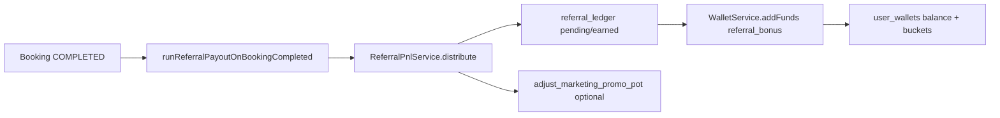

# Referral Financial Flow (SSOT)

**Stage 114.4 / 114.5** — прозрачность движения денег по реферальной программе для владельца и FinOps.  
**Бухгалтерский SSOT:** `docs/REFERRAL_ACCOUNTING.md`.  
**Не меняет** правила начисления и **не включает** автоматический вывод.

См. также: `docs/FINANCIAL_FLOW_MAP.md` (§8 clawback, §4 referral P&L), `ARCHITECTURAL_DECISIONS.md`.

---

## 1. Сущности и таблицы

| Сущность | Таблица / RPC | Роль |
|--------|----------------|------|
| Реферальный журнал | `referral_ledger` | Обязательство платформы: pending → earned / canceled |
| Маркетинговый резерв | `marketing_promo_pot` (+ RPC `adjust_marketing_promo_pot`) | Promo Tank: turbo/boost, host activation |
| Кошелёк гостя/амбассадора | `user_wallets` + `wallet_apply_operation` | Фактическое зачисление THB (internal / withdrawable) |
| Основной фин. ledger | `financial_ledger` / escrow | Доход платформы, выплаты партнёрам — **отдельно** от referral_ledger |
| Заявка на вывод реф. | `user_wallets.referral_withdrawal_*` | Полуавтомат: `withdrawable_referral` → админ `/admin/marketing/payouts` |

**Связь:** `referral_ledger` — **учёт обязательств и аудит**; кошелёк — **исполнение** для earned; promo tank — **источник boost**, не замена ledger.

---

## 2. Поток начисления (guest booking)

1. **`ReferralPnlService.distribute(bookingId)`** читает `pricing_snapshot`, считает pool (`referral_reinvestment_percent`, safety cap).
2. Строки **`referral_ledger`**: `type` bonus/cashback, `referral_type` guest_booking, `ledger_depth`, `status`.
3. При **earned**: **`WalletService.addFunds`** с `reference_id = referral_ledger:{id}`; split internal/withdrawable по tier (`payout_to_internal_ratio`).
4. **Promo Tank**: turbo debits через **`ReferralPnlService.adjustMarketingPromoPot`** — не дублирует строки ledger, но влияет на сумму boost.

**Триггер SSOT:** `lib/services/marketing/referral-completion-trigger.js` → только из перевода брони в **COMPLETED**.

---

## 3. Host activation (supply)

`ReferralPnlService.distributeHostPartnerActivation` — первое COMPLETED бронирование приглашённого партнёра.

- Строки `referral_ledger` с `referral_type = host_activation`.
- Дебет promo tank по политике из `system_settings.general`.
- FinTech показывает **прогноз** следующих 10 активаций (`forecastHostActivationDebitThb`).

---

## 4. Clawback и отмена

| Сценарий | Действие |
|----------|----------|
| Отмена до COMPLETED | `cancelReferralPendingForBooking` — pending → canceled |
| Отмена после earned | `revertReferralLedgerForBooking` — clawback кошелька + ledger canceled |

См. `docs/FINANCIAL_FLOW_MAP.md` §8.1.

---

## 5. Вывод (полуавтомат, Stage 114.2)

**Автовывода нет.**

1. Пользователь: `POST /api/v2/wallet/referral-withdrawal-request` (только `withdrawable_balance_thb`, eligibility).
2. Статус кошелька: `referral_withdrawal_status = withdrawable_referral`.
3. Админ: `/admin/marketing/payouts?referralOnly=1`, bulk API Stage 114.3.
4. Фактический банковский перевод — существующий payout pipeline (не смешивать с promo tank).

---

## 6. FinTech-пульт (Stage 114.4)

| Метрика | Источник | Смысл |
|---------|----------|--------|
| `ledgerEarnedTotalThb` | `referral_ledger` earned | Обязательство по журналу |
| `walletWithdrawableTotalThb` | Σ `user_wallets.withdrawable_balance_thb` | Потенциальный cash-out |
| `ledgerVsWalletGapThb` | ledger − withdrawable − internal | Разрыв (уже выведено / в internal) |
| `marketingPromoPotThb` | monitor / tank | Баланс резерва |
| `accrualsVsPayouts` | earned по месяцам vs `referral_withdrawal_requested_at` | **Заявки**, не оплата банком |

**API:**

- `GET /api/v2/admin/referral/liability` — snapshot + фильтры (`periodFrom`, `periodTo`, `status`, `type`).
- `GET /api/v2/admin/referral/ledger-export` — CSV/JSON `referral_ledger`.

**UI:** `ReferralLiabilityPanel` на `/admin/settings/finances`.

---

## 7. Уведомления и контроль

| Событие | Канал | Поля |
|---------|-------|------|
| `REFERRAL_BONUS_EARNED` | push/email/TG | сумма, уровень (L1/L2/host), источник (referee), ссылки wallet/referral |
| `REFERRAL_TEAMMATE_JOINED` | push/email | имя, `/profile/status` |
| `REFERRAL_ADMIN_ALERT` | admin FINANCE topic | earned ≥ `referral_admin_large_earn_alert_thb` (default 10 000) или всплеск за 1ч ≥ `referral_admin_hourly_burst_alert_thb` (25 000) |

Пороги: `lib/admin/referral-alert-policy.js` ← `system_settings.general` (без смены экономики).

---

## 8. Рекомендации по лимитам и контролю

1. **Ежедневно:** FinTech — ledger earned vs withdrawable, promo tank balance vs forecast debit.
2. **Еженедельно:** CSV export ledger, топ амбассадоров за период, сравнение accruals vs payout requests.
3. **Алерты:** не отключать admin topic; при burst — ручная проверка `referrer_id` и броней.
4. **Не снижать** `referral_reinvestment_percent` без ADR; tier ratio меняет только split кошелька.
5. **Перед MLM-глубиной:** ADR + cap ∑ level payouts (см. FINANCIAL_FLOW_MAP §11).

---

## 9. Профиль пользователя

- `/profile/referral`, `/profile/status` — **`ReferralWithdrawableStrip`** (`GET /api/v2/wallet/me` → `withdrawable_balance_thb`).
- SSOT геймификации: `GET /api/v2/referral/me` → tiers, badges, sparkline.

---

## 10. Код (индекс)

| Область | Файл |
|---------|------|
| P&L / tank | `lib/services/marketing/referral-pnl.service.js` |
| Ledger rows | `lib/services/marketing/referral-ledger.service.js` |
| Completion | `lib/services/marketing/referral-completion-trigger.js` |
| Wallet credit/clawback | `lib/services/finance/wallet.service.js` |
| Liability snapshot | `lib/admin/referral-liability-snapshot.js` |
| Notifications | `lib/services/notifications/referral-events.js`, `referral-notification.service.js` |

Если поведение расходится с документом — правка кода и дока в одном PR (`AGENTS.md`).
