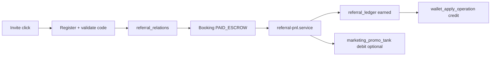

# Реферальная программа 2.0 — архитектурный план (черновик)

> **Stage 118.6** — подготовка к следующему большому этапу. SSOT текущей реализации: `migrations/stage71_*`, `lib/services/marketing/referral-*.js`, Marketing Budget в `system_settings`.

## Текущий контур (as-is)

| Слой | Таблицы / артефакты | Назначение |
|------|---------------------|------------|
| Коды | `referral_codes`, `profiles.referral_code` | Персональный код, validate при регистрации |
| Граф | `referral_relations` (+ `network_depth`, `ancestor_path`) | Кто кого пригласил, MLM-глубина |
| Начисления | `referral_ledger` | bonus/cashback по брони, статусы pending/earned/canceled |
| Кошелёк | `user_wallets`, `wallet_transactions` | Внутренние THB-кредиты, welcome/referral credit |
| Marketing pool | `marketing_promo_tank_ledger`, `adjust_marketing_promo_pot()` | Глобальный promo-pot, turbo/organic topup |
| Аналитика | Admin `/admin/marketing/*`, RPC `referral_ledger_leaderboard_for_period` | ROI, cohort, wallet audit |

Связь с бронью: `referral_ledger.booking_id` → PnL через `referral-pnl.service.js` (safety lock 95% gross).

## Цели 2.0

1. **Прозрачный invite funnel** — от клика по ссылке до earned, с атрибуцией канала.
2. **Единый ledger событий** — audit trail для бонусов, отмен, clawback, выплат.
3. **ROI 2.0** — когорты по invite-коду, LTV, CAC, связь с `marketing_promo_tank_ledger`.
4. **Антифрод** — device/IP/self-referral расширить до rate limits и hold-периода.

## Предлагаемые изменения схемы

### Новые таблицы (минимальный набор)

```sql
-- 1. Клики / сессии атрибуции (до регистрации)
referral_attributions (
  id, invite_code, landing_path, utm_json, device_fingerprint,
  ip_hash, created_at, converted_profile_id NULLABLE, converted_at
)

-- 2. Единый журнал событий рефералки (дополняет referral_ledger, не заменяет сразу)
referral_events (
  id, event_type, referrer_id, referee_id, booking_id NULL,
  amount_thb, status, source, metadata jsonb, created_at
)
-- event_type: invite_click | relation_created | bonus_accrued | bonus_reversed | wallet_credit | payout_requested

-- 3. Версионирование правил начисления
referral_reward_rules (
  id, version, effective_from, tier_json, is_active
)
```

### Расширения существующих

| Таблица | Поля | Зачем |
|---------|------|-------|
| `referral_relations` | `attribution_id`, `invite_channel` | Связь с кликом / Telegram / QR |
| `referral_ledger` | `rule_version`, `event_id` FK | Трассировка к `referral_events` |
| `referral_codes` | `campaign_slug`, `expires_at`, `max_uses` | Кампании и лимиты |
| `profiles` | `referral_tier_v2` (опц.) | Ambassador 2.0 поверх tier из stage72 |

## Логика начисления (target)



- **SSOT расчёта** остаётся в `referral-pnl.service.js`; 2.0 добавляет запись в `referral_events` на каждый переход статуса.
- **Отмена брони** → reverse ledger + debit wallet + опциональный возврат в promo tank.

## API / Admin (эволюция)

| Endpoint | Назначение |
|----------|------------|
| `GET /api/v2/referral/attribution` | Публичный: записать клик (cookie + fingerprint) |
| `GET /api/v2/admin/referral/funnel` | Воронка: clicks → signups → first booking |
| `GET /api/v2/admin/referral/events` | Журнал с фильтрами (уже частично wallet-audit) |

Admin UI: расширить `/admin/marketing/analytics` вкладкой **Funnel 2.0**; не дублировать System Health / Control.

## ROI & Marketing Budget

- **Единый источник расходов:** `referral_ledger.amount_thb` (earned) + `marketing_promo_tank_ledger` (debits) + wallet welcome bonuses.
- **Materialized view** (опционально): `referral_roi_monthly_mv` — refresh cron, питает analytics без full scan.
- Связь с **Stage 118 admin search:** индекс `referral_codes.code` + поиск `@` / code prefix в `AdminGlobalSearch` (фаза 2.1).

## Миграционная стратегия

1. **Phase A** — ✅ **DONE (120.0–120.6):** `referral_attributions`, track API, E2E smoke 12c, денежный пульт `/admin/marketing/attribution`, SSOT `lib/finance/reporting.service.js`, promo tank balance, clawback/gross/net, cohort CSV, anti-fraud v1.
2. **Phase B** — ✅ **DONE (121.0b–123.3):** воронка 2.0, hold-периоды, кампании, A/B rules (production-ready), anti-fraud v2 + manual review queue + fraud KPI/deep-links.
3. **Phase C** — ROI MV + site-wide Financial Intelligence Dashboard.
4. **Phase D** — deprecate дублирующие поля в `metadata` JSON.

### Phase A — итог (Go, 2026-05-27)

| Контур | SSOT | Статус |
|--------|------|--------|
| Клики / атрибуция | `lib/referral/attribution.service.js` | ✅ |
| Начисления | `referral-ledger.service.js` + `referral-pnl.service.js` | ✅ без изменений |
| Promo tank | `referral-promo-tank.service.js` | ✅ |
| Денежная аналитика | `lib/finance/reporting.service.js` | ✅ |
| Admin UI | `/admin/marketing/attribution` | ✅ |

### Phase B — итог (закрыт, 2026-05-28)

| # | Направление | Содержание |
|---|-------------|------------|
| B1 | **Воронка 2.0** | ✅ `computeReferralFunnelBundle` + вкладка «Воронка 2.0» (`/admin/marketing/attribution`); UTM/referrer breakdown; CR→1-я бронь в таблице |
| B2 | **Hold-период** | ✅ 121.1b–121.3: core + `/profile/referral` + `/profile/wallet` + cron `ops_job_runs` + `/admin/health` блок unlock |
| B3 | **Кампании** | ✅ Stage 122.0–122.3 |
| B4 | **A/B правил** | ✅ Stage 123.0–123.1: versioned rules + shadow + production rollout-флаг (`apply_split_in_production`) + facade `resolveReferralAccrualPolicy()` + ledger `rule_version/reward_rule_id` |
| B5 | **Anti-fraud v2** | ✅ Device graph, velocity, strict self-referral/chain, pattern checks, manual review queue `/admin/marketing/fraud-queue`, fraud markers в attribution+ledger |
| B6 | **Fraud observability polish** | ✅ KPI suspicious count/% в attribution + campaign card, deep-link расследование (queue → attribution / ledger / profile) |
| B7 | **Phase B hardening** | ✅ build + smoke, docs sync, финализация SSOT |

## Риски

- Не ломать `referral_ledger_booking_type_rt_unique` и safety lock.
- Wallet credit остаётся через `wallet_apply_operation` RPC.
- RLS: все новые таблицы — service role only для записи, admin read via existing guards.

## Out of scope для 2.0 v1

- Крипто-выплаты рефералам off-platform.
- Многоуровневый MLM > 3 уровней без отдельного compliance review.
