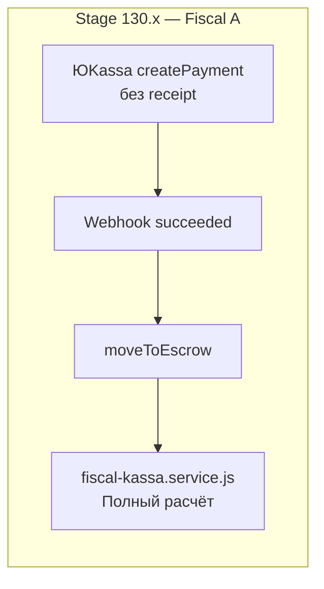
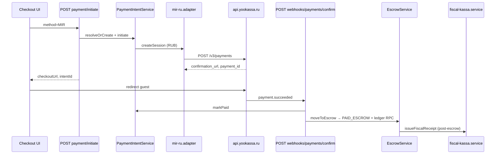
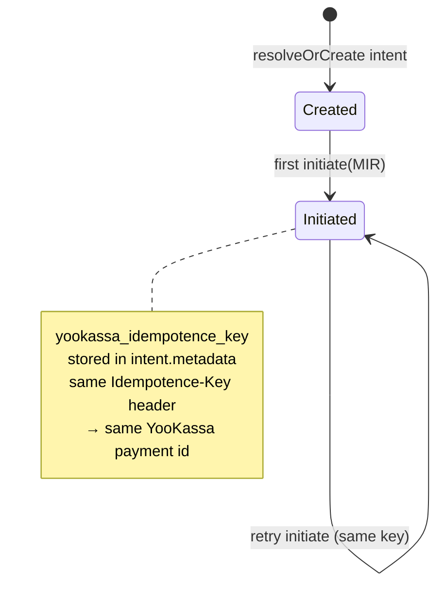
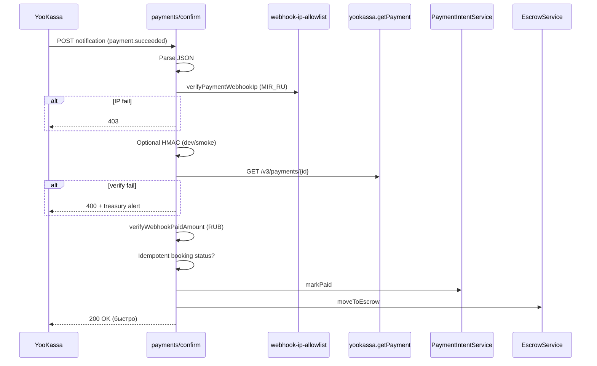
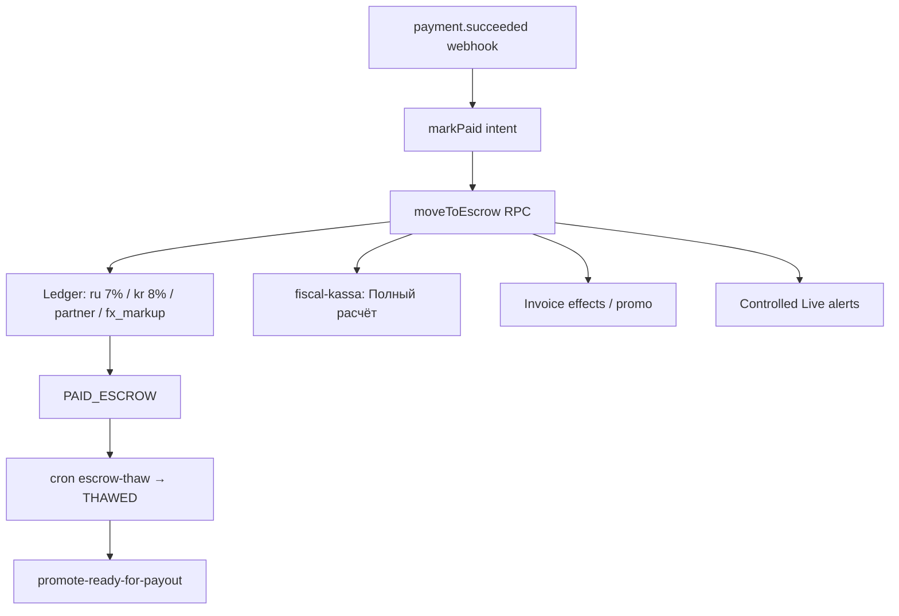

# YooKassa Integration Blueprint 130.1

**Документ:** архитектурный blueprint (Stage 130.1)  
**Дата:** 2026-06-01  
**Статус:** реализовано в коде — **Stage 130.2** (см. § «Утверждено»)  
**Связанные документы:** [`YOOKASSA_INTEGRATION_PLAN.md`](./YOOKASSA_INTEGRATION_PLAN.md) (Stage 130.0), [`PRE_REAL_PAYMENTS_CHECKLIST.md`](./PRE_REAL_PAYMENTS_CHECKLIST.md), [`CONTROLLED_LIVE_RUNBOOK.md`](./CONTROLLED_LIVE_RUNBOOK.md)

---

## 0. Статус и Цели

### 0.1 Статус Stage 130.1

| Элемент | Состояние |
|---------|-----------|
| Аудит текущей платёжной архитектуры | ✅ Завершён (130.0 + 130.1) |
| Код интеграции ЮKassa | ⏸ **Не в scope 130.1** — только blueprint |
| Тестовый магазин ЮKassa | Планируется в **130.2** |
| Первый реальный MIR | **130.4** (Controlled Live) |

### 0.2 Цели

1. Подключить **ЮKassa только как acquirer** (приём RUB, умный платёж redirect) в **sandbox**, не ломая hardening Stage 100–127.
2. Сохранить **платформенный escrow** (`PAID_ESCROW` → cron thaw → payout) и **ledger схемы 3.0** (7% РФ ИП + 8% КР ОсОО + ~85% хост + `fx_markup`).
3. Вынести HTTP к ЮKassa в **изолированный** `lib/payments/yookassa.js`; `mir-ru.adapter` — тонкая обёртка.
4. Усилить webhook: **IP whitelist + обязательный `getPayment()`** после notification.
5. Зафиксировать **Fiscal Strategy A** — чек 54-ФЗ post-escrow, без `receipt` в create payment на v1.

### 0.3 Вне scope v1

- «Безопасная сделка» ЮKassa (PSP-hold).
- `capture: false` + ручной capture в ЮKassa.
- `receipt` в теле `POST /v3/payments` (отложено — см. §1).
- Split / marketplace payouts на стороне ЮKassa.
- Отдельный checkout API (`/api/v2/payments/yookassa/create`) — канон остаётся `payment/initiate`.

---

## 1. Ключевые Архитектурные Решения (включая Fiscal A)

### 1.1 Нормативные решения (SSOT blueprint)

| # | Решение | Детали |
|---|---------|--------|
| **ADR-YK-01** | ЮKassa = **только acquirer** | `capture: true`, `confirmation.type: redirect` (умный платёж). Деньги приняты → webhook → платформа. |
| **ADR-YK-02** | Escrow + ledger — **платформа** | `EscrowService.moveToEscrow` → RPC `move_to_escrow_and_post_ledger_v1`. ЮKassa Safe Deal **не используем** в v1. |
| **ADR-YK-03** | `Idempotence-Key` — **стабильный UUID v4** | Один ключ на `payment_intent`; хранить в `payment_intents.metadata.yookassa_idempotence_key`; переиспользовать при retry `initiate`. |
| **ADR-YK-04** | Webhook — **не polling** для UI | Основной канал статуса: `payment.succeeded`. Дополнительно: **GET** `/v3/payments/{id}` для верификации (не опрос UI). |
| **ADR-YK-05** | Webhook security | **Обязательно:** IP whitelist ЮKassa. **Обязательно:** `getPayment()` сверка status/amount/metadata. **Опционально:** HMAC (`x-yookassa-signature`) для dev/smoke. |
| **ADR-YK-06** | `return_url` — **per-booking** | `/checkout/{bookingId}?intent={intentId}&payment=return` (база из `NEXT_PUBLIC_APP_URL` / site URL). |
| **ADR-YK-07** | Канон API | Create: `POST /api/v2/bookings/[id]/payment/initiate` (`method: MIR`). Webhook: `POST /api/webhooks/payments/confirm` (+ опциональный alias). |
| **ADR-YK-08** | RUB charge SSOT | `acquirer-charge-amount.js` ← `pricing_snapshot.guest_total_rub` / locked rate. Ledger в **THB** (`payment_intents.amount_thb`). |

### 1.2 Fiscal Strategy — **Вариант A** (утверждено для Stage 130.x)

| Аспект | Решение v1 |
|--------|------------|
| `receipt` в `createPayment` ЮKassa | **НЕ передаём** в Stage 130.x |
| Когда пробивается чек | **Post-escrow** через `lib/services/fiscal-kassa.service.js` |
| Тип чека | Один чек **«Полный расчёт»** (существующий pipeline) |
| Теги 1222/1224/1226, agent/supplier | Готовятся в fiscal-слое / отдельной спеки; **не** в теле payment ЮKassa на v1 |
| Причина | Минимизация рисков; проверенная логика; простое согласование с бухгалтером (схема 3.0) |
| Будущее | Переход на `receipt` в ЮKassa — **отдельный этап** (после стабильного MIR + ADR) |



### 1.3 «Finance mode» (уточнение терминов)

В коде **нет** поля `finance_mode`. Операционный «финансовый режим» = связка:

- `lib/payment/payment-production-guard.js` — mock/fiscal/guest pay gates
- `lib/treasury/controlled-live.js` — Controlled Live пилот
- `lib/payment/webhook-guest-payment-gate.js` — те же правила на webhook
- FinTech `/admin/settings/finances` — ops UI, не PSP runtime

ЮKassa **не переключает** формулы 7%/8%/85% — только разрешён ли приём и корректность RUB charge.

---

## 2. Аудит Текущей Архитектуры

### 2.1 Общая схема (code-truth)



### 2.2 Карта модулей

| Слой | Файл / маршрут | Роль | Изменение в 130.2+ |
|------|----------------|------|-------------------|
| **Checkout UI** | `app/checkout/[bookingId]/page.js`, `hooks/useCheckoutPayment.js`, `useCheckoutIntentFlow.js` | Redirect на `checkoutUrl` | Минимально (return UX) |
| **Initiate** | `POST /api/v2/bookings/[id]/payment/initiate` | Intent + AWAITING_PAYMENT | Без смены контракта |
| **Intent SSOT** | `lib/services/payment-intent.service.js` | CRUD, initiate, markPaid | + metadata: idempotence, yookassa_payment_id |
| **Adapter registry** | `lib/services/payment-adapters/index.js` | `MIR → MIR_RU` | Без изменений |
| **MIR adapter** | `lib/services/payment-adapters/mir-ru.adapter.js` | Create payment сегодня | Делегировать в `yookassa.js` |
| **RUB amount** | `lib/services/payment-adapters/acquirer-charge-amount.js` | SSOT RUB | Без изменений |
| **Webhook** | `app/api/webhooks/payments/confirm/route.js` | markPaid + escrow | + GET verify |
| **Статусы PSP** | `lib/services/payment-adapters/status-normalizer.js` | succeeded/canceled | Без изменений |
| **Подпись** | `lib/services/payment-adapters/webhook-signature.js` | HMAC MIR_RU | Опциональный HMAC на prod |
| **IP** | `lib/payment/webhook-ip-allowlist.js` | CIDR ЮKassa | Enforce staging/prod |
| **Escrow** | `lib/services/escrow.service.js` | RPC capture | **Не трогаем** |
| **Ledger 3.0** | `lib/services/ledger/ledger-capture-legs.js` | ru/kr/fx/partner | **Не трогаем** |
| **Fiscal A** | `lib/services/fiscal-kassa.service.js` | Post-escrow чек | **Не трогаем** в 130.2 |
| **Crons** | `escrow-thaw`, `promote-ready-for-payout` | THAWED → payout | **Не трогаем** |
| **Smoke** | `lib/smoke/checkout-mir-escrow-step.js` | MIR path | + test shop branch |
| **Guards** | `payment-production-guard.js`, `webhook-guest-payment-gate.js` | Controlled Live | Без изменений |

### 2.3 Известные gaps (до 130.2)

| Gap | Сейчас | Целевое (130.2) |
|-----|--------|-----------------|
| Idempotence-Key | `pi-{id}-{randomUUID()}` | Стабильный UUID в intent metadata |
| GET payment verify | Нет | Обязательно в webhook handler |
| `return_url` | Один `PAYMENT_RETURN_URL` | Per-booking builder |
| HTTP к ЮKassa | Внутри adapter | `lib/payments/yookassa.js` |
| `receipt` в create | Нет | **Осознанно нет** (Fiscal A) |
| Отдельный webhook URL | Только `payments/confirm` | Опциональный alias |

### 2.4 Crons и escrow — без изменений для ЮKassa

| Этап | Механизм |
|------|----------|
| Capture | `moveToEscrow` → `move_to_escrow_and_post_ledger_v1` |
| PAID_ESCROW → THAWED | `app/api/cron/escrow-thaw` + `lib/escrow-thaw-rules.js` |
| THAWED → READY_FOR_PAYOUT | `app/api/cron/promote-ready-for-payout` |
| Partner payout | Treasury / `PayoutBatchService` (не guest acquirer) |

---

## 3. Изолированный Сервис `lib/payments/yookassa.js`

### 3.1 Принципы

1. **Единственная точка** HTTP к `api.yookassa.ru` (нативный `fetch`).
2. **Без бизнес-логики** escrow/ledger — только PSP transport + нормализация ответа.
3. **`mir-ru.adapter`** остаётся: mock fallback, incidents, charge validation, mapping в `checkoutUrl` / `externalRef`.
4. **Расширяемость:** интерфейс готов к будущим `getPayment`, `cancelPayment`, marketplace split (отдельные функции, не в v1).

### 3.2 Структура файлов (130.2)

```
lib/payments/
  yookassa.js                 # createPayment, getPayment, getConfig
  yookassa-idempotence.js     # getOrCreateIdempotenceKey(intentId)
  yookassa-return-url.js      # buildCheckoutReturnUrl(bookingId, intentId)
  yookassa-metadata.js        # buildYookassaMetadata(...)
```

### 3.3 Контракт API модуля

| Функция | Вход | Выход | Idempotence |
|---------|------|-------|-------------|
| `getYookassaConfig()` | env | `{ shopId, secretKey, apiBase, configured }` | — |
| `createPayment(input)` | см. ниже | `{ ok, paymentId, confirmationUrl, status, test, raw }` | **Обязателен** `input.idempotenceKey` |
| `getPayment(paymentId)` | PSP payment id | `{ ok, status, amount, metadata, paid, test, raw }` | GET — без idempotence |

**`YookassaCreatePaymentInput`:**

| Поле | Тип | Обязательно | Описание |
|------|-----|-------------|----------|
| `bookingId` | string | да | TEXT id брони |
| `paymentIntentId` | string | да | `pi-*` |
| `amountRub` | number | да | 2 decimal, из `acquirer-charge-amount` |
| `amountThb` | number | да | metadata + intent SSOT |
| `idempotenceKey` | string (UUID v4) | да | Стабильный на intent |
| `returnUrl` | string | да | Per-booking (§1) |
| `metadataExtra` | object | нет | `charge_source`, `split_profile: 'none'` |
| `receipt` | object | **нет в v1** | Fiscal A — не передаём |

### 3.4 Metadata contract (SSOT для webhook)

| Ключ | Обязательно | Назначение |
|------|-------------|------------|
| `booking_id` | ✅ | Resolve booking |
| `payment_intent_id` | ✅ | Resolve intent |
| `amount_thb` | ✅ | Сверка с intent (ledger THB) |
| `charge_source` | ✅ | Audit (`pricing_snapshot.guest_total_rub`, …) |
| `bookingId` | legacy dup | Обратная совместимость parsePayload |
| `paymentIntentId` | legacy dup | Обратная совместимость |
| `financial_model` | опц. | `"3.0"` |
| `split_profile` | опц. | `"none"` в v1 |

Webhook handler **требует** `booking_id` + `payment_intent_id` в `object.metadata` (уже assert в `payments/confirm`).

### 3.5 Idempotence strategy



| Правило | Описание |
|---------|----------|
| Генерация | `crypto.randomUUID()` при **первом** успешном вызове create для intent |
| Хранение | `payment_intents.metadata.yookassa_idempotence_key` |
| Retry initiate | Читать существующий ключ; **не** генерировать новый |
| Новый intent | Новая бронь / новый intent row → новый UUID |
| ЮKassa контракт | Один POST + один ключ → идемпотентный ответ (тот же `payment.id`) |

**Анти-паттерн (текущий код):** `pi-${intent.id}-${randomUUID()}` на каждый retry — создаёт дубли платежей в ЮKassa.

### 3.6 Шаблон кода — `yookassa.js` (reference для 130.2)

```javascript
/**
 * lib/payments/yookassa.js — isolated YooKassa API v3 client (Stage 130.2).
 * @see docs/YOOKASSA_BLUEPRINT_130.1.md
 */

function basicAuthHeader(shopId, secretKey) {
  return `Basic ${Buffer.from(`${shopId}:${secretKey}`, 'utf8').toString('base64')}`
}

export function getYookassaConfig() {
  const shopId = String(process.env.YOOKASSA_SHOP_ID || '').trim()
  const secretKey = String(process.env.YOOKASSA_SECRET_KEY || '').trim()
  const apiBase = String(process.env.YOOKASSA_API_URL || 'https://api.yookassa.ru/v3').replace(/\/$/, '')
  return {
    shopId,
    secretKey,
    apiBase,
    configured: Boolean(shopId && secretKey),
  }
}

/**
 * @param {import('./yookassa-types').YookassaCreatePaymentInput} input
 */
export async function createPayment(input) {
  const { shopId, secretKey, apiBase, configured } = getYookassaConfig()
  if (!configured) {
    return { ok: false, code: 'YOOKASSA_NOT_CONFIGURED' }
  }

  const {
    bookingId,
    paymentIntentId,
    amountRub,
    amountThb,
    idempotenceKey,
    returnUrl,
    metadataExtra = {},
  } = input

  // Fiscal Strategy A: no receipt in v1
  const body = {
    amount: { value: Number(amountRub).toFixed(2), currency: 'RUB' },
    capture: true,
    confirmation: { type: 'redirect', return_url: returnUrl },
    description: `${getSiteDisplayName()} booking ${bookingId}`,
    metadata: {
      booking_id: bookingId,
      bookingId,
      payment_intent_id: paymentIntentId,
      paymentIntentId,
      amount_thb: String(amountThb),
      financial_model: '3.0',
      split_profile: 'none',
      ...metadataExtra,
    },
  }

  const res = await fetch(`${apiBase}/payments`, {
    method: 'POST',
    headers: {
      'Content-Type': 'application/json',
      Authorization: basicAuthHeader(shopId, secretKey),
      'Idempotence-Key': idempotenceKey,
    },
    body: JSON.stringify(body),
  })

  const json = await res.json().catch(() => ({}))
  if (!res.ok) {
    return {
      ok: false,
      code: 'YOOKASSA_API_ERROR',
      httpStatus: res.status,
      provider: json,
    }
  }

  return {
    ok: true,
    paymentId: json.id,
    confirmationUrl: json.confirmation?.confirmation_url ?? null,
    status: json.status,
    test: json.test === true,
    raw: json,
  }
}

/**
 * Mandatory webhook verification (official pattern).
 * @param {string} paymentId
 */
export async function getPayment(paymentId) {
  const { shopId, secretKey, apiBase, configured } = getYookassaConfig()
  if (!configured) return { ok: false, code: 'YOOKASSA_NOT_CONFIGURED' }

  const res = await fetch(`${apiBase}/payments/${encodeURIComponent(paymentId)}`, {
    method: 'GET',
    headers: { Authorization: basicAuthHeader(shopId, secretKey) },
  })
  const json = await res.json().catch(() => ({}))
  if (!res.ok) {
    return { ok: false, code: 'YOOKASSA_GET_FAILED', httpStatus: res.status, provider: json }
  }

  return {
    ok: true,
    status: json.status,
    paid: json.paid === true,
    amount: json.amount,
    metadata: json.metadata || {},
    test: json.test === true,
    raw: json,
  }
}
```

### 3.7 Шаблон — `mir-ru.adapter` после рефактора (тонкий слой)

```javascript
import { createPayment } from '@/lib/payments/yookassa'
import { resolveIdempotenceKeyForIntent } from '@/lib/payments/yookassa-idempotence'
import { buildCheckoutReturnUrl } from '@/lib/payments/yookassa-return-url'

// createSession: validate charge → resolveIdempotenceKeyForIntent → createPayment → map checkoutUrl/externalRef
// mock / allowMockAcquiringSessions / logPaymentAdapterIncident — без изменений семантики
```

### 3.8 Задел под marketplace split (не v1)

| Будущее | Где |
|---------|-----|
| Transfers / deals API | Новые функции в `yookassa.js` |
| `split_profile: 'marketplace_v1'` | metadata + ADR |
| 7/8/85 в PSP | Только если юристы переведут split на PSP — **сейчас ledger only** |

---

## 4. Webhook Handler + IP + GET verify

### 4.1 Канонический маршрут

| Маршрут | Статус |
|---------|--------|
| `POST /api/webhooks/payments/confirm` | **Канон** (Mandarin + YooKassa) |
| `POST /api/payments/webhook/yookassa` | **Опциональный alias** (130.2) — re-export того же handler |

URL для кабинета ЮKassa (test/staging):

`https://{host}/api/webhooks/payments/confirm`

### 4.2 Pipeline обработки (целевой 130.2)



### 4.3 События ЮKassa

| Event | `normalizedStatus` | Действие |
|-------|-------------------|----------|
| `payment.succeeded` | PAID | markPaid + moveToEscrow |
| `payment.canceled` | CANCELLED | `200` + `{ ignored: true, reason: 'not_paid' }` |
| `payment.waiting_for_capture` | INITIATED | Ignore (при `capture: true` не ожидается) |
| `refund.succeeded` | — | Out of scope v1 |

### 4.4 IP whitelist (обязательно на staging/prod)

Реализация: `lib/payment/webhook-ip-allowlist.js`

| CIDR / IP (default) | Источник |
|---------------------|----------|
| `185.71.76.0/27` | Документация ЮKassa |
| `185.71.77.0/27` | |
| `77.75.153.0/25` | |
| `77.75.154.128/25` | |
| `77.75.156.11`, `77.75.156.35` | |
| `2a02:5180::/32` | IPv6 |

| Env | Поведение |
|-----|-----------|
| `YOOKASSA_WEBHOOK_ENFORCE_IP=1` | Проверка включена |
| prod default | enforce, если не `=0` |
| `YOOKASSA_WEBHOOK_IP_ALLOWLIST` | Override списка |

### 4.5 GET verify (обязательно)

После IP-check, **до** `markPaid`:

| Проверка | Источник |
|----------|----------|
| `status === 'succeeded'` | `getPayment()` |
| `paid === true` | `getPayment()` |
| `amount.value` + `currency === RUB` | Сверка с `verifyWebhookPaidAmount` |
| `metadata.booking_id` | = payload booking |
| `metadata.payment_intent_id` | = intent |

При mismatch → `400`, `recordTreasuryWebhookError`, **без** escrow.

### 4.6 HMAC (опционально)

| Среда | HMAC |
|-------|------|
| dev / smoke | `YOOKASSA_WEBHOOK_SECRET` + `x-yookassa-signature` (как сейчас) |
| staging/prod | **IP + GET** — primary; HMAC не заменяет GET |

Официальные notification ЮKassa **не документируют** body HMAC — наш HMAC для internal/smoke совместимости.

### 4.7 Идемпотентность webhook (существующий hardening)

| Механизм | Файл |
|----------|------|
| Booking SSOT post-escrow | `isPaymentAcquiringWebhookIdempotentBookingStatus` → `200` без повторного escrow |
| Intent already PAID | `PaymentIntentService.markPaid` → `alreadyPaid` |
| RPC already_escrowed | `EscrowService.moveToEscrow` killswitch (Stage 125.0) |

PSP ретраит 24 часа — платформа **всегда** отвечает `200` на успешно обработанные/идемпотентные случаи.

### 4.8 Шаблон verify-блока (в `payments/confirm`)

```javascript
import { getPayment } from '@/lib/payments/yookassa'

// adapterKey === 'MIR_RU' && gatewayRef:
const verified = await getPayment(gatewayRef)
if (!verified.ok || verified.status !== 'succeeded' || !verified.paid) {
  return NextResponse.json({ success: false, error: 'YOOKASSA_VERIFY_FAILED' }, { status: 400 })
}
// Compare verified.metadata.booking_id / payment_intent_id with parsePayload
// Compare verified.amount with verifyWebhookPaidAmount expected RUB
```

---

## 5. Интеграция с Initiate / Escrow / Ledger (схема 3.0)

### 5.1 Initiate flow (без смены HTTP контракта)

```
POST /api/v2/bookings/:id/payment/initiate
  body: { method: "MIR", invoiceId?, walletUseThb?, acceptedLegalTerms? }

  1. Session + legal consent + assertGuestPaymentOperationsAllowed()
  2. PaymentIntentService.resolveOrCreateForCheckout(booking)
  3. PaymentIntentService.initiate(intentId, "MIR")
       → payment-adapters → MIR_RU
       → [130.2] yookassa.createPayment(...)
  4. transitionBookingStatus → AWAITING_PAYMENT
  5. Response: { checkoutUrl, intentId, amountThb, isTestMode, ... }
```

### 5.2 Схема 3.0 — где что считается

| Компонент | Где считается | ЮKassa знает? |
|-----------|---------------|---------------|
| Сумма гостя RUB | `acquirer-charge-amount` ← snapshot | Только `amount.value` RUB |
| Сумма гостя THB | `payment_intents.amount_thb` | metadata `amount_thb` |
| 7% РФ (ru_fee) | `final_breakdown.ru_fee_thb` → ledger RPC | Нет |
| 8% КР (kr_fee) | `final_breakdown.kr_fee_thb` → ledger RPC | Нет |
| ~85% хост (partner) | `partner_earnings_thb` / netto | Нет |
| fx_markup | `fx_markup_thb` → ledger | Нет |
| Эскроу до заселения | `escrow_thaw_at` + cron | Нет (платформенный) |

Функция: `computeBookingPaymentLedgerLegsV2` в `lib/services/ledger/ledger-capture-legs.js` — вызывается из RPC при `moveToEscrow`, **не** из adapter.

### 5.3 Post-payment chain



### 5.4 Fiscal A в цепочке

| Шаг | Сервис | Примечание |
|-----|--------|------------|
| После RPC escrow | `issueFiscalReceiptForBooking` | Существующий retry/reconcile (Stage 125.6) |
| В createPayment ЮKassa | — | **Нет receipt** (v1) |
| Бухгалтерия 1222/1224/1226 | fiscal layer / будущая спека | Не блокирует 130.2 |

### 5.5 Controlled Live / treasury

| Hook | Когда |
|------|-------|
| `assertGuestPaymentOperationsAllowed` | initiate + webhook |
| `maybeAlertFirstRealPayment` | после первого PAID_ESCROW |
| `CONTROLLED_LIVE_MAX_THB_PER_DAY` | soft alert (не блок checkout) |

---

## 6. Roadmap 130.2–130.4

### Stage 130.2 — Implementation (sandbox)

| # | Задача | Критерий готовности |
|---|--------|---------------------|
| 1 | `lib/payments/yookassa.js` + idempotence + return-url | Unit-less smoke: import OK |
| 2 | Refactor `mir-ru.adapter` → delegate | Mock path сохранён |
| 3 | Stable idempotence в intent metadata | Double initiate → один payment id |
| 4 | `getPayment()` в webhook | Mismatch → 400, no escrow |
| 5 | `YOOKASSA_WEBHOOK_ENFORCE_IP=1` на staging | Forbidden с non-allowlisted IP |
| 6 | Test shop keys в `.env` | Real `confirmation_url` (не mock) |
| 7 | Smoke `checkout-mir-escrow-step` branch | `smoke:full-financial` green / SKIP documented |
| 8 | Docs: `TECHNICAL_MANIFESTO` + `ARCHITECTURAL_PASSPORT` | Stage 130.2 строка |

**Не в 130.2:** `receipt` в create (Fiscal A), Safe Deal, split API.

### Stage 130.3 — Staging E2E + fiscal hardening

| # | Задача |
|---|--------|
| 1 | Manual E2E: test card → PAID_ESCROW → fiscal PENDING/ISSUED |
| 2 | Reconcile: RUB webhook vs `guest_total_rub` snapshot |
| 3 | Optional webhook alias `/api/payments/webhook/yookassa` |
| 4 | Owner checklist § MIR в `PRE_REAL_PAYMENTS_CHECKLIST` |
| 5 | Док `YOOKASSA_FISCAL_RECEIPT.md` (подготовка к будущему receipt в PSP, не внедрение) |

### Stage 130.4 — Controlled Live first MIR

| # | Задача |
|---|--------|
| 1 | Go/No-Go signed (`GO_NO_GO_FIRST_REAL_PAYMENT.md`) |
| 2 | Prod shop credentials (отдельный PR от test) |
| 3 | 1–N реальных MIR под лимитом |
| 4 | Post-mortem: ledger, fiscal, thaw cron, TG alerts |
| 5 | ADR review: переход Fiscal A → receipt-in-PSP (если бухгалтер одобрит) |

### Будущее (после 130.4)

| Тема | Условие старта |
|------|----------------|
| `receipt` в `createPayment` ЮKassa | ADR + бухгалтер + стабильный MIR |
| ЮKassa Safe Deal | Отдельный ADR (конфликт с platform escrow) |
| Marketplace split в PSP | Юридическая модель + ADR |

---

## 7. Env Variables

### 7.1 Обязательные (test shop, 130.2)

| Variable | Пример / примечание |
|----------|---------------------|
| `YOOKASSA_SHOP_ID` | Test shop id из кабинета |
| `YOOKASSA_SECRET_KEY` | Test secret key |

### 7.2 Рекомендуемые

| Variable | Default | Назначение |
|----------|---------|------------|
| `YOOKASSA_API_URL` | `https://api.yookassa.ru/v3` | Base URL (без trailing `/payments` в base — см. код) |
| `PAYMENT_ACQUIRER_RUB_ENABLED` | `1` | RUB charge для MIR |
| `PAYMENT_ACQUIRER_RUB_SHADOW` | `0` | `1` = log RUB, send THB (только drill) |
| `YOOKASSA_WEBHOOK_ENFORCE_IP` | `1` на staging/prod | IP whitelist |
| `YOOKASSA_WEBHOOK_IP_ALLOWLIST` | empty → defaults | Override CIDR |
| `NEXT_PUBLIC_APP_URL` | site origin | Для `buildCheckoutReturnUrl` |
| `YOOKASSA_WEBHOOK_SECRET` | optional | HMAC smoke/dev |
| `PAYMENT_ACQUIRING_WEBHOOK_SECRET` | fallback HMAC | Shared secret |

### 7.3 Production safety (не менять семантику)

| Variable | Prod |
|----------|------|
| `NEXT_PUBLIC_CHECKOUT_MOCK_ACQUIRING` | **не** `1` |
| `PAYMENT_ALLOW_MOCK_ACQUIRING` | **не** `1` |
| `FISCAL_SANDBOX` | **не** `1` на prod |

### 7.4 return_url (per-booking, ADR-YK-06)

Шаблон:

```
{NEXT_PUBLIC_APP_URL}/checkout/{bookingId}?intent={intentId}&payment=return
```

Fallback если env отсутствует: документировать в runbook; **не** использовать один глобальный `/checkout/success` на prod.

---

## 8. Риски и Mitigation

| ID | Риск | Вероятность | Impact | Mitigation |
|----|------|-------------|--------|------------|
| R1 | Дубль платежа в ЮKassa | Средняя (до fix idem) | Высокий | ADR-YK-03: stable idempotence key |
| R2 | Поддельный webhook | Низкая | Критический | IP + GET verify (ADR-YK-05) |
| R3 | RUB amount drift | Средняя | Высокий | `verifyWebhookPaidAmount` + GET amount |
| R4 | PSP retry 24h | Высокая | Средний | Idempotent booking statuses + 200 |
| R5 | Parallel moveToEscrow | Низкая | Средний | RPC `already_escrowed` (125.0) |
| R6 | IPv6 / proxy IP wrong | Средняя | Средний | Тест на Vercel; `x-forwarded-for` |
| R7 | Fiscal без receipt в PSP | Низкая (Fiscal A) | Средний | post-escrow kassa + reconcile |
| R8 | Mock URL на prod | Низкая | Критический | `payment-production-guard` |
| R9 | Safe Deal случайно включён | Низкая | Высокий | ADR-YK-02, code review |
| R10 | Split в ЮKassa преждевременно | Низкая | Высокий | metadata `split_profile: none`, ledger only |

### 8.1 Тест-план (130.2)

| # | Сценарий | Ожидание |
|---|----------|----------|
| T1 | initiate(MIR) × 2 same intent | Один `payment.id` в ЮKassa |
| T2 | webhook succeeded | PAID_ESCROW + ledger legs |
| T3 | webhook retry | 200 idempotent, нет double ledger |
| T4 | webhook wrong amount | 400, no escrow |
| T5 | webhook non-allowlisted IP | 403 (staging enforce) |
| T6 | GET verify status pending | 400, no escrow |
| T7 | smoke MIR step | PASS или SKIP с причиной |
| T8 | fiscal after escrow | PENDING_FISCAL / issued path |

---

## 9. Следующие шаги

| Порядок | Действие | Владелец |
|---------|----------|----------|
| 1 | Утвердить этот blueprint (§ ниже) | Product / Owner |
| 2 | Завести test shop ЮKassa + keys в staging | Ops |
| 3 | PR **130.2**: `yookassa.js` + adapter refactor + GET verify | Engineering |
| 4 | Webhook URL в кабинете ЮKassa → staging host | Ops |
| 5 | Smoke + manual test card | Engineering |
| 6 | Обновить `PRE_REAL_PAYMENTS_CHECKLIST` § MIR | Ops + Engineering |
| 7 | **130.4** Controlled Live после 130.3 E2E | Owner sign-off |

---

## Утверждено

| Поле | Значение |
|------|----------|
| **Документ** | `docs/YOOKASSA_BLUEPRINT_130.1.md` |
| **Версия** | 1.0 |
| **Дата** | 2026-06-01 |

### Зафиксированные решения (кратко)

- [x] Fiscal Strategy **A** — post-escrow `fiscal-kassa`, без `receipt` в createPayment (130.x)
- [x] ЮKassa = acquirer only, `capture: true`
- [x] Platform escrow + ledger 3.0 без изменений
- [x] Stable `Idempotence-Key` per `payment_intent`
- [x] Webhook: IP whitelist + mandatory `getPayment()`
- [x] `return_url` per-booking

### Комментарии владельца

```
(место для ваших комментариев, правок, даты утверждения)

Утверждаю: _________________________  Дата: __________

Замечания:


```

---

*Конец документа YOOKASSA_BLUEPRINT_130.1*
