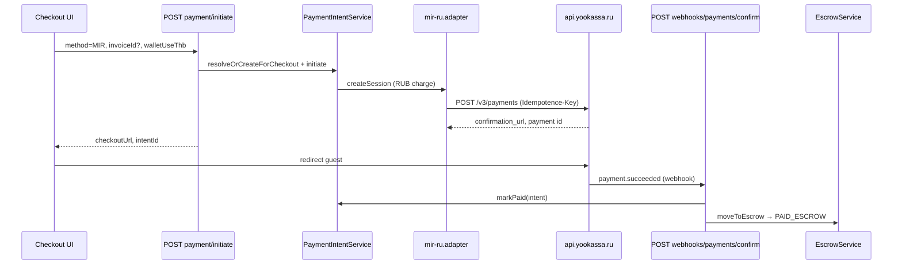

# YooKassa Integration Plan — Stage 130.0 (Pre-MIR)

**Status:** **130.2 Done** · **130.3 Done** · **130.4 Done** (Controlled Live + FinTech ops + smoke `test:true` + webhook IP Vercel)  
**Date:** 2026-06-01 (обновлено 130.4)  
**Scope:** первые MIR/RUB платежи через ЮKassa в **тестовом магазине**, с сохранением платформенного escrow (PAID_ESCROW → THAWED → READY_FOR_PAYOUT).

**Blueprint (норматив):** [`YOOKASSA_BLUEPRINT_130.1.md`](./YOOKASSA_BLUEPRINT_130.1.md)

**Источники:**

- API ЮKassa (документ от PSP, см. [developers](https://yookassa.ru/developers))
- Бухгалтерские материалы «РФ–КР–Тай (схема 3.0)» — юридико-финансовая модель, не замена кода
- Code-truth: `lib/services/payment-adapters/mir-ru.adapter.js`, `app/api/webhooks/payments/confirm/route.js`, Stage 100.3–127.x hardening

---

## 1. Executive summary

| Вопрос | Ответ |
|--------|--------|
| Нужна ли интеграция «с нуля»? | **Нет.** MIR_RU адаптер и webhook-контур уже есть (Stage 100.3+). |
| Рекомендуемый сценарий ЮKassa | **Умный платёж** (`confirmation.type: redirect`) + **webhook** `payment.succeeded` + **capture: true** |
| Платформенный escrow | **Остаётся наш** (`moveToEscrow` RPC) — не путать с «Безопасной сделкой» ЮKassa |
| Безопасная сделка ЮKassa | **Не в v1 MIR** — схема 3.0 и бухгалтерия описывают escrow на уровне платформы/ООО, не hold в PSP |
| Главные gaps (закрыто в 130.2–130.3) | ~~Idempotence-Key~~ ✅ · ~~GET verify~~ ✅ · ~~return_url per-booking~~ ✅ · smoke live-initiate ✅ |
| Остаётся | Fiscal `receipt` в ЮKassa (отложено, Fiscal A) · **первый ручной live MIR** на prod (ops) |
| Следующий шаг | **130.5+** — масштабирование пилота, мониторинг PSP, опционально receipt (не v1) |

### Stage 130.4 (Done)

| Область | Реализация |
|---------|------------|
| Smoke | `assertYookassaTestShopLiveInitiate` — `yookassa_test` + GET `/payments` `test: true` |
| Controlled Live | `controlled-live-mir-guard.js` — soft `CONTROLLED_LIVE_MAX_THB_PER_DAY`, TG первая MIR |
| FinTech | `YookassaOpsCard` + `GET treasury-ops` → `yookassaOps` |
| Webhook IP | `x-vercel-forwarded-for` в `getWebhookClientIp` |
| Docs | `PRE_REAL` §E, `GO_NO_GO` §MIR |

---

## 2. Карта текущей платёжной системы

### 2.1 Guest checkout (MIR / CARD / CRYPTO)

| Слой | Файл | Роль |
|------|------|------|
| UI | `app/checkout/[bookingId]/page.js` | Страница checkout |
| UI hooks | `hooks/useCheckoutPayment.js`, `useCheckoutIntentFlow.js` | Intent load, initiate, redirect |
| UI | `components/PaymentMethods.jsx`, `CheckoutSummary.jsx` | Выбор MIR/CARD/CRYPTO |
| API | `GET/POST app/api/v2/bookings/[id]/payment-intent` | Состояние intent |
| API | `POST app/api/v2/bookings/[id]/payment/initiate` | Создание сессии + `AWAITING_PAYMENT` |
| API | `POST app/api/v2/bookings/[id]/payment/confirm` | Ручное подтверждение (legacy/crypto paths) |
| SSOT intent | `lib/services/payment-intent.service.js` | `payment_intents` CRUD, initiate, markPaid |
| Adapter registry | `lib/services/payment-adapters/index.js` | `MIR → MIR_RU`, `CARD → CARD_INTL` |
| **YooKassa** | `lib/services/payment-adapters/mir-ru.adapter.js` | `POST https://api.yookassa.ru/v3/payments` |
| RUB amount | `lib/services/payment-adapters/acquirer-charge-amount.js` | SSOT RUB из `pricing_snapshot` / locked rate |
| Guards | `lib/payment/payment-production-guard.js`, `lib/payment/webhook-guest-payment-gate.js` | Controlled Live, guest gate |
| Legal | `lib/legal-consent.js` | Consent на initiate |

### 2.2 Webhooks (acquiring)

| Маршрут | Файл | Назначение |
|---------|------|------------|
| `POST /api/webhooks/payments/confirm` | `app/api/webhooks/payments/confirm/route.js` | **Канон** для Mandarin + YooKassa-shaped JSON |
| `POST /api/webhooks/crypto/confirm` | `app/api/webhooks/crypto/confirm/route.js` | USDT/TRON (отдельный контур) |

Цепочка в `payments/confirm` (intent path):

1. Signature / IP (`webhook-signature.js`, `webhook-ip-allowlist.js`)
2. Parse YooKassa body (`event`, `object.metadata`, `object.amount`)
3. `normalizeProviderStatus` → `PAID`
4. Idempotent booking statuses (`lib/booking/status-sets.js`)
5. `verifyWebhookPaidAmount` (RUB vs snapshot)
6. `PaymentIntentService.markPaid`
7. `EscrowService.moveToEscrow` → RPC `move_to_escrow_and_post_ledger_v1`
8. `applyInvoicePostPaymentEffects`

### 2.3 Escrow, thaw, payout (не зависят от PSP)

| Этап | Механизм | Файл |
|------|----------|------|
| Capture в ledger | `moveToEscrow` | `lib/services/escrow.service.js`, `lib/services/escrow/move-to-escrow-side-effects.js` |
| Fiscal 54-ФЗ (после escrow) | `issueFiscalReceiptForBooking` | `lib/services/fiscal-kassa.service.js` (side-effect escrow) |
| PAID_ESCROW → THAWED | Cron | `app/api/cron/escrow-thaw/route.js` + `lib/escrow-thaw-rules.js` |
| THAWED → READY_FOR_PAYOUT | Cron (+24h policy) | `app/api/cron/promote-ready-for-payout/route.js` |
| Partner payout | Treasury / batches | `lib/services/payout-batch.service.js` (не в scope MIR guest pay) |

**Вывод:** ЮKassa подключается только на участке **initiate → redirect → webhook → markPaid → moveToEscrow**. Cron thaw/promote **менять не нужно** для MIR v1.

### 2.4 Smoke / readiness

| Артефакт | Файл |
|----------|------|
| MIR escrow smoke | `lib/smoke/checkout-mir-escrow-step.js` |
| Shared webhook mock | `lib/smoke/checkout-acquiring-smoke-shared.js` |
| Pre-live checklist | `lib/payment/pre-live-readiness.js`, `docs/PRE_REAL_PAYMENTS_CHECKLIST.md` |
| Go/No-Go | `docs/GO_NO_GO_FIRST_REAL_PAYMENT.md` |

---

## 3. Сравнение с требованиями ЮKassa

### 3.1 Рекомендации API (документ PSP)

| Требование ЮKassa | Текущая реализация | Gap / действие |
|-------------------|-------------------|----------------|
| Endpoint `https://api.yookassa.ru/v3/` | `YOOKASSA_API_URL` default ✅ | — |
| Auth: HTTP Basic `shopId:secretKey` | `mir-ru.adapter.js` ✅ | — |
| **Idempotence-Key** на POST | Header есть ✅ | ⚠️ Сейчас `pi-{id}-{randomUUID}` — при retry создаётся **новый** платёж. Нужен **стабильный** ключ = `intent.id` (130.1) |
| Умный платёж: `confirmation.type: redirect` | ✅ | Улучшить `return_url` → `/checkout/[bookingId]?paid=1` |
| `capture: true` (одностадийный) | ✅ | Соответствует «оплата сразу»; `waiting_for_capture` только если позже `capture: false` |
| Webhook `payment.succeeded` | Parsed in `status-normalizer.js` + confirm route ✅ | Подписать в кабинете ЮKassa URL |
| Ответ webhook **HTTP 200** быстро | ✅ | — |
| **Не доверять webhook слепо** — GET payment по `object.id` | ❌ Нет server-side re-fetch | **130.2:** после webhook вызывать `GET /v3/payments/{id}` |
| Безопасность webhook: **whitelist IP** | `lib/payment/webhook-ip-allowlist.js` ✅ (опционально `YOOKASSA_WEBHOOK_ENFORCE_IP=1`) | Включить на prod |
| HMAC подпись тела | `x-yookassa-signature` + `YOOKASSA_WEBHOOK_SECRET` | ⚠️ Для **официальных** уведомлений ЮKassa подпись **не документирована**; HMAC — для **smoke/internal**. На prod опираться на IP + GET |
| Тестовый магазин | Mock fallback если нет ключей | **130.1:** реальные test `shopId` + `test: true` в ответе API |
| Безопасная сделка (hold в ЮKassa) | Не используется | **Осознанно:** escrow платформы (см. §4) |
| 54-ФЗ чек в `receipt` | Не в `mir-ru.adapter` | **130.2+** (бухгалтерия §54-ФЗ) |

### 3.2 События webhook (маппинг)

| Событие ЮKassa | Наш `payment_intents.status` | Действие confirm route |
|----------------|------------------------------|-------------------------|
| `payment.succeeded` | `PAID` | markPaid + moveToEscrow |
| `payment.canceled` | `CANCELLED` | `ignored` (не paid) ✅ |
| `payment.waiting_for_capture` | `INITIATED` | Ignored until capture (при `capture:true` не ожидается) |
| `refund.succeeded` | — | **Out of scope v1** — отдельный handler позже |

### 3.3 Сценарий «двухстадийный» (capture: false)

ЮKassa: `capture: false` → `waiting_for_capture` → POST capture.

| | Сейчас | Альтернатива |
|---|--------|--------------|
| PSP hold до check-in | Нет (`capture: true`) | Возможно в v2, если юристы потребуют hold в банке |
| Платформенный hold | `PAID_ESCROW` + `escrow_thaw_at` | **Канон схемы 3.0** — деньги учтены в ledger, партнёру после thaw |

**Рекомендация Pre-MIR:** оставить `capture: true` + платформенный escrow. Не включать «Безопасную сделку» ЮKassa без отдельного ADR.

---

## 4. Согласование с бухгалтерией (схема 3.0)

Документы на Desktop (схема / бухгалтерия / финблок ИИ) задают **маршрут денег и налогов**, не замену адаптера.

| Тема из бухгалтерии | Импликация для кода |
|---------------------|-------------------|
| Оплата гостя **MIR/карта в RUB** через ЮKassa | Уже: `acquirer-charge-amount.js` + `mir-ru.adapter` RUB |
| Назначение платежа / агентская модель ИП | `description` + `metadata`; позже — шаблон из i18n/настроек |
| **54-ФЗ:** признак расчёта, предмет, НДС, agent/supplier | **Gap:** объект `receipt` в create payment + связь с `fiscal-kassa.service.js` |
| 7% РФ / 8% KR / 85% хост — ledger | Уже в `move_to_escrow` / commission snapshot — **не в ЮKassa API** |
| Эскроу «платформа держит до заселения» | `escrow_thaw_at` + cron — **не** ЮKassa Safe Deal |
| Избегать прямого СБП API | Redirect через ЮKassa (карта/MIR) ✅ |
| WHT 10% / ИП / ООО КР | Операционные договоры + отчётность; в коде — метки в payout/export, не в webhook |
| FX: гость RUB, ledger THB | SSOT: `amount_thb` в intent, RUB только в acquirer charge |

**Идея (130.2):** единый builder `buildYookassaReceiptFromBooking(booking)` — теги 1222/1224/1226, supplier ИП/ООО, сумма = RUB charge.

---

## 5. Переменные окружения

### 5.1 Обязательные для тестового MIR

| Variable | Назначение |
|----------|------------|
| `YOOKASSA_SHOP_ID` | Идентификатор тестового/боевого магазина |
| `YOOKASSA_SECRET_KEY` | Секрет API (Basic Auth) |
| `YOOKASSA_WEBHOOK_SECRET` | HMAC для smoke / dev; на prod см. §3.1 |
| `PAYMENT_ACQUIRING_WEBHOOK_SECRET` | Fallback HMAC (если один секрет на все адаптеры) |

### 5.2 Рекомендуемые

| Variable | Default / примечание |
|----------|---------------------|
| `YOOKASSA_API_URL` | `https://api.yookassa.ru/v3/payments` |
| `PAYMENT_RETURN_URL` | ⚠️ Сейчас один URL; **130.1:** шаблон `https://{host}/checkout/{bookingId}?payment=return` |
| `PAYMENT_ACQUIRER_RUB_ENABLED` | `1` — charge в RUB для MIR |
| `PAYMENT_ACQUIRER_RUB_SHADOW` | `0` в test prod-path; `1` только staging drill |
| `YOOKASSA_WEBHOOK_ENFORCE_IP` | `1` на production |
| `YOOKASSA_WEBHOOK_IP_ALLOWLIST` | опционально override CIDR |
| `NEXT_PUBLIC_CHECKOUT_MOCK_ACQUIRING` | **не** `1` на prod |

### 5.3 Уже существующие (не дублировать)

Controlled Live, fiscal, cron secrets — см. `docs/PRE_REAL_PAYMENTS_CHECKLIST.md`, `docs/CONTROLLED_LIVE_RUNBOOK.md`.

---

## 6. API-маршруты: текущие vs предлагаемые

### 6.1 Рекомендация архитектуры (минимальный diff)

**Не плодить параллельный платёжный контур.** Использовать существующие точки:

| Операция | Канон сейчас | Комментарий |
|----------|--------------|-------------|
| Создать платёж + redirect | `POST /api/v2/bookings/[id]/payment/initiate` (`method: MIR`) | Внутри → `mir-ru.adapter` |
| Webhook | `POST /api/webhooks/payments/confirm` | URL в кабинете ЮKassa |

### 6.2 Опциональные алиасы (только для удобства ops)

| Предложенный путь | Реализация | Зачем |
|-------------------|------------|-------|
| `POST /api/webhooks/yookassa` | Thin re-export → `payments/confirm` | Понятный URL в кабинете ЮKassa |
| `POST /api/v2/payments/yookassa/create` | **Не рекомендуется в v1** | Дублирует `initiate`; путаница SSOT |

Если нужен отдельный namespace для мониторинга — достаточно **webhook alias** + заголовок `x-payment-adapter: MIR_RU`.

---

## 7. Gaps (приоритет)

| P | Gap | Риск | Stage |
|---|-----|------|-------|
| P0 | Нестабильный `Idempotence-Key` | Дубли платежей при retry initiate | **130.1** |
| P0 | Нет `GET /v3/payments/{id}` после webhook | Принятие поддельного webhook | **130.2** |
| P0 | Test shop не подключён в dev | Всегда mock URL | **130.1** |
| P1 | `return_url` не привязан к booking | Плохой UX после оплаты | **130.1** |
| P1 | Нет `receipt` (54-ФЗ) в create payment | Налоговый риск RU MIR | **130.2** |
| P1 | HMAC как «единственная» защита | Ложное чувство безопасности | Docs + IP enforce |
| P2 | `payment.waiting_for_capture` + capture API | Только если юристы требуют PSP hold | ADR + v2 |
| P2 | Refund webhook | Chargeback flow | Backlog |
| P2 | ЮKassa Safe Deal | Другая юридическая модель | **Не делать** без ADR |

---

## 8. Roadmap: Stage 130.1 – 130.3

### Stage 130.1 — Test shop: create payment + redirect (MIR)

**Цель:** реальный тестовый платёж end-to-end в sandbox ЮKassa.

| # | Задача |
|---|--------|
| 1 | Выдать test `YOOKASSA_SHOP_ID` / `YOOKASSA_SECRET_KEY` в `.env.local` |
| 2 | `Idempotence-Key: intent.id` (повтор initiate → тот же payment id или 409 от API) |
| 3 | `return_url` с `bookingId` (+ optional `intentId`) |
| 4 | Webhook URL в кабинете → `https://{staging}/api/webhooks/payments/confirm` |
| 5 | Smoke: ветка «live test keys» в `checkout-mir-escrow-step` (без mock URL) |
| 6 | Manual QA: карта 5555… из доки ЮKassa → PAID_ESCROW в БД |

**Не трогать:** checkout business logic, RQ, ledger формулы.

### Stage 130.2 — Webhook hardening + fiscal receipt

| # | Задача |
|---|--------|
| 1 | После webhook: `GET /v3/payments/{id}`, сверка `status===succeeded`, amount, metadata |
| 2 | `YOOKASSA_WEBHOOK_ENFORCE_IP=1` на staging/prod |
| 3 | `buildYookassaReceiptFromBooking` + `receipt` в create payment (agent/supplier/vat) |
| 4 | Согласовать текст `description` / назначение платежа с бухгалтерией |
| 5 | Док: обновить `TECHNICAL_MANIFESTO.md`, `ARCHITECTURAL_PASSPORT.md`, чеклист MIR |

### Stage 130.3 — Controlled Live first MIR

| # | Задача |
|---|--------|
| 1 | Go/No-Go + `PRE_REAL_PAYMENTS_CHECKLIST` MIR section signed |
| 2 | `CONTROLLED_LIVE` лимиты + TG алерты (уже есть инфра) |
| 3 | Первый реальный MIR под лимитом THB/RUB |
| 4 | Post-mortem: fiscal receipt, ledger reconcile, partner thaw cron |

---

## 9. Идеи и рекомендации

1. **Не дублировать escrow в ЮKassa** — схема 3.0 и текущий RPC уже согласованы; ЮKassa = только приём RUB.
2. **Официальная верификация webhook** — IP allowlist (уже в коде) + обязательный GET payment (добавить).
3. **Один smoke «golden path»** — `initiate(MIR)` → test redirect (optional skip) → webhook → assert PAID_ESCROW + fiscal pending.
4. **Разделить секреты:** test shop keys только в staging; prod shop — отдельный PR с checklist.
5. **Metadata contract** — всегда слать в ЮKassa: `booking_id`, `payment_intent_id`, `amount_thb`, `charge_source` (уже есть — зафиксировать в ADR).
6. **Бухгалтерия → receipt** — отдельная мини-спека `docs/YOOKASSA_FISCAL_RECEIPT.md` в 130.2 (поля 1222/1224/1226).
7. **Мониторинг:** treasury alert уже на webhook errors — добавить метрику `yookassa_get_verify_mismatch`.
8. **Pause TanStack / UI** — Stage 130 не конфликтует с паузой RQ; только payment adapter + webhook.

---

## 10. Checklist перед первым боевым MIR

- [ ] Test shop: платёж `succeeded` в кабинете ЮKassa
- [ ] Webhook 200 + booking → `PAID_ESCROW`
- [ ] Ledger capture smoke / FinTech reconcile
- [ ] Fiscal: чек issued или `PENDING_FISCAL` с retry path
- [ ] `npm run smoke:full-financial:intl` (или MIR step) green с real keys
- [ ] `YOOKASSA_WEBHOOK_ENFORCE_IP=1`
- [ ] Нет `NEXT_PUBLIC_CHECKOUT_MOCK_ACQUIRING` на prod
- [ ] Controlled Live cap + owner sign-off

---

## 11. Связанные документы

| Документ | Роль |
|----------|------|
| `docs/PRE_REAL_PAYMENTS_CHECKLIST.md` | Owner checklist |
| `docs/GO_NO_GO_FIRST_REAL_PAYMENT.md` | Go/No-Go |
| `docs/CONTROLLED_LIVE_RUNBOOK.md` | Первые live платежи |
| `docs/CONCIERGE_LAUNCH_TREASURY_RUNBOOK.md` | RUB acquirer / treasury |
| `ARCHITECTURAL_DECISIONS.md` | ADR при смене capture/hold модели |
| `lib/smoke/checkout-mir-escrow-step.js` | Automated MIR path |

---

**Stage 130.0 complete when:** этот план согласован с owner; код не меняется до 130.1 PR.
