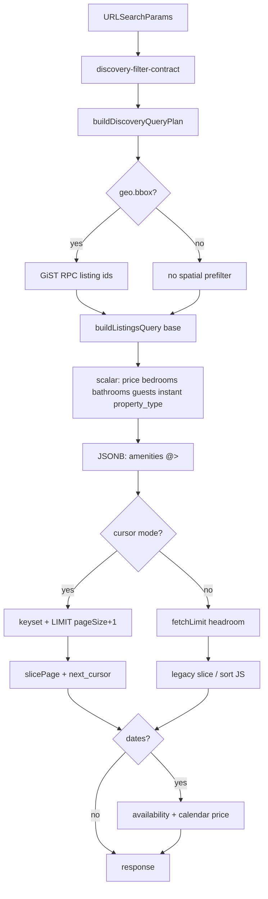

# Stage 177.2b — Housing-фильтры в Unified Discovery Pipeline

> **Status:** In progress (E1–E3 implemented)  
> **Parent spec:** [`discovery-architecture-blueprint.md`](./discovery-architecture-blueprint.md)  
> **Predecessors:** [`stage177-1-task-breakdown.md`](./stage177-1-task-breakdown.md) (implemented), [`stage177-2-cursor-pagination.md`](./stage177-2-cursor-pagination.md) (Step 1 implemented)  
> **Product:** Airento  
> **Scope:** перенос housing-фасетов (цена, спальни/ванные, вместимость, тип жилья) из legacy bridge + JS post-filter в **реестр `FILTER_REGISTRY`** и SQL-план unified path; снятие риска **B4** (пустые страницы) для browse без дат.  
> **Out of scope 177.2b:** availability + календарная цена с датами, transport/service vertical facets, polygon, generated columns для transport/nanny, клиентский infinite scroll (уже в 177.2 Step 1).

---

## 0. Аудит существующих наработок (не плодить дубли)

### 0.1 Что уже есть и **переиспользуем**

| Слой | Файл | Что уже сделано | Роль в 177.2b |
|------|------|-----------------|---------------|
| **Контракт (пустые слоты)** | `lib/search/discovery-filter-contract.js` | `createEmptyDiscoveryContract()` уже содержит `price.minThb` / `price.maxThb`, `housing.bedroomsMin` / `bathroomsMin`, `housing.instantBookingOnly`, `stay.guests` | **Не вводить новый контракт** — только parse + validate в registry |
| **URL SSOT (клиент)** | `lib/search/listings-page-url.js` | `parseExtraFiltersFromParams` / `appendExtraFiltersToParams`: `min_price`, `max_price`, `bedrooms`, `bathrooms`, `instant_booking` | Парсеры registry **делегируют** сюда или в `lib/api/search/params.js` |
| **Legacy SQL** | `lib/api/search/query-builder.js` | `gte/lte('base_price_thb')`, `gte('bedrooms_count')`, `gte('bathrooms_count')`, `eq('instant_booking')`, skip price SQL при валидных датах | **Вынести** в общий helper `applyDiscoveryScalarFilters(q, plan)` — один раз, не копировать предикаты |
| **Bridge dual-parse** | `lib/api/run-listings-search-get.js` | Unified path: `parseDiscoveryFiltersFromSearchParams` + `legacy filters` object с `minPrice`, `bedroomsMin`, … → `executeDiscoverySqlPlan({ legacyFilters })` | Сегодня housing SQL **уже работает** через `legacyFilters`, но **не в registry**, не в `registryFiltersApplied`, не в plan snapshot — 177.2b формализует |
| **Amenities (образец registry)** | `lib/search/filter-registry.js` | `housing.amenities`: parse → `applyPlan` → `plan.sql.jsonbPredicates` + unified `@>` | Шаблон для новых ключей |
| **Executor cascade** | `lib/search/discovery-query-executor.js` | category → GiST bbox → amenities → cursor | Расширить cascade новыми SQL-шагами **до** cursor keyset |
| **Headroom / B4** | `lib/search/discovery-query-plan.js` | `fetchLimit` headroom учитывает `hasGeo`, amenities, category — **не** price/bedrooms | Обновить эвристику или убрать fetchLimit для cursor path |
| **Индексы** | `migrations/stage177_1_metadata_amenities_gin.sql`, колонки `bedrooms_count`, `bathrooms_count`, `base_price_thb`, `max_capacity`, `instant_booking` | Blueprint §2.3 | **Новая миграция не обязательна** для bedrooms/bathrooms/price/instant; опционально — expression для `property_type` |
| **Карта параметров** | `docs/SEARCH_FILTERS_QUERY_MAP.md` | Строки `bedrooms`, `bathrooms`, `min_price`, `guests` | Обновить колонку «Unified registry» |
| **Тесты parity** | `__tests__/discovery-pipeline-parity.test.js` | Catalog vs map plan snapshot | Расширить фикстурами с price + bedrooms |

### 0.2 Терминология: `v_housing.*` vs фактическая схема Airento

В задании упомянуты пути `v_housing.bedrooms`, `v_housing.guestsCapacity`, `v_housing.housingType`. **В репозитории namespace `v_housing` отсутствует.** Канон платформы:

| Концепт (задание) | SSOT в коде / БД | Примечание |
|-------------------|------------------|------------|
| `v_housing.bedrooms` | колонка `listings.bedrooms_count`; fallback в ответе API: `metadata.bedrooms` | SQL-фильтр **только по колонке** в 177.2b (как legacy `query-builder`); backfill metadata — отдельная data-задача |
| `v_housing.bathrooms` | `listings.bathrooms_count`; fallback `metadata.bathrooms` | Аналогично |
| `v_housing.guestsCapacity` | `listings.max_capacity`; JS oracle `resolveListingGuestCapacity()` учитывает `metadata.max_guests` / `metadata.guests` | SQL prefilter: `max_capacity >= stay.guests` (browse); с датами — по-прежнему availability post-step |
| `v_housing.housingType` | `metadata.property_type`, `metadata.subcategory`, `metadata.property_subtype` (wizard) | **Новый** registry-ключ `housing.property_type`; нет в UI URL сегодня — заложить контракт + SQL, UI опционально |

**Правило:** в registry и plan использовать ключи `housing.bedrooms`, `housing.bathrooms`, `price.range`, `stay.guests`, `housing.property_type` — **не** вводить параллельный тип `v_housing`.

### 0.3 Что **не** дублируем

- Новый API route или отдельный «HousingSearchService».
- Второй парсер URL (всё через `discovery-filter-contract` + registry).
- JS post-filter для bedrooms/bathrooms/price **без дат** после миграции в SQL.
- Generated columns (blueprint §2.2) для transport/nanny — фаза **177.3+**.

### 0.4 Связь с B4 и cursor (177.2 Step 1)

```
Сейчас (unified + cursor):
  SQL keyset page (24) → JS availability → JS price-with-dates → пустая страница возможна

Цель 177.2b (browse, без дат):
  category → bbox → price SQL → bedrooms SQL → bathrooms SQL → guests SQL → amenities @> → keyset LIMIT
  → post: только availability при датах, ranking при non-cursor sort
```

Полное закрытие B4 при **датах + цене** — **177.2c** (календарная цена в SQL или post-page refill).

---

## 1. Расширение контракта (Contract Extension)

### 1.1 Поля контракта (без новых top-level объектов)

Расширяем **существующие** ветки `DiscoveryFilterContract`:

```typescript
// Уже в createEmptyDiscoveryContract — добавляем только parse/validate + registry

price: {
  minThb: number | null   // URL: min_price | minPrice
  maxThb: number | null   // URL: max_price | maxPrice
}

housing: {
  bedroomsMin: number | null      // URL: bedrooms | bedrooms_min
  bathroomsMin: number | null     // URL: bathrooms | bathrooms_min
  amenities: string[]             // уже в registry
  instantBookingOnly: boolean     // URL: instant_booking | instantBooking
  propertyType: string | null     // NEW URL: property_type | housing_type (alias)
}

stay: {
  // … существующие поля …
  guests: number | null             // URL: guests — parse в contract (сейчас только legacy filters)
}
```

### 1.2 Парсинг URL → contract

| Параметр API | Registry key | Parse helper (переиспользовать) | Нормализация |
|--------------|--------------|-----------------------------------|--------------|
| `min_price`, `minPrice` | `price.range` | `firstFloatParam` / `parseExtraFiltersFromParams` | `>= 0`, round THB |
| `max_price`, `maxPrice` | `price.range` | то же | `max >= min` или validation issue |
| `bedrooms`, `bedrooms_min` | `housing.bedrooms` | `firstIntParam` | `>= 1` активирует фильтр |
| `bathrooms`, `bathrooms_min` | `housing.bathrooms` | `firstIntParam` | `>= 1` |
| `guests` | `stay.guests` | `parseInt` | `>= 1`, cap 99 (как UI) |
| `instant_booking`, `instantBooking` | `housing.instant_booking` | `parseBooleanSearchParam` | только `true` активирует |
| `property_type`, `housing_type` | `housing.property_type` | trim + lowercase slug | regex `^[a-z0-9_-]{1,48}$` |

**Parse pipeline** (без изменения порядка вызова):

```
parseDiscoveryBrowseParams
parseDiscoveryTextParams
parseDiscoveryStayParams        // NEW thin wrapper: checkIn/Out/guests (вынести из run-listings-search-get)
parseFromRegistry               // расширенный ORDERED_FILTER_KEYS
validateDiscoveryContract       // новые issues
```

`parseDiscoveryStayParams` **не дублирует** логику дат из `run-listings-search-get` — выносим существующую нормализацию checkIn/checkOut в `lib/search/discovery-stay-params.js` (один модуль, два потребителя: contract + legacy filters builder).

### 1.3 Валидация (новые коды)

| Code | path | Условие |
|------|------|---------|
| `PRICE_RANGE_INVALID` | `price` | `minThb > maxThb` когда оба заданы |
| `BEDROOMS_INVALID` | `housing.bedroomsMin` | не целое или `< 1` |
| `BATHROOMS_INVALID` | `housing.bathroomsMin` | не целое или `< 1` |
| `GUESTS_INVALID` | `stay.guests` | не целое или вне 1..99 |
| `PROPERTY_TYPE_INVALID` | `housing.propertyType` | не проходит slug regex |

**Vertical guard:** при `categorySlug` = transport/service/nanny — housing-фильтры **игнорируются** (не 400), как в blueprint §1.4 для transport при housing category.

### 1.4 Правило цены и дат (наследие legacy)

| Сценарий | SQL `base_price_thb` | Post-step |
|----------|----------------------|-----------|
| Browse **без** валидного `checkIn`/`checkOut` | `price.range` в registry → SQL | — |
| С **датами** | SQL price **пропускается** (`skipSqlPriceBecauseCalendar`) | `listingMatchesSearchPriceRange` после availability (как сейчас) |

Контракт всегда парсит `price.*`; plan помечает `plan.sql.skipPriceBecauseCalendar: boolean` для executor.

---

## 2. SQL Query Plan & Executor

### 2.1 Расширение `DiscoveryQueryPlan.sql`

Добавляем поля **в существующий** объект `plan.sql` (не новый plan-тип):

```typescript
sql: {
  // … существующее …
  categoryIds, listingIds, amenities, jsonbPredicates,
  fetchLimit, pageSize, cursor, orderBy, paginationMode, overFetch,

  // NEW — scalar predicates (декларативный снимок для тестов / meta)
  scalarPredicates: ScalarPredicate[]

  // NEW — денормализованные копии для executor (заполняются registry applyPlan)
  priceMinThb: number | null
  priceMaxThb: number | null
  bedroomsMin: number | null
  bathroomsMin: number | null
  guestsMin: number | null
  instantBookingOnly: boolean
  propertyType: string | null

  skipPriceBecauseCalendar: boolean
}
```

`ScalarPredicate` (как в blueprint):

```typescript
type ScalarPredicate = {
  column: string
  op: 'eq' | 'gte' | 'lte' | 'in'
  value: number | string | boolean | string[]
}
```

Registry `applyPlan` **и** записывает в `scalarPredicates`, **и** в плоские поля — executor читает плоские поля; snapshot-тесты — `scalarPredicates`.

### 2.2 Registry: новые ключи и cascade

**Порядок `ORDERED_FILTER_KEYS` (177.2b):**

```
category
→ geo.bbox
→ price.range
→ housing.bedrooms
→ housing.bathrooms
→ stay.guests          // SQL prefilter по max_capacity
→ housing.property_type
→ housing.instant_booking
→ housing.amenities    // JSONB @> последним среди housing (сужает множество)
```

**Почему amenities последними:** GIN `@>` эффективнее на уже суженном id-set; согласовано с blueprint cascade.

#### `price.range`

```javascript
applyPlan(contract, plan) {
  if (plan.sql.skipPriceBecauseCalendar) return
  if (contract.price.minThb != null) {
    plan.sql.priceMinThb = contract.price.minThb
    plan.sql.scalarPredicates.push({ column: 'base_price_thb', op: 'gte', value: contract.price.minThb })
  }
  if (contract.price.maxThb != null) {
    plan.sql.priceMaxThb = contract.price.maxThb
    plan.sql.scalarPredicates.push({ column: 'base_price_thb', op: 'lte', value: contract.price.maxThb })
  }
  plan.registryFiltersApplied.push('price.range')
}
```

#### `housing.bedrooms` / `housing.bathrooms`

```sql
-- Supabase chain (уже в query-builder)
WHERE bedrooms_count >= :bedroomsMin
WHERE bathrooms_count >= :bathroomsMin
```

Индекс: B-tree на `bedrooms_count`, `bathrooms_count` (blueprint §2.3).

#### `stay.guests` (вместимость)

```sql
WHERE max_capacity >= :guests
```

**Ограничение:** не заменяет `resolveListingGuestCapacity()` при датах/транспорте; при `category` = vehicles — registry **не активирует** `stay.guests` SQL (capacity через transport metadata — 177.3).

#### `housing.property_type`

**Фаза A (177.2b):** JSONB text match без generated column:

```sql
-- PostgREST filter (один из вариантов, выбрать в T2b.6)
metadata->>'property_type' ILIKE :type
-- OR нормализованное равенство lower(trim(metadata->>'property_type')) = :slug
```

**Фаза B (опционально T2b.8):** STORED generated column `housing_property_type` + B-tree (blueprint §2.2 pattern).

`applyPlan` добавляет в `plan.sql.jsonbPredicates`:

```javascript
{ op: 'text_eq_ci', path: 'property_type', value: contract.housing.propertyType }
```

Новый mini-helper `lib/api/search/discovery-jsonb-text-filter.js` — **один** модуль для text facets (не N копий в executor).

#### `housing.instant_booking`

```sql
WHERE instant_booking = true
```

Уже в `query-builder`; переносим в registry для симметрии и `registryFiltersApplied`.

### 2.3 `buildDiscoveryQueryPlan` (изменения)

1. **`skipPriceBecauseCalendar`** — вычислить из `contract.stay.checkIn/checkOut` (после `parseDiscoveryStayParams`).
2. **Headroom `fetchLimit`** (non-cursor unified): считать «тяжёлым» запрос с любым активным registry key из `{ price, housing.*, stay.guests }`, не только amenities/geo.
3. **Cursor mode:** при активных housing SQL-фильтрах **не увеличивать** `fetchLimit`; keyset + `pageSize+1` достаточно, если все фасеты в SQL.
4. **`discoveryPlanParitySnapshot`:** включить `scalarPredicates`, `priceMinThb`, `bedroomsMin`, `guestsMin`, `propertyType` — catalog/map **должны совпадать** для map-pins (те же housing фильтры на карте).

### 2.4 `discovery-query-executor.js` (изменения)

**Принцип:** не плодить второй query builder.

```
executeDiscoverySqlPlan(plan, options):
  1. resolveSpatialListingIdsFromPlan(plan)     // без изменений
  2. buildListingsQuery({
       …,
       deferOrderAndLimit: cursorMode,
       amenitiesMode: unified,
       discoveryPlan: plan,                      // NEW: передать plan целиком
     })
  3. applyDiscoveryScalarFiltersFromPlan(q, plan) // NEW: price, bedrooms, bathrooms, guests, instant, property_type
  4. applyDiscoveryCursorToQuery(…)               // без изменений
  5. slicePageAndBuildNextCursor(…)               // без изменений
```

**Рефакторинг `query-builder.js`:**

- Вынести строки 107–127 в `applyDiscoveryScalarFiltersFromPlan(q, plan)`.
- При `discoveryPlan == null` — прежний путь через `filters` (legacy).
- При unified — **не** дублировать предикаты из `legacyFilters` (deprecate передачу `minPrice`/`bedroomsMin` через bridge для unified branch).

**`executeMapPinsDiscoverySqlPlan`:** тот же `applyDiscoveryScalarFiltersFromPlan` — parity catalog/map.

### 2.5 `run-listings-search-get.js` (bridge cleanup)

| До | После 177.2b |
|----|----------------|
| `filters.minPrice` → `legacyFilters` → query-builder | Unified: только `contract` → plan → executor |
| `sqlMetadataFiltersActive(filters)` для headroom | `listActiveRegistryFilterKeys(contract)` или `plan.registryFiltersApplied.length` |
| JS filter bedrooms/price без дат | **Убрать** для unified path (остаётся legacy flag off) |

`meta.discovery.registryFiltersApplied` начнёт включать `price.range`, `housing.bedrooms`, … — наблюдаемость без новых meta-полей.

### 2.6 Диаграмма cascade (catalog, unified, browse)



---

## 3. Атомарные задачи (Task Breakdown)

### E1 — Contract & stay params

| ID | Задача | Файл | Acceptance |
|----|--------|------|------------|
| T2b.1 | `parseDiscoveryStayParams(sp, draft)` — guests + делегирование дат | `lib/search/discovery-stay-params.js` (new), wire в contract | guests попадает в `contract.stay.guests`; unit parse tests |
| T2b.2 | Validation issues: price range, bedrooms, bathrooms, guests, property_type | `discovery-filter-contract.js` | matrix tests |
| T2b.3 | Vertical ignore: housing filters не активны для non-housing category | `filter-registry.js` `isRegistryFilterActive` | transport URL + bedrooms → не в plan |

### E2 — Filter registry

| ID | Задача | Файл | Acceptance |
|----|--------|------|------------|
| T2b.4 | Registry keys: `price.range`, `housing.bedrooms`, `housing.bathrooms`, `housing.instant_booking` | `filter-registry.js` | parse + applyPlan + `isRegistryFilterActive` |
| T2b.5 | Registry key: `stay.guests` → `max_capacity` SQL | `filter-registry.js` | guests=4 → predicate в plan |
| T2b.6 | Registry key: `housing.property_type` → jsonb text filter | `filter-registry.js` + `discovery-jsonb-text-filter.js` | villa slug → plan.jsonbPredicates |
| T2b.7 | Обновить `ORDERED_FILTER_KEYS` + `listActiveRegistryFilterKeys` | `filter-registry.js` | parity test cascade order |

### E3 — Query plan & executor

| ID | Задача | Файл | Acceptance |
|----|--------|------|------------|
| T2b.8 | `skipPriceBecauseCalendar` в plan; headroom учитывает housing filters | `discovery-query-plan.js` | plan snapshot tests |
| T2b.9 | `applyDiscoveryScalarFiltersFromPlan` — extract из query-builder | `lib/api/search/discovery-scalar-sql.js` (new) | mocked supabase chain |
| T2b.10 | Wire plan в `buildListingsQuery` / executor; убрать дубль legacyFilters для unified | `discovery-query-executor.js`, `query-builder.js` | integration test |
| T2b.11 | Map pins executor parity | `executeMapPinsDiscoverySqlPlan` | `diffDiscoveryPlansForSurfaces` green |

### E4 — Handler & legacy

| ID | Задача | Файл | Acceptance |
|----|--------|------|------------|
| T2b.12 | Unified branch: `registryFiltersApplied` в meta; убрать redundant JS pre-filter без дат | `run-listings-search-get.js` | e2e search fixture |
| T2b.13 | `sqlMetadataFiltersActive` → thin wrapper над registry active keys (deprecated alias) | `lib/api/search/params.js` | no duplicate logic |

### E5 — Tests & docs

| ID | Задача | Файл |
|----|--------|------|
| T2b.14 | Contract parse matrix: price + bedrooms + guests + property_type | `__tests__/discovery-housing-contract.test.js` |
| T2b.15 | Plan + scalar predicate snapshot | `__tests__/discovery-housing-plan.test.js` |
| T2b.16 | Executor: combined bbox + price + bedrooms + amenities | `__tests__/discovery-housing-executor.test.js` |
| T2b.17 | Расширить parity fixtures | `__tests__/discovery-pipeline-parity.test.js` |
| T2b.18 | `SEARCH_FILTERS_QUERY_MAP.md`, `TECHNICAL_MANIFESTO.md`, passport version | docs |

**npm script (предложение):**

```json
"test:discovery-housing": "node --import ./scripts/node-test-alias-register.mjs --test __tests__/discovery-housing-contract.test.js __tests__/discovery-housing-plan.test.js __tests__/discovery-housing-executor.test.js"
```

### E6 — Опционально (не блокирует 177.2b core)

| ID | Задача | Примечание |
|----|--------|------------|
| T2b.19 | Generated column `housing_property_type` + index | если explain на JSONB `->>` > 50ms |
| T2b.20 | UI: `property_type` в `SearchFiltersDialog` | продуктовое решение; API готов раньше UI |

---

## 4. Тестовая матрица

### 4.1 Contract parse & validation

| # | URL (фрагмент) | Ожидание contract | Ожидание validation |
|---|----------------|-------------------|---------------------|
| C1 | `bedrooms=2` | `housing.bedroomsMin=2` | ok |
| C2 | `bedrooms=0` | `bedroomsMin` не активен | ok |
| C3 | `min_price=5000&max_price=1000` | оба заданы | `PRICE_RANGE_INVALID` |
| C4 | `guests=8` | `stay.guests=8` | ok |
| C5 | `guests=0` | — | `GUESTS_INVALID` |
| C6 | `property_type=villa` | `housing.propertyType='villa'` | ok |
| C7 | `category=vehicles&bedrooms=2` | bedrooms в URL | registry inactive (ignore) |
| C8 | `checkIn=2026-07-01&checkOut=2026-07-05&min_price=1000` | price в contract | `plan.skipPriceBecauseCalendar=true` |

### 4.2 Plan snapshot (`buildDiscoveryQueryPlan`)

| # | Вход | `registryFiltersApplied` | Ключевые `scalarPredicates` / jsonb |
|---|------|--------------------------|---------------------------------------|
| P1 | villa 2br, price 3k–15k | `price.range`, `housing.bedrooms` | gte bedrooms 2; gte/lte price |
| P2 | guests=4 only | `stay.guests` | gte max_capacity 4 |
| P3 | amenities=wifi,pool + bedrooms=1 | `housing.bedrooms`, `housing.amenities` | scalar + one `@>` amenities |
| P4 | bbox + all housing filters | geo + price + bedrooms + bathrooms + guests + amenities | полный cascade |
| P5 | map surface | same as P4 | catalog plan snapshot **===** map plan snapshot |

### 4.3 Executor / SQL integration (mock Supabase or staging)

| # | Сценарий | Данные | Ожидание |
|---|----------|--------|----------|
| E1 | **Вилла строго 2 спальни** | listings: 1br, 2br, 3br; `bedrooms=2` | только `bedrooms_count >= 2` |
| E2 | **Бюджет** | base_price 2000/8000/20000 THB; `max_price=10000` | 2000 и 8000 в выдаче, 20000 нет |
| E3 | **Комбинированный** | bbox Phuket + `min_price=5000` + `bedrooms=2` + `amenities=pool` | пересечение всех предикатов в **одном** SQL до LIMIT |
| E4 | **Cursor + housing** | flag on, `sort=created_at`, `bedrooms=2`, page1 + cursor page2 | нет дублей id; `hasMore` корректен; страницы не пустые при достаточном seed |
| E5 | **Guests capacity** | max_capacity 2 vs 6; `guests=4` | только 6 |
| E6 | **Property type** | metadata.property_type Villa vs Apartment; `property_type=villa` | case-insensitive match |
| E7 | **Даты + цена** | с checkIn/Out | SQL price skipped; JS `listingMatchesSearchPriceRange` после availability |

### 4.4 Регрессия legacy (`DISCOVERY_UNIFIED_PIPELINE=0`)

| # | Сценарий | Ожидание |
|---|----------|----------|
| L1 | `bedrooms=2&max_price=10000` | идентичная выдача до/после рефактора (snapshot listing ids) |
| L2 | recommended sort + load more slice | клиентский slice без изменений |

### 4.5 Наблюдаемость

| # | Проверка |
|---|----------|
| M1 | `meta.discovery.registryFiltersApplied` содержит `housing.bedrooms` при активном фильтре |
| M2 | `meta.pagination` при cursor не ломается при комбинированных фильтрах |

---

## 5. Критерии приёмки (Definition of Done)

1. При `DISCOVERY_UNIFIED_PIPELINE=1` и browse **без дат** фильтры price / bedrooms / bathrooms / guests / property_type / instant_booking / amenities применяются **в SQL** до `LIMIT` / keyset cursor.
2. Нет второго парсера URL и нет дублирующих предикатов в `legacyFilters` + plan одновременно для unified path.
3. `registryFiltersApplied` и plan parity catalog/map отражают новые ключи.
4. B4: при seed ≥ 3× pageSize и активных housing-фильтрах cursor-страница возвращает **> 0** строк (тест E4).
5. Legacy path и флаг `0` — байт-в-байт поведение search для тех же URL (L1).
6. Документация: манифест + `SEARCH_FILTERS_QUERY_MAP.md` + этот spec → Status: Implemented (после merge).

---

## 6. Риски и открытые вопросы

| Риск | Митигация |
|------|-----------|
| `bedrooms_count` NULL при заполненном `metadata.bedrooms` | Data audit / backfill migration (вне 177.2b); в spec зафиксирован SQL по колонке |
| `resolveListingGuestCapacity` ≠ `max_capacity` | SQL prefilter по колонке; edge cases с датами — availability path |
| `property_type` без индекса медленный | T2b.19 generated column; мониторинг explain |
| Цена с датами всё ещё post-filter | Явно out of scope → 177.2c |
| Дублирование с `listings-page-url` extra filters | Registry parse вызывает существующие helpers |

---

## 7. Связанные документы

- [`discovery-architecture-blueprint.md`](./discovery-architecture-blueprint.md) — B4, §2.3 индексы, registry pattern  
- [`stage177-2-cursor-pagination.md`](./stage177-2-cursor-pagination.md) — keyset, `meta.pagination`  
- [`docs/SEARCH_FILTERS_QUERY_MAP.md`](../SEARCH_FILTERS_QUERY_MAP.md) — URL ↔ сервер  
- [`docs/TECHNICAL_MANIFESTO.md`](../TECHNICAL_MANIFESTO.md) — флаги pipeline  

---

*Версия: 0.1 (2026-06-22). Автор: Architecture / Stage 177.2b planning.*
