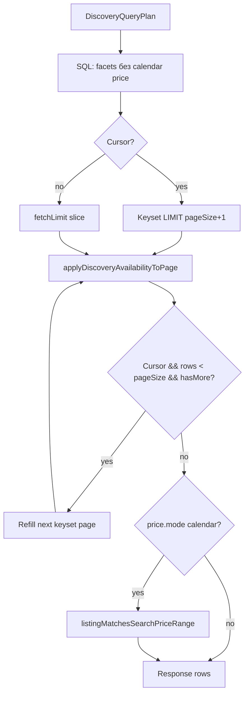

# Stage 177.2c — Календарь и доступность в Unified Discovery Pipeline

> **Status:** E1–E3 implemented (registry, executor, handler guard); E4 docs pending  
> **Parent spec:** [`discovery-architecture-blueprint.md`](./discovery-architecture-blueprint.md)  
> **Predecessors:** [`stage177-2b-housing-filters.md`](./stage177-2b-housing-filters.md) (E1–E3 implemented), [`stage177-2-cursor-pagination.md`](./stage177-2-cursor-pagination.md) (Step 1 implemented)  
> **Product:** Airento  
> **Scope:** интеграция `checkIn` / `checkOut` / `guests` и календарной цены в unified path; закрытие **B4** при поиске с датами и **cursor pagination**; паритет каталог ↔ карта.  
> **Out of scope 177.2c:** транспортный интервальный режим (`checkInTime` / `checkOutTime` ISO), polygon, сортировки price/distance с cursor, полный перенос promo-enrichment в SQL.

---

## 0. Связь с предыдущими этапами

| Этап | Что сделано | Что остаётся «дырой» B4 |
|------|-------------|-------------------------|
| **177.2 Step 1** | Keyset cursor, `meta.pagination` | Post-filter availability **после** SQL page → пустые страницы |
| **177.2b** | Housing SQL facets, `skipPriceBecauseCalendar` | Цена с датами — JS post-step; availability — JS post-step |
| **177.2c (этот)** | `stay.dates` в registry + availability в executor | Browse без дат уже стабилен; даты — финальный слой |

### 0.1 Инварианты (не ломаем)

- Parse дат — **`discovery-stay-params.js`** (`toListingDate`, `hasValidDiscoveryStayDateRange`).
- Batch availability SSOT — **`CalendarService.checkBatchAvailability`** → RPC **`batch_check_listing_availability`** (`CalendarUpdateLayer`).
- Гостевая цена на карточке — **`getGuestDisplayForSearchFilters`** / **`listingMatchesSearchPriceRange`** (`effective-unit-price-for-search.js`).
- Legacy path (`DISCOVERY_UNIFIED_PIPELINE=0`) — поведение идентично до soak unified.
- Map/catalog — один **`DiscoveryQueryPlan`** + parity snapshot (расширить полями `availability` / `price`).

---

## 1. Анализ текущего слоя дат (Legacy + Unified bridge)

### 1.1 Поток данных сегодня

```
run-listings-search-get.js
  ├─ parseDiscoveryFiltersFromSearchParams → contract.stay (177.2b: parseDiscoveryStayParams)
  ├─ buildDiscoveryQueryPlan → executeDiscoverySqlPlan (SQL: category, bbox, housing, cursor)
  └─ POST (одинаково legacy и unified):
       filterListingsByAvailability(listings, filters)
       → listingMatchesSearchPriceRange (если hasDateFilter && min/max price)
       → applyCatalogSort / cursor page (без JS sort при cursor)
```

**Критично:** unified path **уже** выполняет SQL housing facets (177.2b), но **availability и календарная цена** остаются в **`run-listings-search-get.js`** после executor — вне registry и вне plan.

### 1.2 `resolveListingGuestCapacity` (вместимость до batch)

**Файл:** `lib/listing-guest-capacity.js`

| Источник | Логика |
|----------|--------|
| `listings.max_capacity` | Приоритет над устаревшим `metadata.max_guests` |
| `metadata.max_guests` / `metadata.guests` | Fallback |
| `metadata.bedrooms` | Для жилья: `max(bedrooms*2, bedrooms+1)` если колонка занижена |
| Transport | `metadata.seats` или fallback 2 |

**Где используется в поиске:**

- `lib/api/search/availability.js` — **pre-filter** до RPC: если `filters.guests` и не `vehicles`, отсекает листинги с `maxGuests < filters.guests` (`filteredOutByCapacity`).
- **177.2b** добавил SQL `max_capacity >= guests` в unified plan (`stay.guests`) — частичное пересечение; oracle batch RPC использует `required_guests` / `min_remaining_spots` по ночам (строже).

**Вывод для 177.2c:** при активных датах SQL `stay.guests` остаётся coarse prefilter; финальная вместимость — в RPC. Не дублировать `resolveListingGuestCapacity` в SQL без миграции.

### 1.3 `filterListingsByAvailability` (занятость + pricing snapshot)

**Файл:** `lib/api/search/availability.js`

**Условие активации:** валидный диапазон `checkIn < checkOut` (YYYY-MM-DD, нормализация в handler).

**Алгоритм:**

1. Capacity pre-pass (`resolveListingGuestCapacity`).
2. **`CalendarService.checkBatchAvailability(ids, checkIn, checkOut, { guestsCount })`**
   - Реализация: `lib/services/calendar/calendar-update.service.js`
   - RPC: **`batch_check_listing_availability`**
3. Для `available === false` — исключение из выдачи; опционально **soft fallback** (`softAvailability`, тег `_isAvailabilityMismatch`) если результатов < 3.
4. Для `available === true` — на листинг пишется **`listing._pricing`** (nights, totalPrice, averagePerNight, promo flags) после enrichment в `CalendarUpdateLayer`.
5. **Re-check** «пессимистичных» unavailable через `checkAvailability` (single) — защита от ложных negative batch.
6. **Fail-open:** при ошибке RPC — карточки с `_isAvailabilityMismatch` (не пустой каталог).

**Карта:** `run-map-pins-get.js` — тот же `filterListingsByAvailability` + `listingMatchesSearchPriceRange` перед `mapPinRowToPayload`.

### 1.4 Где хранятся занятые слоты (Supabase)

Отдельной таблицы `unavailabilities` **нет**. SSOT занятости:

| Сущность | Таблица | Роль в `batch_check_listing_availability` |
|----------|---------|-------------------------------------------|
| Брони | **`public.bookings`** | `booking_load`: overlap ночей `[check_in, check_out)` в TZ листинга (`resolve_listing_timezone_v1`); статусы из **`OCCUPYING_BOOKING_STATUSES`** (`lib/booking/status-sets.js`) |
| Ручные / iCal / hold блоки | **`public.calendar_blocks`** | `block_load`: `start_date`..`end_date`, `units_blocked`; **исключены** `source = inquiry_hold` (Stage 175.3) |
| Сезонные цены | **`public.seasonal_prices`** + `metadata.seasonal_pricing` | `priced_listing_nights` → `average_per_night` / `total_price` |
| Ёмкость | **`listings.max_capacity`** | `night_rollup.remaining_spots` |

**Миграции-референс:** `migrations/stage175_3_inquiry_hold_no_availability_block.sql` (актуальная версия batch RPC).

**Важно:** RPC работает на уровне **ночей** (date), не transport ISO interval — интервальный транспорт (`checkInTime`) остаётся legacy/single-check path (out of scope 177.2c).

### 1.5 Цена: browse vs calendar

| Режим | SQL `base_price_thb` | Фильтр min/max | Отображение на карточке |
|-------|----------------------|----------------|-------------------------|
| Без дат | `price.range` в SQL (177.2b) | SQL | `base_price_thb` + guest fee % |
| С датами | **пропуск** (`skipPriceBecauseCalendar`) | JS `listingMatchesSearchPriceRange` на `_pricing.averagePerNight` | `getGuestDisplayForSearchFilters` → `_pricing` |

**177.2b уже выставляет** `plan.sql.skipPriceBecauseCalendar = true` в `price.range.applyPlan` при валидных датах — SQL price **не** применяется. **177.2c** формализует режим **`price.mode: 'calendar'`** и переносит post-steps в executor.

### 1.6 Проблема B4 при cursor + датах

```
SQL keyset LIMIT 25
  → 8 строк прошли availability
  → клиент видит «дырявую» страницу; hasMore=true, но UX плохой
  → при жёстком filter: 0 строк при hasMore=true — критический баг infinite scroll
```

**Цель 177.2c:** availability-aware **page assembly** в unified executor (см. §3), не откатывать cursor.

---

## 2. Интеграция в FILTER_REGISTRY

### 2.1 Новые / расширенные ключи

| Registry key | Layer | Поверхности | Условие active |
|--------------|-------|-------------|----------------|
| **`stay.dates`** | `availability` / `rpc` | catalog, map | `hasValidDiscoveryStayDateRange(contract.stay)` |
| **`stay.guests`** | `sql` (уже есть) | catalog, map | guests >= 1; при dates — coarse + RPC |
| **`price.range`** | `sql` \| `calendar` | catalog, map | min/max в contract; mode зависит от dates |

**Порядок cascade (обновлённый):**

```
category
→ geo.bbox
→ stay.dates          // NEW: планирует availability, не SQL WHERE напрямую
→ price.range         // mode: sql | calendar
→ housing.bedrooms
→ housing.bathrooms
→ stay.guests
→ housing.property_type
→ housing.instant_booking
→ housing.amenities
```

`stay.dates` **до** `price.range`, чтобы plan знал режим цены до applyPlan price.

### 2.2 Контракт `stay.dates` (без нового top-level объекта)

Поля уже в `contract.stay` (`discovery-filter-contract.js` / `discovery-stay-params.js`):

```typescript
stay: {
  checkIn: string | null      // YYYY-MM-DD
  checkOut: string | null
  checkInTime: string | null  // parse only; executor ignore в 177.2c
  checkOutTime: string | null
  guests: number | null
  softAvailability: boolean   // URL: softAvailability=0 → false
}
```

**Parse:** остаётся в `parseDiscoveryStayParams` (не дублировать в registry `parse`).

**Registry `stay.dates`:**

```javascript
{
  key: 'stay.dates',
  urlKeys: ['checkIn', 'checkOut'],
  verticals: ['all'],
  layer: 'availability',
  surfaces: ['catalog', 'map'],
  parse() { /* no-op — SSOT stay-params */ },
  applyPlan(contract, plan) {
    if (!hasValidDiscoveryStayDateRange(contract.stay)) return
    plan.availability = {
      engine: 'batch_rpc',
      rpc: 'batch_check_listing_availability',
      checkIn: contract.stay.checkIn,
      checkOut: contract.stay.checkOut,
      guestsCount: Math.max(1, contract.stay.guests ?? 1),
      softAvailability: contract.stay.softAvailability !== false,
    }
    plan.sql.skipPriceBecauseCalendar = true
    plan.price = plan.price || {}
    plan.price.mode = 'calendar'  // NEW
    plan.registryFiltersApplied.push('stay.dates')
  },
}
```

### 2.3 Связь `price.range` ↔ calendar mode

**Сегодня (177.2b):** `skipPriceBecauseCalendar` → early return в `applyPlan` (нет scalar predicates).

**177.2c — расширение `plan.price`:**

```typescript
price: {
  mode: 'sql' | 'calendar'     // default 'sql'
  minThb: number | null
  maxThb: number | null
  // calendar: фильтр после batch, не в PostgREST
}
```

| `plan.price.mode` | SQL scalar | Post-executor filter |
|-------------------|------------|---------------------|
| `sql` | `base_price_thb` gte/lte | — |
| `calendar` | **нет** | `listingMatchesSearchPriceRange` на строках с `_pricing` |

`price.range.applyPlan` **не** дублирует логику skip — читает `plan.price.mode` / `plan.sql.skipPriceBecauseCalendar` из `stay.dates`.

### 2.4 Расширение `DiscoveryQueryPlan`

```typescript
plan: {
  contract, spatial, sql, registryFiltersApplied, surface,
  availability: {
    engine: 'none' | 'batch_rpc'
    rpc: 'batch_check_listing_availability' | null
    checkIn: string | null
    checkOut: string | null
    guestsCount: number
    softAvailability: boolean
  },
  price: {
    mode: 'sql' | 'calendar'
    minThb: number | null
    maxThb: number | null
  },
  postSteps: ('availability' | 'calendar_price' | 'soft_mismatch')[]
}
```

`computeDiscoveryPostSteps(plan)` в **`discovery-query-plan.js`**:

- Если `stay.dates` active → `['availability', 'calendar_price'?]`
- `calendar_price` только если `price.minThb` или `price.maxThb`

---

## 3. SQL / Executor: отсечение занятых объектов

### 3.1 Почему не чистый SQL subquery в PostgREST

Логика batch RPC (TZ, multi-night capacity, seasonal pricing, calendar_blocks, vehicle vs housing) **уже канонична** в `batch_check_listing_availability`. Дублировать в inline SQL — риск рассинхрона с `create_booking_atomic_v1`.

**Стратегия 177.2c (рекомендуемая):**

| Уровень | Механизм |
|---------|----------|
| **L1 — Coarse SQL** | Существующие facets (category, bbox, housing, `max_capacity`) сужают кандидатов |
| **L2 — Availability RPC** | `batch_check_listing_availability` на **странице кандидатов** (или refill loop) |
| **L3 — Calendar price filter** | JS на `_pricing` (паритет с карточкой) |

**Опционально T2c.8 (Phase B):** миграция **`listings_ids_available_for_stay_v1(p_check_in, p_check_out, p_guests, p_candidate_ids text[])`** — thin wrapper над той же CTE что batch, возвращает только `listing_id` где `available = true`. Использование: pre-intersect **до** keyset при высокой плотности занятости. Не блокирует MVP.

### 3.2 Новый модуль executor

**Файл:** `lib/search/discovery-availability-page.js` (предложение)

```javascript
/**
 * @param {object[]} pageRows — строки после SQL/cursor slice
 * @param {DiscoveryQueryPlan} plan
 * @returns {Promise<{ rows, stats, pricingAttached }>}
 */
export async function applyDiscoveryAvailabilityToPage(pageRows, plan)
```

**Делегирует** в существующий `filterListingsByAvailability` (не копировать бизнес-логику), передавая:

```javascript
filters: {
  checkIn: plan.availability.checkIn,
  checkOut: plan.availability.checkOut,
  guests: plan.availability.guestsCount,
  softAvailability: plan.availability.softAvailability,
  minPrice: plan.price.mode === 'calendar' ? plan.price.minThb : null,
  maxPrice: plan.price.mode === 'calendar' ? plan.price.maxThb : null,
}
```

**Важно:** вынести calendar price filter из handler в эту функцию **или** вызывать `listingMatchesSearchPriceRange` отдельным шагом после availability — один SSOT.

### 3.3 `executeDiscoverySqlPlan` — новый поток

```
1. resolveSpatialListingIdsFromPlan
2. buildListingsQuery + applyDiscoveryScalarFiltersFromPlan  // price SQL только mode=sql
3. applyDiscoveryCursorToQuery (если cursor)
4. await query → rawRows
5. slicePageAndBuildNextCursor (если cursor)
6. applyDiscoveryAvailabilityToPage(pageRows, plan)          // NEW
7. [cursor + dates] discoveryCursorRefillIfSparse(...)       // NEW — см. §3.4
8. return { data, pagination, plan, availabilityStats }
```

**Legacy handler** (`run-listings-search-get.js`): при unified + plan.postSteps — **не** вызывать повторно `filterListingsByAvailability` (guard `discoveryPlanHasAvailabilityStep(plan)`).

### 3.4 Cursor refill (закрытие B4)

**Файл:** `lib/search/discovery-cursor-refill.js`

Когда `paginationMode === 'cursor'` && `stay.dates` active:

```
while (acceptedRows.length < pageSize && hasMore && refillAttempts < MAX_REFILL):
  run availability on current SQL page
  append accepted to acceptedRows
  if still short: fetch next keyset page (internal cursor = nextCursor from slice)
```

| Параметр | Значение |
|----------|----------|
| `MAX_REFILL` | 5 (конфиг env `DISCOVERY_CURSOR_REFILL_MAX`) |
| `next_cursor` в ответе | От **последней принятой** SQL-строки (не от последней probed) — стабильность keyset |

Если после refill страница пуста и `hasMore=false` — легитимный конец; если пуста и `hasMore=true` — telemetry `recordCriticalSignal('discovery_cursor_starvation')`.

### 3.5 `executeMapPinsDiscoverySqlPlan`

Идентичный post-step availability на `rows` после SQL (без cursor refill — лимит пинов фиксирован `MAP_PINS_MAX`).

Паритет: `diffDiscoveryPlansForSurfaces` включает `availability` и `price.mode`.

### 3.6 Диаграмма (catalog, unified, с датами)



---

## 4. Task Breakdown (T2c.1–T2c.12)

### E1 — Registry & plan

| ID | Задача | Файл | Acceptance |
|----|--------|------|------------|
| T2c.1 | Registry key `stay.dates` + `isRegistryFilterActive` | `filter-registry.js` | plan.availability заполнен при checkIn/Out |
| T2c.2 | `plan.price.mode` (`sql` \| `calendar`); `price.range` учитывает mode | `filter-registry.js` | snapshot tests |
| T2c.3 | `ORDERED_FILTER_KEYS` — вставить `stay.dates` после `geo.bbox` | `filter-registry.js` | parity order test |
| T2c.4 | `computeDiscoveryPostSteps(plan)` | `discovery-query-plan.js` | `postSteps` содержит `availability` |
| T2c.5 | Расширить `discoveryPlanParitySnapshot` (`availability`, `price.mode`) | `discovery-query-plan.js` | catalog === map |

### E2 — Availability executor

| ID | Задача | Файл | Acceptance |
|----|--------|------|------------|
| T2c.6 | `applyDiscoveryAvailabilityToPage` — обёртка над `filterListingsByAvailability` | `discovery-availability-page.js` | unit mock batch |
| T2c.7 | Wire в `executeDiscoverySqlPlan` + calendar price step | `discovery-query-executor.js` | integration test |
| T2c.8 | `discoveryCursorRefillIfSparse` | `discovery-cursor-refill.js` | cursor+dates не отдаёт 0 при наличии следующих id |
| T2c.9 | Wire в `executeMapPinsDiscoverySqlPlan` | `discovery-query-executor.js` | map pins parity test |

### E3 — Handler cleanup

| ID | Задача | Файл | Acceptance |
|----|--------|------|------------|
| T2c.10 | Unified branch: skip duplicate availability/price в handler | `run-listings-search-get.js`, `run-map-pins-get.js` | e2e fixture no double-filter |
| T2c.11 | `meta.availability` stats + `meta.price.unitSource` (`calendar_avg_per_period`) | handlers | JSON contract test |

### E4 — Tests & docs

| ID | Задача | Файл |
|----|--------|------|
| T2c.12 | Contract/plan/executor/parity tests | `__tests__/discovery-calendar-*.test.js` |
| T2c.13 | `SEARCH_FILTERS_QUERY_MAP.md`, `TECHNICAL_MANIFESTO.md`, статус spec | docs |

**npm script (предложение):**

```json
"test:discovery-calendar": "node --import ./scripts/node-test-alias-register.mjs --test __tests__/discovery-calendar-contract.test.js __tests__/discovery-calendar-executor.test.js"
```

### E5 — Опционально (Phase B)

| ID | Задача | Примечание |
|----|--------|------------|
| T2c.14 | RPC `listings_ids_available_for_stay_v1` | Pre-filter ids до keyset; только при профилировании |
| T2c.15 | Transport interval в registry | `stay.interval` + vehicle RPC |

---

## 5. Критерии качества и UX-тесты

### 5.1 Definition of Done

1. При `DISCOVERY_UNIFIED_PIPELINE=1` и валидных датах availability выполняется **в executor** (registry `stay.dates` в `registryFiltersApplied`).
2. Нет двойного вызова `filterListingsByAvailability` в unified handler.
3. `plan.price.mode === 'calendar'` → SQL не фильтрует `base_price_thb`; min/max применяются к `_pricing`.
4. Catalog/map plans parity сохранён для фикстур с датами + ценой + bbox.
5. Cursor + dates: страница **не пустая** при наличии достаточного числа доступных листингов в БД (refill).
6. Fail-open batch RPC сохранён (soft mismatch, не белый экран).
7. Legacy flag off — байт-паритет с поведением до изменений.

### 5.2 Матрица функциональных тестов

| # | Сценарий | Вход | Ожидание |
|---|----------|------|----------|
| A1 | Свободные даты | checkIn/Out, все листинги свободны | `available` = count SQL; `_pricing.averagePerNight` > 0 |
| A2 | Полностью занято | даты перекрывают все брони seed | `available` = 0; `meta.pagination.hasMore` корректен; нет 500 |
| A3 | Частично занято | 50% свободны | фильтр отсекает только conflict ids |
| A4 | min_price с датами | dates + min_price | SQL price **не** применён; JS price filter на `_pricing` |
| A5 | guests > max_capacity | guests=10, listing cap=4 | отсекается до RPC (capacity) или в RPC |
| A6 | softAvailability | занято + soft=1 | при <3 результатах — mismatch cards с флагом |
| A7 | RPC failure | mock RPC error | fail-open mismatch; `filteredOutByAvailabilityErrors` > 0 |
| A8 | Map parity | те же params catalog/map | те же id после availability; pin price = catalog guest display |

### 5.3 Cursor / infinite scroll (критично для UX)

| # | Сценарий | Ожидание |
|---|----------|----------|
| C1 | Page 1, dates, cursor mode | `len(listings) <= pageSize`; каждый id прошёл batch `available=true` (или soft mismatch) |
| C2 | Page 1 sparse (2/24) + hasMore | refill догружает до ≥ min(24, remaining) или исчерпания |
| C3 | `next_cursor` стабильность | повторный запрос с cursor не дублирует id page 1 |
| C4 | Последняя страница | `hasMore=false`; пустая страница допустима |
| C5 | Client infinite scroll | `meta.pagination.hasMore` + `next_cursor` согласованы с server refill (ручной / Playwright smoke) |

### 5.4 Meta / pricing contract

| Поле | Когда | Смысл |
|------|-------|-------|
| `meta.priceHistogram.unitSource` | dates | `'calendar_avg_per_period'` (уже есть) |
| `meta.availability.filteredOutByAvailability` | dates | счётчики из executor stats |
| `meta.discovery.registryFiltersApplied` | unified | включает `stay.dates` |
| `meta.pagination` | cursor | `hasMore`, `next_cursor`; **не** дублировать цену на уровне pagination |
| `listing._pricing` / card price | dates | SSOT для отображения и price filter; тест: `getGuestDisplayForSearchFilters` === UI |

**Примечание:** агрегированная «финальная цена» в `meta.pagination` **не вводится** — цена пер-листинг в `_pricing`; в pagination только навигация. Опционально `meta.pagination.refillAttempts` для диагностики.

### 5.5 Риски

| Риск | Митигация |
|------|-----------|
| Refill loop latency | `MAX_REFILL` cap; метрики `search-performance-metrics` |
| Keyset drift после refill | `next_cursor` от последней **возвращённой** строки |
| Двойной batch RPC | guard в handler + флаг `plan.postSteps` |
| Transport dates ISO | Explicit out of scope; document in SEARCH_FILTERS_QUERY_MAP |
| Расхождение batch vs single check | сохранить re-check path в `filterListingsByAvailability` |

---

## 6. Связанные документы

- [`stage177-2b-housing-filters.md`](./stage177-2b-housing-filters.md) — `skipPriceBecauseCalendar`, scalar SQL  
- [`stage177-2-cursor-pagination.md`](./stage177-2-cursor-pagination.md) — keyset, `meta.pagination`  
- [`discovery-architecture-blueprint.md`](./discovery-architecture-blueprint.md) — B4, postSteps  
- [`docs/SEARCH_FILTERS_QUERY_MAP.md`](../SEARCH_FILTERS_QUERY_MAP.md) — `checkIn`, `checkOut`, `guests`  
- `migrations/stage175_3_inquiry_hold_no_availability_block.sql` — RPC SSOT  

---

*Версия: 0.1 (2026-06-22). Автор: Architecture / Stage 177.2c planning.*
